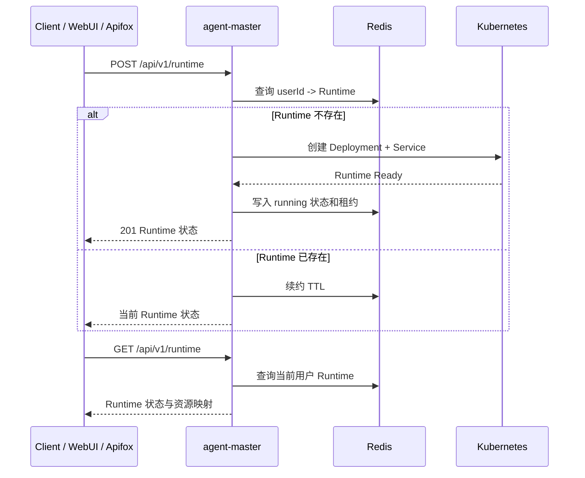
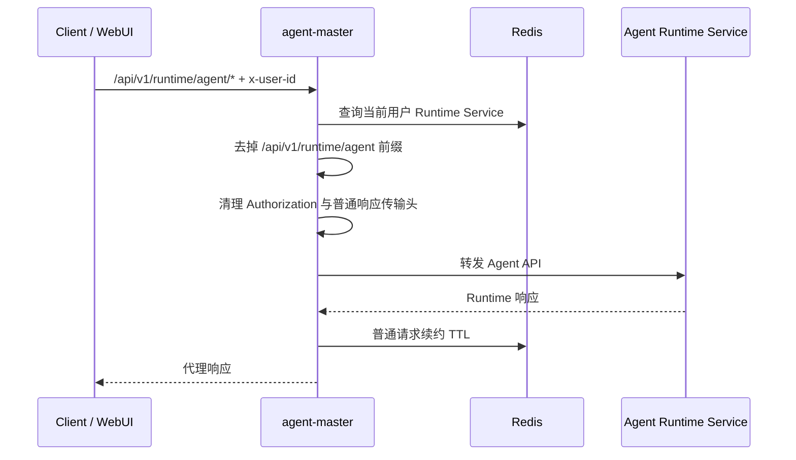
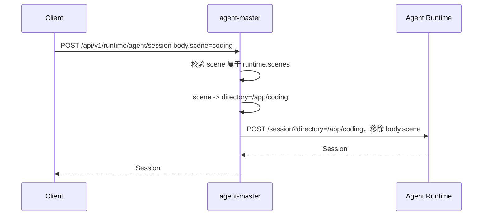
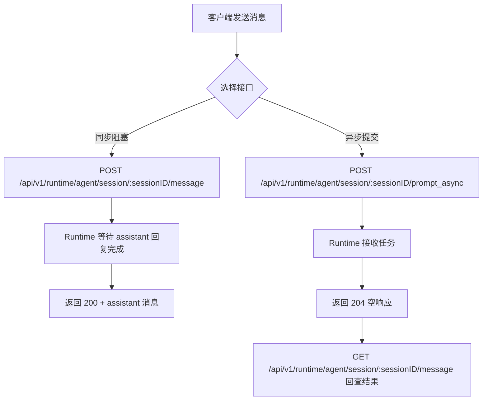
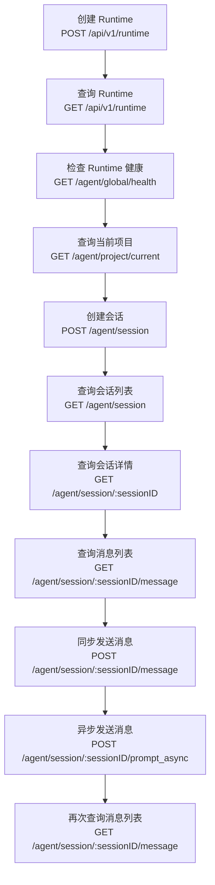

# agent-master API 文档

## 1. 通用约定

本文档定义 `agent-master` 对外接口、请求参数、响应结构和错误边界。示例中的 `{baseUrl}` 按部署环境替换；除健康检查外，接口默认要求上游注入 `x-user-id`。

### 1.1 通用 Header

| Header          | 必填 | 示例                  | 说明                                         |
| --------------- | -: | ------------------- | ------------------------------------------ |
| `x-user-id`     |  是 | `user-ref`          | 上游鉴权后注入的用户标识；除 `GET /api/v1/health` 外默认必填。 |
| `Content-Type`  | 按需 | `application/json`  | 请求体为 JSON 时传入。                             |
| `Accept`        |  否 | `text/event-stream` | SSE 客户端可传入。                                |
| `Authorization` |  否 | `Bearer ...`        | 由上游处理；如请求携带，`agent-master` 不向 Runtime 透传。  |

### 1.2 Agent API 代理规则

代理入口：

```http
/api/v1/runtime/agent/*
```

规则：

1. 基于 `x-user-id` 查询当前用户 Runtime。
2. 只通过 Runtime Service 转发，不直接访问 Pod IP。
3. 去掉 `/api/v1/runtime/agent` 前缀后转发到 Agent Runtime。
4. 保留 HTTP 方法、后续路径、查询参数和请求体。
5. `Authorization` 不透传到 Runtime。
6. 普通 HTTP 代理请求会续约 Runtime TTL。
7. Runtime 原生 SSE 仍走 `/api/v1/runtime/agent/*` 代理入口。

示例：

```http
GET /api/v1/runtime/agent/session/{sessionID}/message
```

转发为：

```http
GET /session/{sessionID}/message
```

### 1.3 普通响应与 SSE 响应头

普通 HTTP 响应会被代理层读取并重新输出 body，因此不透传上游已失效的传输/编码头：

| Header              | 普通 HTTP        | SSE    |
| ------------------- | -------------- | ------ |
| `content-encoding`  | 移除             | 保留流式语义 |
| `content-length`    | 移除，由 HTTP 框架重算 | 保留流式语义 |
| `transfer-encoding` | 移除             | 保留流式语义 |

这样避免客户端出现 `incorrect header check` 或 `Invalid character in chunk size`。

## 2. 核心业务流程

### 2.1 Runtime 创建与复用



### 2.2 Agent API 透明代理



### 2.3 会话创建与 scene 转换



### 2.4 同步消息与异步消息



### 2.5 推荐调用顺序



## 3. Runtime 管理接口

### 3.1 健康检查

- **用途**：检查 `agent-master` 服务自身是否存活。
- **URL 定义**：`GET {baseUrl}/health`
- **请求方案**：普通 HTTP GET。
- **Header**：无必填 Header。
- **请求体**：无。
- **响应体**：状态码 `200`。

```json
{
  "status": "ok",
  "service": "agent-master"
}
```

### 3.2 创建或复用 Runtime

- **用途**：为当前用户创建或复用 Agent Runtime。Runtime 以 `x-user-id` 归属，不接受客户端传入 `runtimeId`。
- **URL 定义**：`POST {baseUrl}/runtime`
- **请求方案**：普通 HTTP POST。
- **Header**：

| Header         | 必填 | 示例                 | 说明         |
| -------------- | -: | ------------------ | ---------- |
| `x-user-id`    |  是 | `user-ref`         | 当前用户标识。    |
| `Content-Type` |  否 | `application/json` | 请求体为空时可不传。 |

- **请求体**：无，或空 JSON。

```json
{}
```

- **响应体**：新建 Runtime 时状态码 `201`；复用已有 Runtime 时状态码 `200`。

```json
{
  "runtimeId": "rt-000001",
  "userId": "user-ref",
  "status": "running",
  "cluster": "cluster-a",
  "namespace": "runtime-namespace",
  "deploymentName": "runtime-rt-000001",
  "serviceName": "runtime-rt-000001",
  "servicePort": 4096,
  "leaseExpireAt": "2026-06-15T07:30:00.000Z"
}
```

### 3.3 查询当前用户 Runtime

- **用途**：查询当前用户 Runtime 生命周期状态、租约和 Kubernetes 资源映射。
- **URL 定义**：`GET {baseUrl}/runtime`
- **请求方案**：普通 HTTP GET。
- **Header**：`x-user-id` 必填。
- **请求体**：无。
- **响应体**：状态码 `200`。

```json
{
  "runtimeId": "rt-000001",
  "userId": "user-ref",
  "status": "running",
  "cluster": "cluster-a",
  "namespace": "runtime-namespace",
  "deploymentName": "runtime-rt-000001",
  "serviceName": "runtime-rt-000001",
  "servicePort": 4096,
  "leaseExpireAt": "2026-06-15T07:30:00.000Z"
}
```

### 3.4 重启 Runtime

- **用途**：重启当前用户 Runtime，让 Runtime 重新加载项目级配置、skills、tools、plugins 或运行时环境变更。
- **URL 定义**：`POST {baseUrl}/runtime/restart`
- **请求方案**：普通 HTTP POST。
- **Header**：`x-user-id` 必填；请求体为 JSON 时传 `Content-Type: application/json`。
- **请求体**：`reason` 可选。

```json
{
  "reason": "reload-runtime-config"
}
```

- **响应体**：状态码 `200`。

```json
{
  "runtimeId": "rt-000001",
  "userId": "user-ref",
  "status": "running",
  "deploymentName": "runtime-rt-000001",
  "serviceName": "runtime-rt-000001"
}
```

### 3.5 删除 Runtime

- **用途**：关闭当前用户 Runtime，删除对应 Deployment、Service 和 Redis 映射。
- **URL 定义**：`DELETE {baseUrl}/runtime`
- **请求方案**：普通 HTTP DELETE。
- **Header**：`x-user-id` 必填。
- **请求体**：无。
- **响应体**：状态码 `204`，响应体为空。

```text
<empty body>
```

### 3.6 Runtime 平台事件 SSE

- **用途**：订阅当前用户 Runtime 控制面事件，包括创建、调度、就绪、重启、回收、失败和心跳。该接口不是 Runtime 原生事件流。
- **URL 定义**：`GET {baseUrl}/runtime/events`
- **请求方案**：SSE 长连接。
- **Header**：`x-user-id` 必填；`Accept: text/event-stream` 可选。
- **请求体**：无。
- **响应体**：状态码 `200`，`Content-Type: text/event-stream`。

```text
event: runtime.heartbeat
data: {"userId":"user-ref","runtimeId":"rt-000001","status":"running","time":"2026-06-15T06:30:00.000Z"}
```

## 4. Agent API 代理接口：基础与会话

### 4.1 Agent Runtime 健康检查

- **用途**：检查当前用户 Runtime 内 Runtime Server 是否健康。
- **URL 定义**：`GET {baseUrl}/runtime/agent/global/health`
- **请求方案**：普通 HTTP GET；转发到 Runtime `GET /global/health`。
- **Header**：`x-user-id` 必填。
- **请求体**：无。
- **响应体**：状态码 `200`。

```json
{
  "healthy": true,
  "version": "1.17.3"
}
```

### 4.2 查询当前 Runtime 项目

- **用途**：查询当前 Runtime 中 Runtime Server 识别的当前项目。
- **URL 定义**：`GET {baseUrl}/runtime/agent/project/current`
- **请求方案**：普通 HTTP GET；转发到 Runtime `GET /project/current`。
- **Header**：`x-user-id` 必填。
- **请求体**：无。
- **响应体**：状态码 `200`。

```json
{
  "id": "global"
}
```

### 4.3 获取 Runtime OpenAPI 文档

- **用途**：获取 Runtime 暴露的 Runtime OpenAPI 规范，用于确认官方路径和请求体结构。
- **URL 定义**：`GET {baseUrl}/runtime/agent/doc`
- **请求方案**：普通 HTTP GET；转发到 Runtime `GET /doc`。
- **Header**：`x-user-id` 必填。
- **请求体**：无。
- **响应体**：状态码 `200`，返回 OpenAPI JSON。

```json
{
  "openapi": "3.1.0",
  "paths": {
    "/session/{sessionID}/message": {
      "post": {
        "summary": "Send message"
      }
    }
  }
}
```

### 4.4 创建 Runtime 会话

- **用途**：在当前用户 Runtime 中创建 Runtime 会话。`scene` 是 `agent-master` 扩展参数，用于选择预设场景目录。
- **URL 定义**：`POST {baseUrl}/runtime/agent/session`
- **请求方案**：普通 HTTP POST；代理转换为 `POST /session?directory=/app/{scene}`，并移除请求体中的 `scene`。
- **Header**：`x-user-id`、`Content-Type: application/json` 必填。
- **请求体**：

```json
{
  "scene": "coding",
  "title": "验收会话"
}
```

- **响应体**：状态码 `200`。

```json
{
  "id": "ses_136144a19ffehwVU9Oj8m5GsXm",
  "slug": "neon-star",
  "projectID": "global",
  "directory": "/app/coding",
  "path": "app/coding",
  "title": "验收会话",
  "version": "1.17.3",
  "time": {
    "created": 1781504128486,
    "updated": 1781504128486
  }
}
```

### 4.5 查询会话列表

- **用途**：查询当前 Runtime 中的 Runtime 会话列表。
- **URL 定义**：`GET {baseUrl}/runtime/agent/session`
- **请求方案**：普通 HTTP GET；转发到 Runtime `GET /session`。
- **Header**：`x-user-id` 必填。
- **请求体**：无。
- **响应体**：状态码 `200`。

```json
[
  {
    "id": "ses_136144a19ffehwVU9Oj8m5GsXm",
    "slug": "neon-star",
    "projectID": "global",
    "directory": "/app/coding",
    "path": "app/coding",
    "title": "验收会话",
    "version": "1.17.3"
  }
]
```

### 4.6 查询会话详情

- **用途**：查询指定 Runtime 会话详情。
- **URL 定义**：`GET {baseUrl}/runtime/agent/session/{sessionID}`
- **请求方案**：普通 HTTP GET；转发到 Runtime `GET /session/{sessionID}`。
- **Header**：`x-user-id` 必填。
- **Path 参数**：`sessionID` 为会话 ID，如 `ses_136144a19ffehwVU9Oj8m5GsXm`。
- **Query 参数**：无。
- **请求体**：无。
- **响应体**：状态码 `200`。

```json
{
  "id": "ses_136144a19ffehwVU9Oj8m5GsXm",
  "slug": "neon-star",
  "projectID": "global",
  "directory": "/app/coding",
  "path": "app/coding",
  "title": "验收会话",
  "version": "1.17.3"
}
```

### 4.7 删除会话

- **用途**：删除指定 Runtime 会话及其数据。
- **URL 定义**：`DELETE {baseUrl}/runtime/agent/session/{sessionID}`
- **请求方案**：普通 HTTP DELETE；转发到 Runtime `DELETE /session/{sessionID}`。
- **Header**：`x-user-id` 必填。
- **Path 参数**：`sessionID` 为会话 ID。
- **Query 参数**：无。
- **请求体**：无。
- **响应体**：状态码以 Agent Runtime 实际返回为准，成功时通常返回删除结果或空响应。

```json
{
  "success": true
}
```

## 5. Agent API 代理接口：消息

### 5.1 查询会话消息列表

- **用途**：查询指定会话的历史消息。同步消息完成后会立即可见；异步消息返回 `204` 后，可通过该接口回查执行结果。
- **URL 定义**：`GET {baseUrl}/runtime/agent/session/{sessionID}/message`
- **请求方案**：普通 HTTP GET；转发到 Runtime `GET /session/{sessionID}/message`。
- **Header**：`x-user-id` 必填。
- **Path 参数**：`sessionID` 为会话 ID。
- **Query 参数**：无。
- **请求体**：无。
- **响应体**：状态码 `200`。

```json
[
  {
    "info": {
      "id": "msg_user_example",
      "sessionID": "ses_136144a19ffehwVU9Oj8m5GsXm",
      "role": "user",
      "time": {
        "created": 1781506601637
      },
      "agent": "build",
      "model": {
        "providerID": "runtime",
        "modelID": "big-pickle"
      }
    },
    "parts": [
      {
        "id": "prt_user_text_example",
        "sessionID": "ses_136144a19ffehwVU9Oj8m5GsXm",
        "messageID": "msg_user_example",
        "type": "text",
        "text": "请异步回复：runtime-namespace async 接口验收成功。"
      }
    ]
  },
  {
    "info": {
      "id": "msg_assistant_example",
      "sessionID": "ses_136144a19ffehwVU9Oj8m5GsXm",
      "role": "assistant",
      "parentID": "msg_user_example",
      "modelID": "big-pickle",
      "providerID": "runtime",
      "finish": "stop"
    },
    "parts": [
      {
        "id": "prt_assistant_text_example",
        "sessionID": "ses_136144a19ffehwVU9Oj8m5GsXm",
        "messageID": "msg_assistant_example",
        "type": "text",
        "text": "runtime-namespace async 接口验收成功。"
      }
    ]
  }
]
```

### 5.2 同步发送消息

- **用途**：向指定会话发送消息，并等待 assistant 回复完成后返回完整结果。
- **URL 定义**：`POST {baseUrl}/runtime/agent/session/{sessionID}/message`
- **请求方案**：同步阻塞式普通 HTTP POST；转发到 Runtime `POST /session/{sessionID}/message`。
- **Header**：`x-user-id`、`Content-Type: application/json` 必填。
- **Path 参数**：`sessionID` 为会话 ID。
- **Query 参数**：无。
- **请求体**：`parts` 必填，文本消息使用 `type=text`。

```json
{
  "parts": [
    {
      "type": "text",
      "text": "请回复：runtime-namespace 接口验收成功。"
    }
  ]
}
```

可选字段以 Runtime `/doc` 为准，包括 `messageID`、`model`、`agent`、`noReply`、`tools`、`format`、`system`、`variant` 等。

- **响应体**：状态码 `200`，返回 assistant 消息。

```json
{
  "info": {
    "id": "msg_eca0e96c3001dD8ouO3eCIyI7y",
    "sessionID": "ses_136144a19ffehwVU9Oj8m5GsXm",
    "role": "assistant",
    "parentID": "msg_eca0e96ad001Jygo8GNii235Hz",
    "modelID": "big-pickle",
    "providerID": "runtime",
    "finish": "stop"
  },
  "parts": [
    {
      "type": "text",
      "text": "runtime-namespace 接口验收成功。"
    }
  ]
}
```

### 5.3 异步发送消息

- **用途**：向指定会话提交消息任务，不等待 assistant 回复完成。
- **URL 定义**：`POST {baseUrl}/runtime/agent/session/{sessionID}/prompt_async`
- **请求方案**：异步普通 HTTP POST；转发到 Runtime `POST /session/{sessionID}/prompt_async`。
- **Header**：`x-user-id`、`Content-Type: application/json` 必填。
- **Path 参数**：`sessionID` 为会话 ID。
- **Query 参数**：无。
- **请求体**：与同步发送消息一致，`parts` 必填。

```json
{
  "parts": [
    {
      "type": "text",
      "text": "请异步回复：runtime-namespace async 接口验收成功。"
    }
  ]
}
```

- **响应体**：状态码 `204`，响应体为空。

```text
<empty body>
```

### 5.4 查询单条消息

- **用途**：查询指定会话中的单条消息。
- **URL 定义**：`GET {baseUrl}/runtime/agent/session/{sessionID}/message/{messageID}`
- **请求方案**：普通 HTTP GET；转发到 Runtime `GET /session/{sessionID}/message/{messageID}`。
- **Header**：`x-user-id` 必填。
- **Path 参数**：`sessionID` 为会话 ID，`messageID` 为消息 ID。
- **Query 参数**：无。
- **请求体**：无。
- **响应体**：状态码 `200`。

```json
{
  "info": {
    "id": "msg_assistant_example",
    "sessionID": "ses_136144a19ffehwVU9Oj8m5GsXm",
    "role": "assistant"
  },
  "parts": [
    {
      "type": "text",
      "text": "runtime-namespace 接口验收成功。"
    }
  ]
}
```

### 5.5 中断会话运行

- **用途**：中断指定会话当前正在运行的任务。
- **URL 定义**：`POST {baseUrl}/runtime/agent/session/{sessionID}/abort`
- **请求方案**：普通 HTTP POST；转发到 Runtime `POST /session/{sessionID}/abort`。
- **Header**：`x-user-id` 必填。
- **Path 参数**：`sessionID` 为会话 ID。
- **Query 参数**：无。
- **请求体**：无或 `{}`。
- **响应体**：状态码以 Agent Runtime 实际返回为准。

```json
{
  "success": true
}
```

### 5.6 执行命令

- **用途**：在指定会话中执行 Runtime slash command。
- **URL 定义**：`POST {baseUrl}/runtime/agent/session/{sessionID}/command`
- **请求方案**：普通 HTTP POST；转发到 Runtime `POST /session/{sessionID}/command`。
- **Header**：`x-user-id`、`Content-Type: application/json` 必填。
- **Path 参数**：`sessionID` 为会话 ID。
- **Query 参数**：无。
- **请求体**：以 Runtime `/doc` 为准，通常包含命令名称和参数。

```json
{
  "name": "help",
  "arguments": ""
}
```

- **响应体**：状态码以 Agent Runtime 实际返回为准。

```json
{
  "success": true
}
```

### 5.7 执行 Shell

- **用途**：在指定会话中执行 shell command。
- **URL 定义**：`POST {baseUrl}/runtime/agent/session/{sessionID}/shell`
- **请求方案**：普通 HTTP POST；转发到 Runtime `POST /session/{sessionID}/shell`。
- **Header**：`x-user-id`、`Content-Type: application/json` 必填。
- **Path 参数**：`sessionID` 为会话 ID。
- **Query 参数**：无。
- **请求体**：以 Runtime `/doc` 为准。

```json
{
  "command": "pwd"
}
```

- **响应体**：状态码以 Agent Runtime 实际返回为准。

```json
{
  "output": "/app/coding"
}
```

## 6. Agent API 代理接口：事件与文件

### 6.1 Runtime 全局事件 SSE

- **用途**：订阅 Agent Runtime 全局事件流。
- **URL 定义**：`GET {baseUrl}/runtime/agent/global/event`
- **请求方案**：SSE 长连接；转发到 Runtime `GET /global/event`。
- **Header**：`x-user-id` 必填；`Accept: text/event-stream` 可选。
- **请求体**：无。
- **响应体**：状态码 `200`，`Content-Type: text/event-stream`。

```text
event: server.connected
data: {"type":"server.connected"}
```

### 6.2 Runtime 目录事件 SSE

- **用途**：订阅指定 directory / workspace 相关 Runtime 事件。
- **URL 定义**：`GET {baseUrl}/runtime/agent/event`
- **请求方案**：SSE 长连接；转发到 Runtime `GET /event`，并携带 `directory` Query 参数。
- **Header**：`x-user-id` 必填；`Accept: text/event-stream` 可选。
- **Query 参数**：

| Query       | 必填 | 示例            | 说明            |
| ----------- | -: | ------------- | ------------- |
| `directory` |  否 | `/app/coding` | Runtime 会话目录。 |

- **请求体**：无。
- **响应体**：状态码 `200`，`Content-Type: text/event-stream`。

```text
event: session.updated
data: {"sessionID":"ses_136144a19ffehwVU9Oj8m5GsXm"}
```

### 6.3 查询文件目录

- **用途**：查询 Runtime 工作目录内的文件列表。
- **URL 定义**：`GET {baseUrl}/runtime/agent/file`
- **请求方案**：普通 HTTP GET；转发到 Runtime `GET /file`，并携带 `path` Query 参数。
- **Header**：`x-user-id` 必填。
- **Query 参数**：

| Query  | 必填 | 示例            | 说明           |
| ------ | -: | ------------- | ------------ |
| `path` |  是 | `/app/coding` | 要查询的文件或目录路径。 |

- **请求体**：无。
- **响应体**：状态码 `200`。

```json
[
  {
    "name": "AGENTS.md",
    "path": "/app/coding/AGENTS.md",
    "type": "file"
  }
]
```

### 6.4 查询文件内容

- **用途**：读取 Runtime 工作目录内指定文件内容。
- **URL 定义**：`GET {baseUrl}/runtime/agent/file/content`
- **请求方案**：普通 HTTP GET；转发到 Runtime `GET /file/content`，并携带 `path` Query 参数。
- **Header**：`x-user-id` 必填。
- **Query 参数**：

| Query  | 必填 | 示例                      | 说明    |
| ------ | -: | ----------------------- | ----- |
| `path` |  是 | `/app/coding/AGENTS.md` | 文件路径。 |

- **请求体**：无。
- **响应体**：状态码 `200`。

```json
{
  "type": "text",
  "content": "# AGENTS.md\n..."
}
```

### 6.5 查询文件状态

- **用途**：查询 Runtime 当前工作目录的文件状态。
- **URL 定义**：`GET {baseUrl}/runtime/agent/file/status`
- **请求方案**：普通 HTTP GET；转发到 Runtime `GET /file/status`。
- **Header**：`x-user-id` 必填。
- **请求体**：无。
- **响应体**：状态码 `200`。

```json
[
  {
    "file": "README.md",
    "status": "modified"
  }
]
```

### 6.6 查询 Agent 列表

- **用途**：查询 Runtime 中可用的 Runtime agents。
- **URL 定义**：`GET {baseUrl}/runtime/agent/agent`
- **请求方案**：普通 HTTP GET；转发到 Runtime `GET /agent`。
- **Header**：`x-user-id` 必填。
- **请求体**：无。
- **响应体**：状态码 `200`。

```json
[
  {
    "name": "build",
    "mode": "primary"
  }
]
```

## 7. Agent Interaction API：WebUI 聚合交互协议

Interaction API 是面向 Agent WebUI 的 BFF 聚合层。它不替代 `/api/v1/runtime/agent/*` 原生代理，而是在进入会话后提供稳定的会话恢复、消息输入、模型选择、附件输入、流式事件、终端、命令、文件和中断语义。底层运行时由系统内部适配器装配，调用方不能选择，也不会在请求或响应中看到内部实现名称。`sessionID`、`messageID` 必须是安全单段标识；文件路径和 SSE `directory` 仅允许访问 `/app` 工作目录，禁止访问 `.runtime`、全局配置、运行态数据库、日志和凭证目录；底层调用返回非 2xx 时，Interaction API 返回稳定错误，不透传原始错误体。

> 本章 URL 均相对 `baseUrl=/api/v1` 描述，例如 `{baseUrl}/runtime/interactions/capabilities`。

### 7.1 查询交互能力

- **用途**：查询当前 Interaction BFF 对 WebUI 暴露的交互能力，用于页面决定是否展示消息、流式输出、附件、命令、终端、文件面板等入口。
- **URL 定义**：`GET {baseUrl}/runtime/interactions/capabilities`
- **请求方案**：普通 HTTP GET。
- **Header**：`x-user-id` 必填。
- **Path 参数**：无。
- **Query 参数**：无。
- **请求体**：无。
- **响应体**：状态码 `200`。

```json
{
  "messages": true,
  "streaming": true,
  "abort": true,
  "terminal": true,
  "commands": true,
  "files": true,
  "tools": true,
  "models": true,
  "agents": true,
  "attachments": true,
  "usage": false
}
```

### 7.2 查询模型列表与当前模型

- **用途**：查询 WebUI 可选的模型服务商、模型列表，以及指定会话当前模型选择。未传会话时返回系统默认模型状态。
- **URL 定义**：`GET {baseUrl}/runtime/interactions/models`
- **请求方案**：普通 HTTP GET。
- **Header**：`x-user-id` 必填。
- **Path 参数**：无。
- **Query 参数**：

| Query | 必填 | 示例 | 说明 |
|---|---:|---|---|
| `sessionId` | 否 | `ses_136144a19ffehwVU9Oj8m5GsXm` | 会话 ID；也兼容 `sessionID`。 |

- **请求体**：无。
- **响应体**：状态码 `200`。

```json
{
  "available": [
    {
      "provider": "default",
      "displayName": "系统默认",
      "models": [{ "id": "default", "displayName": "使用默认模型" }]
    }
  ],
  "current": { "mode": "default" }
}
```

### 7.3 查询会话列表

- **用途**：恢复 WebUI 左侧会话列表，返回当前用户 Runtime 中可见的会话摘要。
- **URL 定义**：`GET {baseUrl}/runtime/interactions/sessions`
- **请求方案**：普通 HTTP GET。
- **Header**：`x-user-id` 必填。
- **Path 参数**：无。
- **Query 参数**：无。
- **请求体**：无。
- **响应体**：状态码 `200`。

```json
[
  {
    "id": "ses_136144a19ffehwVU9Oj8m5GsXm",
    "title": "工作会话",
    "directory": "/app/coding",
    "status": "idle",
    "model": { "mode": "default" }
  }
]
```

### 7.4 查询 Agent 列表

- **用途**：查询当前 Runtime 支持的 agent 角色，用于 WebUI 展示 `build`、`plan`、`review`、`general` 等可选角色。该接口不暴露底层运行时适配器名称。
- **URL 定义**：`GET {baseUrl}/runtime/interactions/agents`
- **请求方案**：普通 HTTP GET。
- **Header**：`x-user-id` 必填。
- **Path 参数**：无。
- **Query 参数**：无。
- **请求体**：无。
- **响应体**：状态码 `200`。

```json
[
  {
    "name": "build",
    "mode": "primary",
    "description": "编码开发"
  }
]
```

### 7.5 查询文件列表

- **用途**：查询 `/app` 工作目录下的文件或目录列表，用于 WebUI 文件面板。
- **URL 定义**：`GET {baseUrl}/runtime/interactions/files`
- **请求方案**：普通 HTTP GET。
- **Header**：`x-user-id` 必填。
- **Path 参数**：无。
- **Query 参数**：

| Query | 必填 | 示例 | 说明 |
|---|---:|---|---|
| `path` | 否 | `/app/coding` | 文件目录路径；默认 `/app`；必须位于 `/app` 工作目录内，禁止 `/app/.runtime` 和路径穿越。 |

- **请求体**：无。
- **响应体**：状态码 `200`。

```json
[
  {
    "name": "README.md",
    "path": "/app/coding/README.md",
    "type": "file"
  }
]
```

### 7.6 查询文件内容

- **用途**：读取 `/app` 工作目录下指定文本文件内容，用于 WebUI 文件预览。
- **URL 定义**：`GET {baseUrl}/runtime/interactions/files/content`
- **请求方案**：普通 HTTP GET。
- **Header**：`x-user-id` 必填。
- **Path 参数**：无。
- **Query 参数**：

| Query | 必填 | 示例 | 说明 |
|---|---:|---|---|
| `path` | 是 | `/app/coding/README.md` | 文件路径；必须位于 `/app` 工作目录内，禁止 `/app/.runtime` 和路径穿越。 |

- **请求体**：无。
- **响应体**：状态码 `200`。

```json
{
  "type": "text",
  "content": "# README\n..."
}
```

### 7.7 查询文件状态

- **用途**：查询当前工作目录文件变更状态，用于 WebUI 展示 modified、added、deleted 等状态。
- **URL 定义**：`GET {baseUrl}/runtime/interactions/files/status`
- **请求方案**：普通 HTTP GET。
- **Header**：`x-user-id` 必填。
- **Path 参数**：无。
- **Query 参数**：无。
- **请求体**：无。
- **响应体**：状态码 `200`。

```json
[
  {
    "file": "README.md",
    "status": "modified"
  }
]
```

### 7.8 查询会话详情聚合视图

- **用途**：进入或刷新指定会话时，一次性返回会话摘要、消息列表和交互能力，减少 WebUI 首屏恢复所需请求数。
- **URL 定义**：`GET {baseUrl}/runtime/interactions/sessions/{sessionID}`
- **请求方案**：普通 HTTP GET。
- **Header**：`x-user-id` 必填。
- **Path 参数**：

| Path | 必填 | 示例 | 说明 |
|---|---:|---|---|
| `sessionID` | 是 | `ses_136144a19ffehwVU9Oj8m5GsXm` | 会话 ID，安全单段标识。 |

- **Query 参数**：无。
- **请求体**：无。
- **响应体**：状态码 `200`。

```json
{
  "session": {
    "id": "ses_136144a19ffehwVU9Oj8m5GsXm",
    "title": "工作会话",
    "directory": "/app/coding",
    "status": "idle",
    "model": { "mode": "default" }
  },
  "messages": [],
  "capabilities": { "messages": true, "streaming": true, "abort": true }
}
```

### 7.9 查询会话状态

- **用途**：查询指定会话当前运行状态，用于页面刷新按钮、停止按钮和断线恢复判断。
- **URL 定义**：`GET {baseUrl}/runtime/interactions/sessions/{sessionID}/status`
- **请求方案**：普通 HTTP GET。
- **Header**：`x-user-id` 必填。
- **Path 参数**：

| Path | 必填 | 示例 | 说明 |
|---|---:|---|---|
| `sessionID` | 是 | `ses_136144a19ffehwVU9Oj8m5GsXm` | 会话 ID，安全单段标识。 |

- **Query 参数**：无。
- **请求体**：无。
- **响应体**：状态码 `200`。

```json
{
  "sessionId": "ses_136144a19ffehwVU9Oj8m5GsXm",
  "status": "running",
  "runningMessageId": "msg_assistant_example"
}
```

### 7.10 查询会话消息列表

- **用途**：查询指定会话的通用 Interaction 消息列表，隐藏底层运行时原始消息结构。
- **URL 定义**：`GET {baseUrl}/runtime/interactions/sessions/{sessionID}/messages`
- **请求方案**：普通 HTTP GET。
- **Header**：`x-user-id` 必填。
- **Path 参数**：

| Path | 必填 | 示例 | 说明 |
|---|---:|---|---|
| `sessionID` | 是 | `ses_136144a19ffehwVU9Oj8m5GsXm` | 会话 ID，安全单段标识。 |
- **Query 参数**：无。
- **请求体**：无。
- **响应体**：状态码 `200`。

```json
[
  {
    "id": "msg_user_example",
    "sessionId": "ses_136144a19ffehwVU9Oj8m5GsXm",
    "role": "user",
    "content": [{ "type": "text", "text": "你好" }],
    "status": "completed",
    "createdAt": 1781506601637
  }
]
```

### 7.11 查询单条消息

- **用途**：按消息 ID 查询指定会话中的单条消息，用于 SSE 断线、消息缺失或局部刷新兜底。
- **URL 定义**：`GET {baseUrl}/runtime/interactions/sessions/{sessionID}/messages/{messageID}`
- **请求方案**：普通 HTTP GET。
- **Header**：`x-user-id` 必填。
- **Path 参数**：

| Path | 必填 | 示例 | 说明 |
|---|---:|---|---|
| `sessionID` | 是 | `ses_136144a19ffehwVU9Oj8m5GsXm` | 会话 ID，安全单段标识。 |
| `messageID` | 是 | `msg_assistant_example` | 消息 ID，安全单段标识。 |

- **Query 参数**：无。
- **请求体**：无。
- **响应体**：状态码 `200`。

```json
{
  "id": "msg_assistant_example",
  "sessionId": "ses_136144a19ffehwVU9Oj8m5GsXm",
  "role": "assistant",
  "content": [{ "type": "text", "text": "处理完成" }],
  "status": "completed"
}
```

### 7.12 异步发送会话消息

- **用途**：向指定会话提交用户消息，固定使用异步发送语义，适合 WebUI 流式输出链路。
- **URL 定义**：`POST {baseUrl}/runtime/interactions/sessions/{sessionID}/messages`
- **请求方案**：普通 HTTP POST。
- **Header**：`x-user-id`、`Content-Type: application/json` 必填。
- **Path 参数**：

| Path | 必填 | 示例 | 说明 |
|---|---:|---|---|
| `sessionID` | 是 | `ses_136144a19ffehwVU9Oj8m5GsXm` | 会话 ID，安全单段标识。 |

- **Query 参数**：无。
- **请求体**：

```json
{
  "agent": "build",
  "text": "帮我分析这个问题",
  "attachments": [{ "id": "att-000001" }],
  "model": { "provider": "deepseek", "model": "deepseek-chat" }
}
```

| Body | 必填 | 示例 | 说明 |
|---|---:|---|---|
| `agent` | 否 | `build` | 当前 Runtime 支持的 agent 名称。 |
| `text` | 条件 | `帮我分析这个问题` | 用户文本消息；未传文本时必须传附件。 |
| `attachments` | 条件 | `[{"id":"att-000001"}]` | 附件引用；未传附件时必须传文本。 |
| `model.provider` | 否 | `deepseek` | 单次消息模型服务商。 |
| `model.model` | 否 | `deepseek-chat` | 单次消息模型。 |

- **响应体**：状态码 `202`。

```json
{
  "sessionId": "ses_136144a19ffehwVU9Oj8m5GsXm",
  "status": "submitted"
}
```

### 7.13 设置会话模型

- **用途**：为指定会话设置默认模型。后续发送消息未传单次模型时，使用该会话模型；没有配置时使用 Runtime 默认模型。
- **URL 定义**：`PUT {baseUrl}/runtime/interactions/sessions/{sessionID}/model`
- **请求方案**：普通 HTTP PUT。
- **Header**：`x-user-id`、`Content-Type: application/json` 必填。
- **Path 参数**：

| Path | 必填 | 示例 | 说明 |
|---|---:|---|---|
| `sessionID` | 是 | `ses_136144a19ffehwVU9Oj8m5GsXm` | 会话 ID，安全单段标识。 |

- **Query 参数**：无。
- **请求体**：

```json
{
  "provider": "anthropic",
  "model": "claude-sonnet-4"
}
```

| Body | 必填 | 示例 | 说明 |
|---|---:|---|---|
| `provider` | 是 | `anthropic` | 模型服务商。 |
| `model` | 是 | `claude-sonnet-4` | 模型 ID。 |

- **响应体**：状态码 `200`。

```json
{
  "mode": "configured",
  "provider": "anthropic",
  "model": "claude-sonnet-4"
}
```

### 7.14 上传会话附件

- **用途**：上传用户消息附件。BFF 会将附件写入 Runtime 可读取的 `/app/.interaction/uploads/{sessionID}/` 受控目录；写入不可确认时不会返回 `ready`。
- **URL 定义**：`POST {baseUrl}/runtime/interactions/sessions/{sessionID}/attachments`
- **请求方案**：普通 HTTP POST，当前请求体为 JSON 文本内容；后续如支持 multipart，应保持同一安全边界。
- **Header**：`x-user-id`、`Content-Type: application/json` 必填。
- **Path 参数**：

| Path | 必填 | 示例 | 说明 |
|---|---:|---|---|
| `sessionID` | 是 | `ses_136144a19ffehwVU9Oj8m5GsXm` | 会话 ID，安全单段标识。 |

- **Query 参数**：无。
- **请求体**：

```json
{
  "name": "API.md",
  "mimeType": "text/markdown",
  "content": "# API"
}
```

| Body | 必填 | 示例 | 说明 |
|---|---:|---|---|
| `name` | 否 | `API.md` | 原始文件名；服务端会清洗为安全文件名。 |
| `mimeType` | 否 | `text/markdown` | MIME 类型；缺省为 `application/octet-stream`。 |
| `content` | 是 | `# API` | 文件文本内容。 |

- **响应体**：状态码 `201`。

```json
{
  "id": "att-000001",
  "sessionId": "ses_136144a19ffehwVU9Oj8m5GsXm",
  "name": "API.md",
  "mimeType": "text/markdown",
  "path": "/app/.interaction/uploads/ses_136144a19ffehwVU9Oj8m5GsXm/att-000001-API.md",
  "size": 5,
  "status": "ready"
}
```

### 7.15 中断会话运行

- **用途**：中断指定会话当前正在运行的任务。
- **URL 定义**：`POST {baseUrl}/runtime/interactions/sessions/{sessionID}/abort`
- **请求方案**：普通 HTTP POST。
- **Header**：`x-user-id`、`Content-Type: application/json` 必填。
- **Path 参数**：

| Path | 必填 | 示例 | 说明 |
|---|---:|---|---|
| `sessionID` | 是 | `ses_136144a19ffehwVU9Oj8m5GsXm` | 会话 ID，安全单段标识。 |

- **Query 参数**：无。
- **请求体**：无或 `{}`。
- **响应体**：状态码 `200`。

```json
{
  "sessionId": "ses_136144a19ffehwVU9Oj8m5GsXm",
  "status": "cancelling"
}
```

### 7.16 执行 Slash Command

- **用途**：在指定会话中执行 slash command，用于 WebUI 触发预置命令或工具流程。
- **URL 定义**：`POST {baseUrl}/runtime/interactions/sessions/{sessionID}/commands`
- **请求方案**：普通 HTTP POST。
- **Header**：`x-user-id`、`Content-Type: application/json` 必填。
- **Path 参数**：

| Path | 必填 | 示例 | 说明 |
|---|---:|---|---|
| `sessionID` | 是 | `ses_136144a19ffehwVU9Oj8m5GsXm` | 会话 ID，安全单段标识。 |

- **Query 参数**：无。
- **请求体**：

```json
{
  "command": "review",
  "arguments": "README.md"
}
```

| Body | 必填 | 示例 | 说明 |
|---|---:|---|---|
| `command` | 是 | `review` | 要执行的 command 名称，不能为空。 |
| `arguments` | 否 | `README.md` | command 参数。 |

- **响应体**：状态码 `200`。

```json
{
  "sessionId": "ses_136144a19ffehwVU9Oj8m5GsXm",
  "success": true
}
```

### 7.17 执行终端命令

- **用途**：在指定会话中执行终端命令，并返回通用终端输出结构。
- **URL 定义**：`POST {baseUrl}/runtime/interactions/sessions/{sessionID}/terminal`
- **请求方案**：普通 HTTP POST。
- **Header**：`x-user-id`、`Content-Type: application/json` 必填。
- **Path 参数**：

| Path | 必填 | 示例 | 说明 |
|---|---:|---|---|
| `sessionID` | 是 | `ses_136144a19ffehwVU9Oj8m5GsXm` | 会话 ID，安全单段标识。 |

- **Query 参数**：无。
- **请求体**：

```json
{
  "command": "pwd"
}
```

| Body | 必填 | 示例 | 说明 |
|---|---:|---|---|
| `command` | 是 | `pwd` | 要执行的 shell 命令。 |

- **响应体**：状态码 `200`。

```json
{
  "sessionId": "ses_136144a19ffehwVU9Oj8m5GsXm",
  "stdout": "/app/coding",
  "stderr": ""
}
```

### 7.18 订阅会话事件流

- **用途**：订阅指定会话的规整化 SSE 事件，用于 WebUI 展示连接状态、运行状态和 assistant 输出快照。断线后应结合消息列表或单条消息回查做兜底。
- **URL 定义**：`GET {baseUrl}/runtime/interactions/sessions/{sessionID}/events`
- **请求方案**：SSE 长连接，响应 `Content-Type: text/event-stream`。
- **Header**：`x-user-id` 必填，`Accept: text/event-stream` 建议传入。
- **Path 参数**：

| Path | 必填 | 示例 | 说明 |
|---|---:|---|---|
| `sessionID` | 是 | `ses_136144a19ffehwVU9Oj8m5GsXm` | 会话 ID，安全单段标识。 |

- **Query 参数**：

| Query | 必填 | 示例 | 说明 |
|---|---:|---|---|
| `directory` | 否 | `/app/coding` | 订阅目录；必须位于 `/app` 工作目录内，禁止 `/app/.runtime` 和路径穿越。 |

- **请求体**：无。
- **响应体**：状态码 `200`，SSE 事件流。

```text
event: session.connected
data: {"sessionId":"ses_136144a19ffehwVU9Oj8m5GsXm"}

event: session.status
data: {"sessionId":"ses_136144a19ffehwVU9Oj8m5GsXm","status":"running"}

event: assistant.snapshot
data: {"sessionId":"ses_136144a19ffehwVU9Oj8m5GsXm"}
```

## 8. 常见错误

### 8.1 代理路径缺少斜杠

错误：

```text
{baseUrl}runtime/agent/session
```

正确：

```text
{baseUrl}/runtime/agent/session
```

### 8.2 `incorrect header check`

如果普通 HTTP 响应 body 已被代理层解码，但仍透传上游 `Content-Encoding: gzip`，客户端可能二次解压失败。普通 HTTP 代理响应必须移除 `content-encoding`。

### 8.3 `Invalid character in chunk size`

如果普通 HTTP 响应 body 已被代理层重组，但仍透传上游 `Transfer-Encoding: chunked`，客户端会按 chunk 格式解析普通 JSON。普通 HTTP 代理响应必须移除 `transfer-encoding`。

### 8.4 同步消息与异步消息混淆

- `POST /session/{sessionID}/message` 是同步阻塞式：等待 assistant 回复完成，返回 `200` 和完整消息。
- `POST /session/{sessionID}/prompt_async` 是异步提交式：立即返回 `204` 空响应，后续通过消息列表或事件流查询结果。

### 8.5 scene 与 directory 混淆

客户端创建会话时传 `scene`：

```json
{
  "scene": "coding"
}
```

`agent-master` 校验后转换为 Runtime 官方 query：

```http
POST /session?directory=/app/coding
```

`scene` 不会透传给 Agent Runtime。
