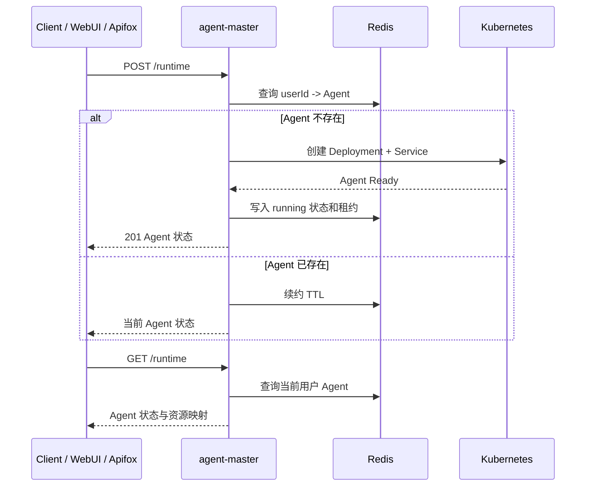
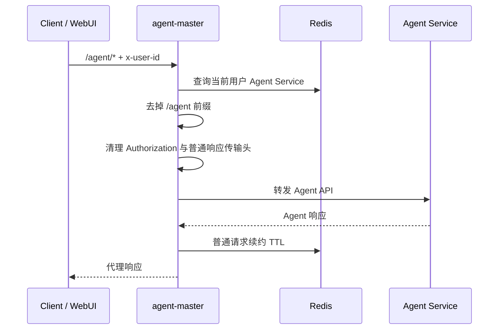
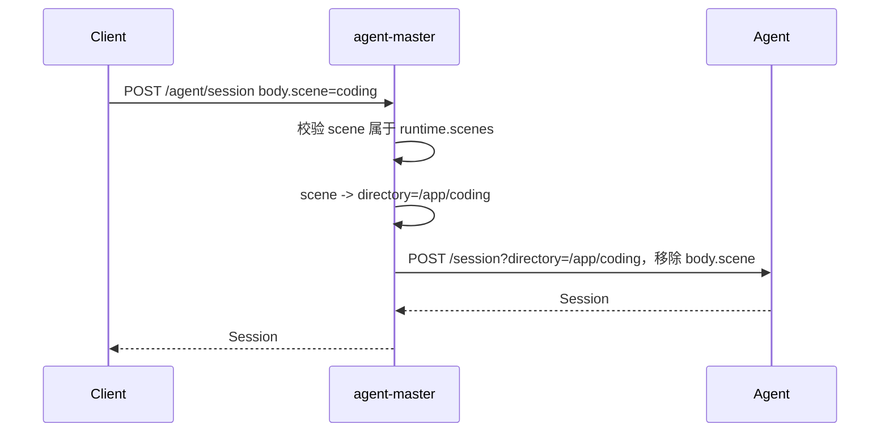
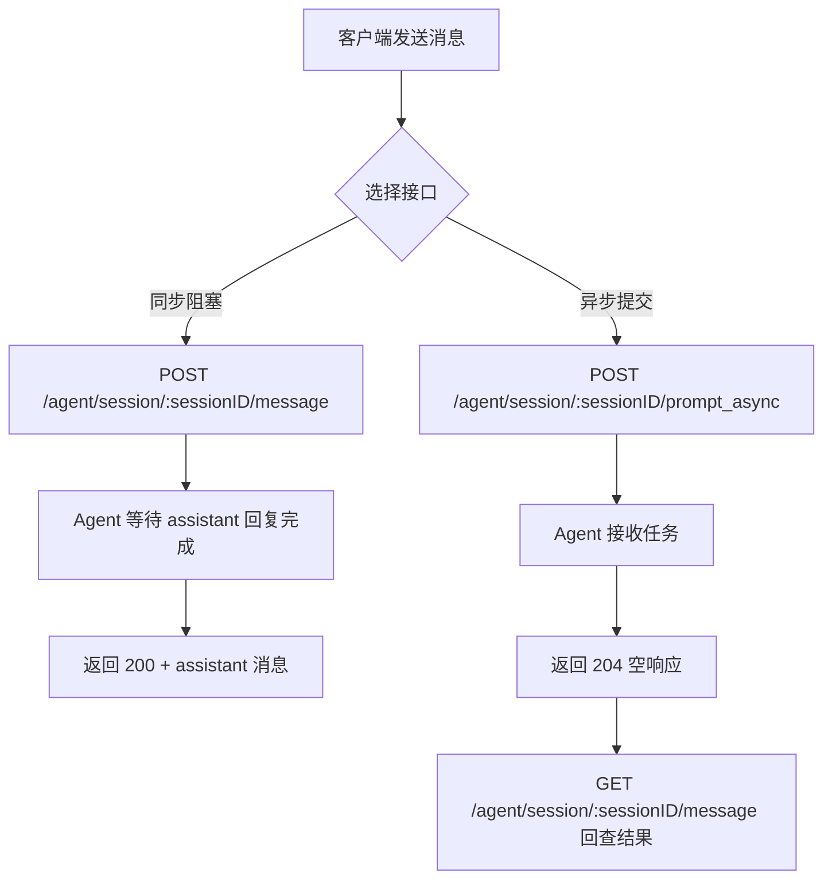
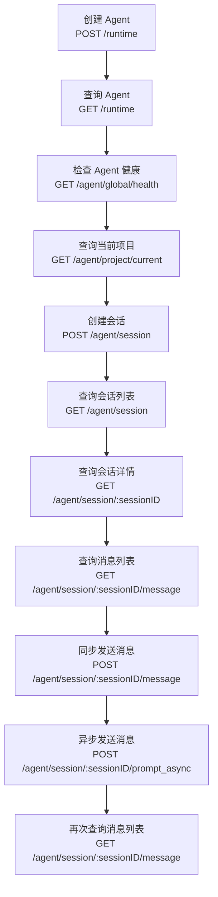

# agent-master API 文档

## 1. 通用约定

本文档定义 `agent-master` 对外接口、请求参数、响应结构和错误边界。示例中的 `{baseUrl}` 按部署环境替换；除健康检查外，接口默认要求上游注入 `x-user-id`。

### 1.1 通用 Header

| Header          | 必填 | 示例                  | 说明                                         |
| --------------- | -: | ------------------- | ------------------------------------------ |
| `x-user-id`     |  是 | `user-ref`          | 上游鉴权后注入的用户标识；除 `GET /health` 外默认必填。 |
| `Content-Type`  | 按需 | `application/json`  | 请求体为 JSON 时传入。                             |
| `Accept`        |  否 | `text/event-stream` | SSE 客户端可传入。                                |
| `Authorization` |  否 | `Bearer ...`        | 由上游处理；如请求携带，`agent-master` 不向 Agent 透传。  |

### 1.2 Agent API 代理规则

本文档只定义 gateway 对外可见的业务路径，不定义 gateway 前缀和转发规则。

路径分组：

1. `3.x` Agent 管理接口使用 `/runtime`。
2. `4.x` 至 `7.x` Agent 代理接口使用 `/agent/*`。

代理规则：

1. 基于 `x-user-id` 查询当前用户 Agent。
2. 只通过 Agent Service 转发，不直接访问 Pod IP。
3. `/agent/*` 去掉 `/agent` 代理前缀后转发到 Agent。
4. 保留 HTTP 方法、后续路径、查询参数和请求体。
5. `Authorization` 不透传到 Agent。
6. 普通 HTTP 代理请求会续约 Agent TTL。
7. Agent 原生 SSE 仍走 `/agent/*` 代理入口。

示例：

```http
GET /agent/session/{sessionID}/message
```

转发为：

```http
GET /session/{sessionID}/message
```

### 1.3 普通响应与 SSE 响应头

普通 HTTP 响应会被代理层读取并重新输出 body，因此不透传上游已失效的传输/编码头：

| Header              | 普通 HTTP        | SSE    |
| ------------------- | -------------- | ------ |
| `content-encoding`  | 移除             | 保留流式语义 |
| `content-length`    | 移除，由 HTTP 框架重算 | 保留流式语义 |
| `transfer-encoding` | 移除             | 保留流式语义 |

这样避免客户端出现 `incorrect header check` 或 `Invalid character in chunk size`。

## 2. 核心业务流程

### 2.1 Agent 创建与复用



### 2.2 Agent API 透明代理



### 2.3 会话创建与 scene 转换



### 2.4 同步消息与异步消息



### 2.5 推荐调用顺序



## 3. Agent 管理接口

### 3.1 健康检查

- **用途**：检查 `agent-master` 服务自身是否存活。
- **URL 定义**：`GET {baseUrl}/health`
- **请求方案**：普通 HTTP GET。
- **Header**：无必填 Header。
- **请求体**：无。
- **响应体**：状态码 `200`。

```json
{
  "status": "ok",
  "service": "agent-master"
}
```

### 3.2 创建或复用 Agent

- **用途**：为当前用户创建或复用 Agent。Agent 以 `x-user-id` 归属，不接受客户端传入 `runtimeId`。
- **URL 定义**：`POST {baseUrl}/runtime`
- **请求方案**：普通 HTTP POST。
- **Header**：

| Header         | 必填 | 示例                 | 说明         |
| -------------- | -: | ------------------ | ---------- |
| `x-user-id`    |  是 | `user-ref`         | 当前用户标识。    |
| `Content-Type` |  否 | `application/json` | 请求体为空时可不传。 |

- **请求体**：无，或空 JSON。

```json
{}
```

- **响应体**：新建 Agent 时状态码 `201`；复用已有 Agent 时状态码 `200`。

```json
{
  "runtimeId": "rt-000001",
  "userId": "user-ref",
  "status": "running",
  "cluster": "cluster-a",
  "namespace": "runtime-namespace",
  "deploymentName": "runtime-rt-000001",
  "serviceName": "runtime-rt-000001",
  "servicePort": 4096,
  "leaseExpireAt": "2026-06-15T07:30:00.000Z"
}
```

### 3.3 查询当前用户 Agent

- **用途**：查询当前用户 Agent 生命周期状态、租约和 Kubernetes 资源映射。
- **URL 定义**：`GET {baseUrl}/runtime`
- **请求方案**：普通 HTTP GET。
- **Header**：`x-user-id` 必填。
- **请求体**：无。
- **响应体**：状态码 `200`。

```json
{
  "runtimeId": "rt-000001",
  "userId": "user-ref",
  "status": "running",
  "cluster": "cluster-a",
  "namespace": "runtime-namespace",
  "deploymentName": "runtime-rt-000001",
  "serviceName": "runtime-rt-000001",
  "servicePort": 4096,
  "leaseExpireAt": "2026-06-15T07:30:00.000Z"
}
```

### 3.4 重启 Agent

- **用途**：重启当前用户 Agent，让 Agent 重新加载项目级配置、skills、tools、plugins 或运行时环境变更。
- **URL 定义**：`POST {baseUrl}/runtime/restart`
- **请求方案**：普通 HTTP POST。
- **Header**：`x-user-id` 必填；请求体为 JSON 时传 `Content-Type: application/json`。
- **请求体**：`reason` 可选。

```json
{
  "reason": "reload-runtime-config"
}
```

- **响应体**：状态码 `200`。

```json
{
  "runtimeId": "rt-000001",
  "userId": "user-ref",
  "status": "running",
  "deploymentName": "runtime-rt-000001",
  "serviceName": "runtime-rt-000001"
}
```

### 3.5 删除 Agent

- **用途**：关闭当前用户 Agent，删除对应 Deployment、Service 和 Redis 映射。
- **URL 定义**：`DELETE {baseUrl}/runtime`
- **请求方案**：普通 HTTP DELETE。
- **Header**：`x-user-id` 必填。
- **请求体**：无。
- **响应体**：状态码 `204`，响应体为空。

```text
<empty body>
```

### 3.6 调度事件 SSE

- **用途**：订阅当前用户 Agent 控制面事件，包括创建、调度、就绪、重启、回收、失败和心跳。该接口不是 Agent 原生事件流。
- **URL 定义**：`GET {baseUrl}/runtime/events`
- **请求方案**：SSE 长连接。
- **Header**：`x-user-id` 必填；`Accept: text/event-stream` 可选。
- **请求体**：无。
- **响应体**：状态码 `200`，`Content-Type: text/event-stream`。

```text
event: runtime.heartbeat
data: {"userId":"user-ref","runtimeId":"rt-000001","status":"running","time":"2026-06-15T06:30:00.000Z"}
```

## 4. 基础与会话接口代理

本节接口均为 Agent 代理接口，统一使用 `/agent/*` 路径；gateway 前缀和转发规则不在本文档中定义。

### 4.1 Agent 健康检查

- **用途**：检查当前用户 Agent 内 Agent Server 是否健康。
- **URL 定义**：`GET {baseUrl}/agent/global/health`
- **请求方案**：普通 HTTP GET；转发到 Agent `GET /global/health`。
- **Header**：`x-user-id` 必填。
- **请求体**：无。
- **响应体**：状态码 `200`。

```json
{
  "healthy": true,
  "version": "1.17.3"
}
```

### 4.2 查询当前 Agent 项目

- **用途**：查询当前 Agent 中 Agent Server 识别的当前项目。
- **URL 定义**：`GET {baseUrl}/agent/project/current`
- **请求方案**：普通 HTTP GET；转发到 Agent `GET /project/current`。
- **Header**：`x-user-id` 必填。
- **请求体**：无。
- **响应体**：状态码 `200`。

```json
{
  "id": "global"
}
```

### 4.3 获取 Agent OpenAPI 文档

- **用途**：获取 Agent 暴露的 Agent OpenAPI 规范，用于确认官方路径和请求体结构。
- **URL 定义**：`GET {baseUrl}/agent/doc`
- **请求方案**：普通 HTTP GET；转发到 Agent `GET /doc`。
- **Header**：`x-user-id` 必填。
- **请求体**：无。
- **响应体**：状态码 `200`，返回 OpenAPI JSON。

```json
{
  "openapi": "3.1.0",
  "paths": {
    "/session/{sessionID}/message": {
      "post": {
        "summary": "Send message"
      }
    }
  }
}
```

### 4.4 创建 Agent 会话

- **用途**：在当前用户 Agent 中创建 Agent 会话。`scene` 是 `agent-master` 扩展参数，用于选择预设场景目录。
- **URL 定义**：`POST {baseUrl}/agent/session`
- **请求方案**：普通 HTTP POST；代理转换为 `POST /session?directory=/app/{scene}`，并移除请求体中的 `scene`。
- **Header**：`x-user-id`、`Content-Type: application/json` 必填。
- **请求体**：

```json
{
  "scene": "coding",
  "title": "验收会话"
}
```

- **响应体**：状态码 `200`。

```json
{
  "id": "ses_136144a19ffehwVU9Oj8m5GsXm",
  "slug": "neon-star",
  "projectID": "global",
  "directory": "/app/coding",
  "path": "app/coding",
  "title": "验收会话",
  "version": "1.17.3",
  "time": {
    "created": 1781504128486,
    "updated": 1781504128486
  }
}
```

### 4.5 查询会话列表

- **用途**：查询当前 Agent 中的 Agent 会话列表。
- **URL 定义**：`GET {baseUrl}/agent/session`
- **请求方案**：普通 HTTP GET；转发到 Agent `GET /session`。
- **Header**：`x-user-id` 必填。
- **请求体**：无。
- **响应体**：状态码 `200`。

```json
[
  {
    "id": "ses_136144a19ffehwVU9Oj8m5GsXm",
    "slug": "neon-star",
    "projectID": "global",
    "directory": "/app/coding",
    "path": "app/coding",
    "title": "验收会话",
    "version": "1.17.3"
  }
]
```

### 4.6 查询会话详情

- **用途**：查询指定 Agent 会话详情。
- **URL 定义**：`GET {baseUrl}/agent/session/{sessionID}`
- **请求方案**：普通 HTTP GET；转发到 Agent `GET /session/{sessionID}`。
- **Header**：`x-user-id` 必填。
- **Path 参数**：`sessionID` 为会话 ID，如 `ses_136144a19ffehwVU9Oj8m5GsXm`。
- **Query 参数**：无。
- **请求体**：无。
- **响应体**：状态码 `200`。

```json
{
  "id": "ses_136144a19ffehwVU9Oj8m5GsXm",
  "slug": "neon-star",
  "projectID": "global",
  "directory": "/app/coding",
  "path": "app/coding",
  "title": "验收会话",
  "version": "1.17.3"
}
```

### 4.7 删除会话

- **用途**：删除指定 Agent 会话及其数据。
- **URL 定义**：`DELETE {baseUrl}/agent/session/{sessionID}`
- **请求方案**：普通 HTTP DELETE；转发到 Agent `DELETE /session/{sessionID}`。
- **Header**：`x-user-id` 必填。
- **Path 参数**：`sessionID` 为会话 ID。
- **Query 参数**：无。
- **请求体**：无。
- **响应体**：状态码以 Agent 实际返回为准，成功时通常返回删除结果或空响应。

```json
{
  "success": true
}
```

## 5. 消息处理接口代理

本节接口均为 Agent 代理接口，统一使用 `/agent/*` 路径；gateway 前缀和转发规则不在本文档中定义。

### 5.1 查询会话消息列表

- **用途**：查询指定会话的历史消息。同步消息完成后会立即可见；异步消息返回 `204` 后，可通过该接口回查执行结果。
- **URL 定义**：`GET {baseUrl}/agent/session/{sessionID}/message`
- **请求方案**：普通 HTTP GET；转发到 Agent `GET /session/{sessionID}/message`。
- **Header**：`x-user-id` 必填。
- **Path 参数**：`sessionID` 为会话 ID。
- **Query 参数**：无。
- **请求体**：无。
- **响应体**：状态码 `200`。

```json
[
  {
    "info": {
      "id": "msg_user_example",
      "sessionID": "ses_136144a19ffehwVU9Oj8m5GsXm",
      "role": "user",
      "time": {
        "created": 1781506601637
      },
      "agent": "build",
      "model": {
        "providerID": "runtime",
        "modelID": "big-pickle"
      }
    },
    "parts": [
      {
        "id": "prt_user_text_example",
        "sessionID": "ses_136144a19ffehwVU9Oj8m5GsXm",
        "messageID": "msg_user_example",
        "type": "text",
        "text": "请异步回复：runtime-namespace async 接口验收成功。"
      }
    ]
  },
  {
    "info": {
      "id": "msg_assistant_example",
      "sessionID": "ses_136144a19ffehwVU9Oj8m5GsXm",
      "role": "assistant",
      "parentID": "msg_user_example",
      "modelID": "big-pickle",
      "providerID": "runtime",
      "finish": "stop"
    },
    "parts": [
      {
        "id": "prt_assistant_text_example",
        "sessionID": "ses_136144a19ffehwVU9Oj8m5GsXm",
        "messageID": "msg_assistant_example",
        "type": "text",
        "text": "runtime-namespace async 接口验收成功。"
      }
    ]
  }
]
```

### 5.2 同步发送消息

- **用途**：向指定会话发送消息，并等待 assistant 回复完成后返回完整结果。
- **URL 定义**：`POST {baseUrl}/agent/session/{sessionID}/message`
- **请求方案**：同步阻塞式普通 HTTP POST；转发到 Agent `POST /session/{sessionID}/message`。
- **Header**：`x-user-id`、`Content-Type: application/json` 必填。
- **Path 参数**：`sessionID` 为会话 ID。
- **Query 参数**：无。
- **请求体**：`parts` 必填，文本消息使用 `type=text`。

```json
{
  "parts": [
    {
      "type": "text",
      "text": "请回复：runtime-namespace 接口验收成功。"
    }
  ]
}
```

可选字段以 Agent `/doc` 为准，包括 `messageID`、`model`、`agent`、`noReply`、`tools`、`format`、`system`、`variant` 等。

- **响应体**：状态码 `200`，返回 assistant 消息。

```json
{
  "info": {
    "id": "msg_eca0e96c3001dD8ouO3eCIyI7y",
    "sessionID": "ses_136144a19ffehwVU9Oj8m5GsXm",
    "role": "assistant",
    "parentID": "msg_eca0e96ad001Jygo8GNii235Hz",
    "modelID": "big-pickle",
    "providerID": "runtime",
    "finish": "stop"
  },
  "parts": [
    {
      "type": "text",
      "text": "runtime-namespace 接口验收成功。"
    }
  ]
}
```

### 5.3 异步发送消息

- **用途**：向指定会话提交消息任务，不等待 assistant 回复完成。
- **URL 定义**：`POST {baseUrl}/agent/session/{sessionID}/prompt_async`
- **请求方案**：异步普通 HTTP POST；转发到 Agent `POST /session/{sessionID}/prompt_async`。
- **Header**：`x-user-id`、`Content-Type: application/json` 必填。
- **Path 参数**：`sessionID` 为会话 ID。
- **Query 参数**：无。
- **请求体**：与同步发送消息一致，`parts` 必填。

```json
{
  "parts": [
    {
      "type": "text",
      "text": "请异步回复：runtime-namespace async 接口验收成功。"
    }
  ]
}
```

- **响应体**：状态码 `204`，响应体为空。

```text
<empty body>
```

### 5.4 查询单条消息

- **用途**：查询指定会话中的单条消息。
- **URL 定义**：`GET {baseUrl}/agent/session/{sessionID}/message/{messageID}`
- **请求方案**：普通 HTTP GET；转发到 Agent `GET /session/{sessionID}/message/{messageID}`。
- **Header**：`x-user-id` 必填。
- **Path 参数**：`sessionID` 为会话 ID，`messageID` 为消息 ID。
- **Query 参数**：无。
- **请求体**：无。
- **响应体**：状态码 `200`。

```json
{
  "info": {
    "id": "msg_assistant_example",
    "sessionID": "ses_136144a19ffehwVU9Oj8m5GsXm",
    "role": "assistant"
  },
  "parts": [
    {
      "type": "text",
      "text": "runtime-namespace 接口验收成功。"
    }
  ]
}
```

### 5.5 中断会话运行

- **用途**：中断指定会话当前正在运行的任务。
- **URL 定义**：`POST {baseUrl}/agent/session/{sessionID}/abort`
- **请求方案**：普通 HTTP POST；转发到 Agent `POST /session/{sessionID}/abort`。
- **Header**：`x-user-id` 必填。
- **Path 参数**：`sessionID` 为会话 ID。
- **Query 参数**：无。
- **请求体**：无或 `{}`。
- **响应体**：状态码以 Agent 实际返回为准。

```json
{
  "success": true
}
```

### 5.6 执行命令

- **用途**：在指定会话中执行 Agent slash command。
- **URL 定义**：`POST {baseUrl}/agent/session/{sessionID}/command`
- **请求方案**：普通 HTTP POST；转发到 Agent `POST /session/{sessionID}/command`。
- **Header**：`x-user-id`、`Content-Type: application/json` 必填。
- **Path 参数**：`sessionID` 为会话 ID。
- **Query 参数**：无。
- **请求体**：以 Agent `/doc` 为准，通常包含命令名称和参数。

```json
{
  "name": "help",
  "arguments": ""
}
```

- **响应体**：状态码以 Agent 实际返回为准。

```json
{
  "success": true
}
```

### 5.7 执行 Shell

- **用途**：在指定会话中执行 shell command。
- **URL 定义**：`POST {baseUrl}/agent/session/{sessionID}/shell`
- **请求方案**：普通 HTTP POST；转发到 Agent `POST /session/{sessionID}/shell`。
- **Header**：`x-user-id`、`Content-Type: application/json` 必填。
- **Path 参数**：`sessionID` 为会话 ID。
- **Query 参数**：无。
- **请求体**：以 Agent `/doc` 为准。

```json
{
  "command": "pwd"
}
```

- **响应体**：状态码以 Agent 实际返回为准。

```json
{
  "output": "/app/coding"
}
```

## 6. 事件与文件接口代理

本节接口均为 Agent 代理接口，统一使用 `/agent/*` 路径；gateway 前缀和转发规则不在本文档中定义。

### 6.1 Agent 全局事件 SSE

- **用途**：订阅 Agent 全局事件流。
- **URL 定义**：`GET {baseUrl}/agent/global/event`
- **请求方案**：SSE 长连接；转发到 Agent `GET /global/event`。
- **Header**：`x-user-id` 必填；`Accept: text/event-stream` 可选。
- **请求体**：无。
- **响应体**：状态码 `200`，`Content-Type: text/event-stream`。

```text
event: server.connected
data: {"type":"server.connected"}
```

### 6.2 Agent 目录事件 SSE

- **用途**：订阅指定 directory / workspace 相关 Agent 事件。
- **URL 定义**：`GET {baseUrl}/agent/event`
- **请求方案**：SSE 长连接；转发到 Agent `GET /event`，并携带 `directory` Query 参数。
- **Header**：`x-user-id` 必填；`Accept: text/event-stream` 可选。
- **Query 参数**：

| Query       | 必填 | 示例            | 说明            |
| ----------- | -: | ------------- | ------------- |
| `directory` |  否 | `/app/coding` | Agent 会话目录。 |

- **请求体**：无。
- **响应体**：状态码 `200`，`Content-Type: text/event-stream`。

```text
event: session.updated
data: {"sessionID":"ses_136144a19ffehwVU9Oj8m5GsXm"}
```

### 6.3 查询文件目录

- **用途**：查询 Agent 工作目录内的文件列表。
- **URL 定义**：`GET {baseUrl}/agent/file`
- **请求方案**：普通 HTTP GET；转发到 Agent `GET /file`，并携带 `path` Query 参数。
- **Header**：`x-user-id` 必填。
- **Query 参数**：

| Query  | 必填 | 示例            | 说明           |
| ------ | -: | ------------- | ------------ |
| `path` |  是 | `/app/coding` | 要查询的文件或目录路径。 |

- **请求体**：无。
- **响应体**：状态码 `200`。

```json
[
  {
    "name": "AGENTS.md",
    "path": "/app/coding/AGENTS.md",
    "type": "file"
  }
]
```

### 6.4 查询文件内容

- **用途**：读取 Agent 工作目录内指定文件内容。
- **URL 定义**：`GET {baseUrl}/agent/file/content`
- **请求方案**：普通 HTTP GET；转发到 Agent `GET /file/content`，并携带 `path` Query 参数。
- **Header**：`x-user-id` 必填。
- **Query 参数**：

| Query  | 必填 | 示例                      | 说明    |
| ------ | -: | ----------------------- | ----- |
| `path` |  是 | `/app/coding/AGENTS.md` | 文件路径。 |

- **请求体**：无。
- **响应体**：状态码 `200`。

```json
{
  "type": "text",
  "content": "# AGENTS.md\n..."
}
```

### 6.5 查询文件状态

- **用途**：查询 Agent 当前工作目录的文件状态。
- **URL 定义**：`GET {baseUrl}/agent/file/status`
- **请求方案**：普通 HTTP GET；转发到 Agent `GET /file/status`。
- **Header**：`x-user-id` 必填。
- **请求体**：无。
- **响应体**：状态码 `200`。

```json
[
  {
    "file": "README.md",
    "status": "modified"
  }
]
```

### 6.6 查询 Agent 列表

- **用途**：查询当前 Agent 实例内可用的 OpenCode agents。
- **URL 定义**：`GET {baseUrl}/agent/agent`
- **请求方案**：普通 HTTP GET；转发到 Agent `GET /agent`。
- **Header**：`x-user-id` 必填。
- **请求体**：无。
- **响应体**：状态码 `200`。

```json
[
  {
    "name": "build",
    "mode": "primary"
  }
]
```

## 7. 配置管理接口代理

本节接口均为 Agent 代理接口，统一使用 `/agent/*` 路径；gateway 前缀和转发规则不在本文档中定义。涉及 Provider 凭证时只能使用占位符，不得在文档、日志或公开材料中写入真实密钥、Token 或 Cookie。

### 7.1 查询 Provider 与模型列表

- **用途**：查询当前 Agent 可用的模型服务商及模型清单。
- **URL 定义**：`GET {baseUrl}/agent/provider`
- **请求方案**：普通 HTTP GET；转发到 Agent `GET /provider`。
- **Header**：`x-user-id` 必填。
- **Query 参数**：

| Query       | 必填 | 示例            | 说明            |
| ----------- | -: | ------------- | ------------- |
| `directory` |  否 | `/app/coding` | Agent 工作目录。 |
| `workspace` |  否 | `global`      | Agent workspace。 |

- **请求体**：无。
- **响应体**：状态码 `200`。

```json
{
  "all": [
    {
      "id": "requesty",
      "name": "Requesty",
      "models": {
        "google/gemini-2.5-flash": {
          "id": "google/gemini-2.5-flash",
          "providerID": "requesty",
          "name": "Gemini 2.5 Flash"
        }
      }
    }
  ]
}
```

### 7.2 查询 Provider 鉴权方式

- **用途**：查询 Agent 支持的 Provider 鉴权方式，用于前端展示 API Key、OAuth 等配置入口。
- **URL 定义**：`GET {baseUrl}/agent/provider/auth`
- **请求方案**：普通 HTTP GET；转发到 Agent `GET /provider/auth`。
- **Header**：`x-user-id` 必填。
- **Query 参数**：

| Query       | 必填 | 示例            | 说明            |
| ----------- | -: | ------------- | ------------- |
| `directory` |  否 | `/app/coding` | Agent 工作目录。 |
| `workspace` |  否 | `global`      | Agent workspace。 |

- **请求体**：无。
- **响应体**：状态码 `200`。

```json
[
  {
    "id": "requesty",
    "methods": [
      {
        "type": "api",
        "key": "REQUESTY_API_KEY"
      }
    ]
  }
]
```

### 7.3 查询当前配置

- **用途**：查询当前目录合并后的 Agent OpenCode 配置。
- **URL 定义**：`GET {baseUrl}/agent/config`
- **请求方案**：普通 HTTP GET；转发到 Agent `GET /config`。
- **Header**：`x-user-id` 必填。
- **Query 参数**：

| Query       | 必填 | 示例            | 说明            |
| ----------- | -: | ------------- | ------------- |
| `directory` |  否 | `/app/coding` | Agent 工作目录。 |
| `workspace` |  否 | `global`      | Agent workspace。 |

- **请求体**：无。
- **响应体**：状态码 `200`。

```json
{
  "$schema": "https://opencode.ai/config.json",
  "model": "requesty/google/gemini-2.5-flash",
  "small_model": "requesty/google/gemini-2.5-flash",
  "agent": {}
}
```

### 7.4 更新当前配置

- **用途**：更新当前目录 Agent OpenCode 配置，可用于切换默认模型、默认 agent、技能路径等。
- **URL 定义**：`PATCH {baseUrl}/agent/config`
- **请求方案**：普通 HTTP PATCH；转发到 Agent `PATCH /config`。
- **Header**：`x-user-id`、`Content-Type: application/json` 必填。
- **Query 参数**：

| Query       | 必填 | 示例            | 说明            |
| ----------- | -: | ------------- | ------------- |
| `directory` |  否 | `/app/coding` | Agent 工作目录。 |
| `workspace` |  否 | `global`      | Agent workspace。 |

- **请求体**：以 Agent `/doc` 的 `Config` schema 为准。配置变更不会保存真实密钥。

```json
{
  "model": "requesty/google/gemini-2.5-flash",
  "small_model": "requesty/google/gemini-2.5-flash"
}
```

- **响应体**：状态码 `200`。

```json
{
  "model": "requesty/google/gemini-2.5-flash",
  "small_model": "requesty/google/gemini-2.5-flash"
}
```

### 7.5 查询全局配置

- **用途**：查询 Agent 全局 OpenCode 配置。
- **URL 定义**：`GET {baseUrl}/agent/global/config`
- **请求方案**：普通 HTTP GET；转发到 Agent `GET /global/config`。
- **Header**：`x-user-id` 必填。
- **请求体**：无。
- **响应体**：状态码 `200`。

```json
{
  "$schema": "https://opencode.ai/config.json",
  "username": "unknown"
}
```

### 7.6 更新全局配置

- **用途**：更新 Agent 全局 OpenCode 配置。生产环境应谨慎开放该接口，避免越权修改全局默认模型、Provider、插件和权限策略。
- **URL 定义**：`PATCH {baseUrl}/agent/global/config`
- **请求方案**：普通 HTTP PATCH；转发到 Agent `PATCH /global/config`。
- **Header**：`x-user-id`、`Content-Type: application/json` 必填。
- **请求体**：以 Agent `/doc` 的 `Config` schema 为准。不得包含真实 API Key、Token 或 Cookie。

```json
{
  "model": "requesty/google/gemini-2.5-flash"
}
```

- **响应体**：状态码 `200`。

```json
{
  "model": "requesty/google/gemini-2.5-flash"
}
```

### 7.7 查询 Skill 列表

- **用途**：查询 Agent 当前可用 skills。
- **URL 定义**：`GET {baseUrl}/agent/skill`
- **请求方案**：普通 HTTP GET；转发到 Agent `GET /skill`。
- **Header**：`x-user-id` 必填。
- **Query 参数**：

| Query       | 必填 | 示例            | 说明            |
| ----------- | -: | ------------- | ------------- |
| `directory` |  否 | `/app/coding` | Agent 工作目录。 |

> 验收记录：OpenCode Agent `/skill` 携带 `workspace=global` 时会返回 `500 UnknownError`，本接口不要传 `workspace`。

- **请求体**：无。
- **响应体**：状态码 `200`。

```json
[
  {
    "name": "customize-opencode",
    "description": "Use ONLY when the user is editing or creating opencode's own configuration...",
    "location": "<built-in>"
  }
]
```

### 7.8 设置 Provider 凭证

- **用途**：为指定 Provider 设置 Agent 鉴权凭证。
- **URL 定义**：`PUT {baseUrl}/agent/auth/{providerID}`
- **请求方案**：普通 HTTP PUT；转发到 Agent `PUT /auth/{providerID}`。
- **Header**：`x-user-id`、`Content-Type: application/json` 必填。
- **Path 参数**：`providerID` 为 Provider ID，如 `requesty`。
- **Query 参数**：无。
- **请求体**：以 Agent `/doc` 的 `Auth` schema 为准。示例仅使用占位符，不得在文档、日志或公开材料中写入真实密钥。

```json
{
  "type": "api",
  "key": "REQUESTY_API_KEY",
  "value": "${REQUESTY_API_KEY}"
}
```

- **响应体**：状态码以 Agent 实际返回为准。

### 7.9 删除 Provider 凭证

- **用途**：删除指定 Provider 的 Agent 鉴权凭证。
- **URL 定义**：`DELETE {baseUrl}/agent/auth/{providerID}`
- **请求方案**：普通 HTTP DELETE；转发到 Agent `DELETE /auth/{providerID}`。
- **Header**：`x-user-id` 必填。
- **Path 参数**：`providerID` 为 Provider ID，如 `requesty`。
- **Query 参数**：无。
- **请求体**：无。
- **响应体**：状态码以 Agent 实际返回为准。

