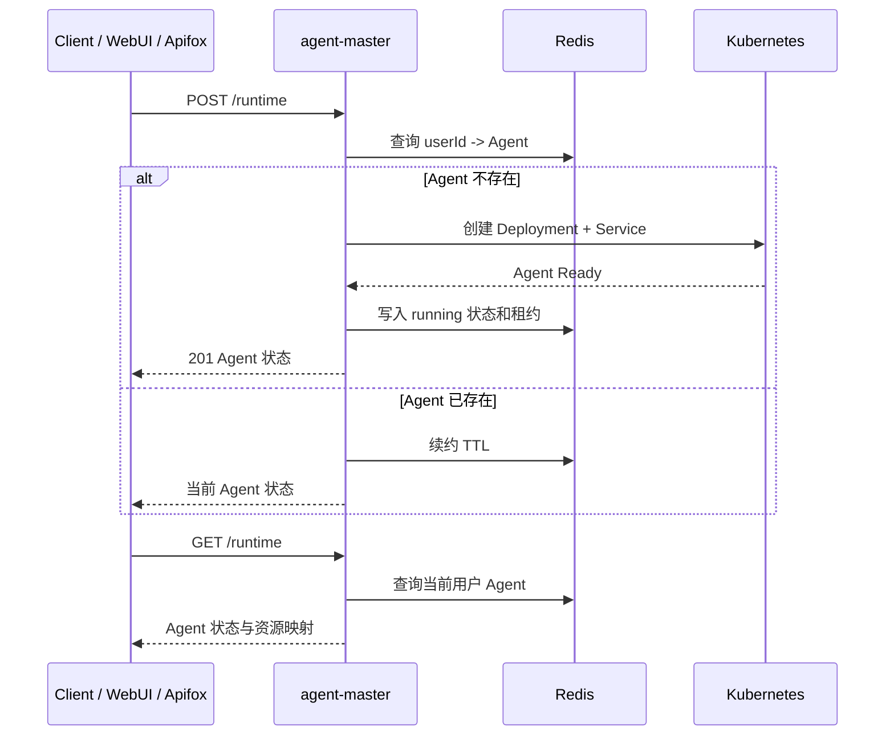
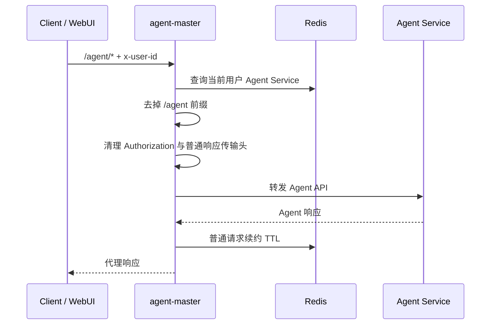
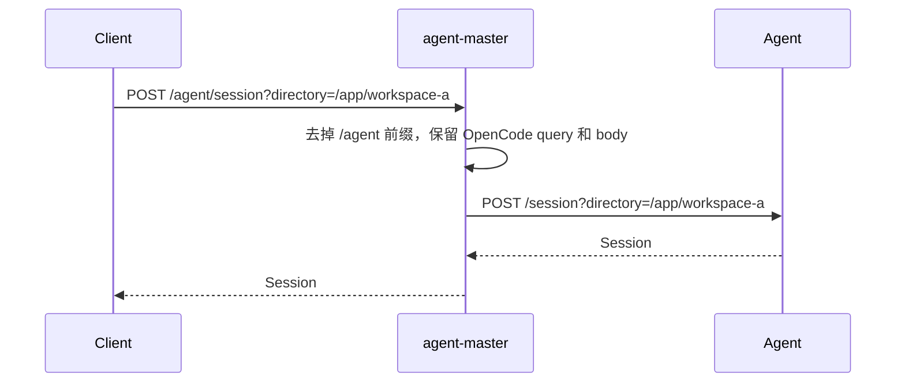
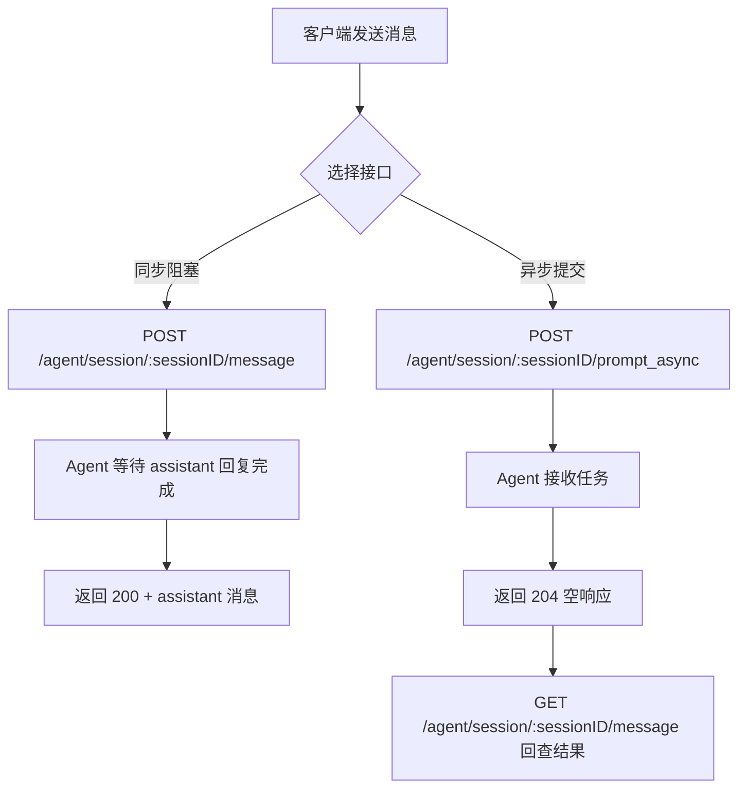
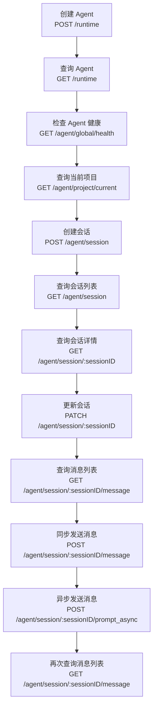

# agent-master API 文档

## 1. 通用约定

本文档定义 `agent-master` 对外接口、请求参数、响应结构和错误边界。示例中的 `{baseUrl}` 按部署环境替换；除健康检查外，接口默认要求上游注入 `x-user-id`。

### 1.1 通用 Header

| Header          | 必填 | 示例                  | 说明                                         |
| --------------- | -: | ------------------- | ------------------------------------------ |
| `x-user-id`     |  是 | `user-ref`          | 上游鉴权后注入的用户标识；除 `GET /health` 外默认必填。 |
| `Content-Type`  | 按需 | `application/json`  | 请求体为 JSON 时传入。                             |
| `Accept`        |  否 | `text/event-stream` | SSE 客户端可传入。                                |
| `Authorization` |  否 | `Bearer ...`        | 由上游处理；如请求携带，`agent-master` 不向 Agent 透传。  |

### 1.2 Agent API 代理规则

本文档只定义 gateway 对外可见的业务路径，不定义 gateway 前缀和转发规则。

路径分组：

1. `3.x` Agent 管理接口使用 `/runtime`。
2. `4.x` 至 `7.x` Agent 代理接口使用 `/agent/*`。

代理规则：

1. 基于 `x-user-id` 查询当前用户 Agent。
2. 只通过 Agent Service 转发，不直接访问 Pod IP。
3. `/agent/*` 去掉 `/agent` 代理前缀后转发到 Agent。
4. 保留 HTTP 方法、后续路径、查询参数和请求体。
5. `Authorization` 不透传到 Agent。
6. 普通 HTTP 代理请求会续约 Agent TTL。
7. Agent 原生 SSE 仍走 `/agent/*` 代理入口。

示例：

```http
GET /agent/session/{sessionID}/message
```

转发为：

```http
GET /session/{sessionID}/message
```

### 1.3 普通响应与 SSE 响应头

普通 HTTP 响应会被代理层读取并重新输出 body，因此不透传上游已失效的传输/编码头：

| Header              | 普通 HTTP        | SSE    |
| ------------------- | -------------- | ------ |
| `content-encoding`  | 移除             | 保留流式语义 |
| `content-length`    | 移除，由 HTTP 框架重算 | 保留流式语义 |
| `transfer-encoding` | 移除             | 保留流式语义 |

这样避免客户端出现 `incorrect header check` 或 `Invalid character in chunk size`。

## 2. 核心业务流程

### 2.1 Agent 创建与复用



### 2.2 Agent API 透明代理



### 2.3 会话创建与 directory 透明透传



`directory` 是 OpenCode 官方 query 参数，由调用方显式传入。`agent-master` 不读取请求体 `scene`，也不做 `scene -> directory` 转换。

### 2.4 同步消息与异步消息



### 2.5 推荐调用顺序



## 3. Agent 管理接口

### 3.1 健康检查

- **用途**：检查 `agent-master` 服务自身是否存活。
- **URL 定义**：`GET {baseUrl}/health`
- **请求方案**：普通 HTTP GET。
- **Header**：无必填 Header。
- **请求体**：无。
- **响应体**：状态码 `200`。

```json
{
  "status": "ok",
  "service": "agent-master"
}
```

### 3.2 创建或复用 Agent

- **用途**：为当前用户创建或复用 Agent。Agent 以 `x-user-id` 归属，不接受客户端传入 `runtimeId`。
- **URL 定义**：`POST {baseUrl}/runtime`
- **请求方案**：普通 HTTP POST。
- **Header**：

| Header         | 必填 | 示例                 | 说明         |
| -------------- | -: | ------------------ | ---------- |
| `x-user-id`    |  是 | `user-ref`         | 当前用户标识。    |
| `Content-Type` |  否 | `application/json` | 请求体为空时可不传。 |

- **请求体**：无，或空 JSON。

```json
{}
```

- **响应体**：新建 Agent 时状态码 `201`；复用已有 Agent 时状态码 `200`。

```json
{
  "runtimeId": "rt-000001",
  "userId": "user-ref",
  "status": "running",
  "cluster": "cluster-a",
  "namespace": "runtime-namespace",
  "deploymentName": "runtime-rt-000001",
  "serviceName": "runtime-rt-000001",
  "servicePort": 4096,
  "leaseExpireAt": "2026-06-15T07:30:00.000Z"
}
```

### 3.3 查询当前用户 Agent

- **用途**：查询当前用户 Agent 生命周期状态、租约和 Kubernetes 资源映射。
- **URL 定义**：`GET {baseUrl}/runtime`
- **请求方案**：普通 HTTP GET。
- **Header**：`x-user-id` 必填。
- **请求体**：无。
- **响应体**：状态码 `200`。

```json
{
  "runtimeId": "rt-000001",
  "userId": "user-ref",
  "status": "running",
  "cluster": "cluster-a",
  "namespace": "runtime-namespace",
  "deploymentName": "runtime-rt-000001",
  "serviceName": "runtime-rt-000001",
  "servicePort": 4096,
  "leaseExpireAt": "2026-06-15T07:30:00.000Z"
}
```

### 3.4 重启 Agent

- **用途**：重启当前用户 Agent，让 Agent 重新加载项目级配置、skills、tools、plugins 或运行时环境变更。
- **URL 定义**：`POST {baseUrl}/runtime/restart`
- **请求方案**：普通 HTTP POST。
- **Header**：`x-user-id` 必填；请求体为 JSON 时传 `Content-Type: application/json`。
- **请求体**：`reason` 可选。

```json
{
  "reason": "reload-runtime-config"
}
```

- **响应体**：状态码 `200`。

```json
{
  "runtimeId": "rt-000001",
  "userId": "user-ref",
  "status": "running",
  "deploymentName": "runtime-rt-000001",
  "serviceName": "runtime-rt-000001"
}
```

### 3.5 删除 Agent

- **用途**：关闭当前用户 Agent，删除对应 Deployment、Service 和 Redis 映射。
- **URL 定义**：`DELETE {baseUrl}/runtime`
- **请求方案**：普通 HTTP DELETE。
- **Header**：`x-user-id` 必填。
- **请求体**：无。
- **响应体**：状态码 `204`，响应体为空。

```text
<empty body>
```

### 3.6 调度事件 SSE

- **用途**：订阅当前用户 Agent 控制面事件，包括创建、调度、就绪、重启、回收、失败和心跳。该接口不是 Agent 原生事件流。
- **URL 定义**：`GET {baseUrl}/runtime/events`
- **请求方案**：SSE 长连接。
- **Header**：`x-user-id` 必填；`Accept: text/event-stream` 可选。
- **请求体**：无。
- **响应体**：状态码 `200`，`Content-Type: text/event-stream`。

```text
event: runtime.heartbeat
data: {"userId":"user-ref","runtimeId":"rt-000001","status":"running","time":"2026-06-15T06:30:00.000Z"}
```

## 4. 基础与会话接口代理

本节接口均为 Agent 代理接口，统一使用 `/agent/*` 路径；gateway 前缀和转发规则不在本文档中定义。

### 4.1 Agent 健康检查

- **用途**：检查当前用户 Agent 内 Agent Server 是否健康。
- **URL 定义**：`GET {baseUrl}/agent/global/health`
- **请求方案**：普通 HTTP GET；转发到 Agent `GET /global/health`。
- **Header**：`x-user-id` 必填。
- **请求体**：无。
- **响应体**：状态码 `200`。

```json
{
  "healthy": true,
  "version": "1.17.3"
}
```

### 4.2 查询当前 Agent 项目

- **用途**：查询当前 Agent 中 Agent Server 识别的当前项目。
- **URL 定义**：`GET {baseUrl}/agent/project/current`
- **请求方案**：普通 HTTP GET；转发到 Agent `GET /project/current`。
- **Header**：`x-user-id` 必填。
- **请求体**：无。
- **响应体**：状态码 `200`。

```json
{
  "id": "global"
}
```

### 4.3 获取 Agent OpenAPI 文档

- **用途**：获取 Agent 暴露的 Agent OpenAPI 规范，用于确认官方路径和请求体结构。
- **URL 定义**：`GET {baseUrl}/agent/doc`
- **请求方案**：普通 HTTP GET；转发到 Agent `GET /doc`。
- **Header**：`x-user-id` 必填。
- **请求体**：无。
- **响应体**：状态码 `200`，返回 OpenAPI JSON。

```json
{
  "openapi": "3.1.0",
  "paths": {
    "/session/{sessionID}/message": {
      "post": {
        "summary": "Send message"
      }
    }
  }
}
```

### 4.4 创建 Agent 会话

- **用途**：在当前用户 Agent 中创建 Agent 会话。`directory` 是 OpenCode 官方 query 参数，由调用方显式传入。
- **URL 定义**：`POST {baseUrl}/agent/session`
- **请求方案**：普通 HTTP POST；代理透明转发为 `POST /session`，保留 `directory` query、请求体和其它 OpenCode 官方参数。
- **Header**：`x-user-id`、`Content-Type: application/json` 必填。
- **Query 参数**：

| Query | 必填 | 示例 | 说明 |
|---|---:|---|---|
| `directory` | 否 | `/app/workspace-a` | OpenCode 会话目录；由调用方显式传入，`agent-master` 不根据 `scene` 推导。 |

- **请求体**：

```json
{
  "title": "验收会话"
}
```

- **响应体**：状态码 `200`。

```json
{
  "id": "ses_136144a19ffehwVU9Oj8m5GsXm",
  "slug": "neon-star",
  "projectID": "global",
  "directory": "/app/workspace-a",
  "path": "app/workspace-a",
  "title": "验收会话",
  "version": "1.17.3",
  "time": {
    "created": 1781504128486,
    "updated": 1781504128486
  }
}
```

### 4.5 查询会话列表

- **用途**：查询当前 Agent 中的 Agent 会话列表。
- **URL 定义**：`GET {baseUrl}/agent/session`
- **请求方案**：普通 HTTP GET；转发到 Agent `GET /session`。
- **Header**：`x-user-id` 必填。
- **请求体**：无。
- **响应体**：状态码 `200`。

```json
[
  {
    "id": "ses_136144a19ffehwVU9Oj8m5GsXm",
    "slug": "neon-star",
    "projectID": "global",
    "directory": "/app/coding",
    "path": "app/coding",
    "title": "验收会话",
    "version": "1.17.3"
  }
]
```

### 4.6 查询会话详情

- **用途**：查询指定 Agent 会话详情。
- **URL 定义**：`GET {baseUrl}/agent/session/{sessionID}`
- **请求方案**：普通 HTTP GET；转发到 Agent `GET /session/{sessionID}`。
- **Header**：`x-user-id` 必填。
- **Path 参数**：`sessionID` 为会话 ID，如 `ses_136144a19ffehwVU9Oj8m5GsXm`。
- **Query 参数**：无。
- **请求体**：无。
- **响应体**：状态码 `200`。

```json
{
  "id": "ses_136144a19ffehwVU9Oj8m5GsXm",
  "slug": "neon-star",
  "projectID": "global",
  "directory": "/app/workspace-a",
  "path": "app/workspace-a",
  "title": "验收会话",
  "version": "1.17.3"
}
```

### 4.7 更新会话

- **用途**：更新指定 Agent 会话的属性，例如标题、元数据、权限规则、归档时间。常用场景是修改会话标题。
- **URL 定义**：`PATCH {baseUrl}/agent/session/{sessionID}`
- **请求方案**：普通 HTTP PATCH；转发到 Agent `PATCH /session/{sessionID}`。
- **Header**：`x-user-id`、`Content-Type: application/json` 必填。
- **Path 参数**：`sessionID` 为会话 ID。
- **Query 参数**：

| Query | 必填 | 示例 | 说明 |
|---|---:|---|---|
| `directory` | 否 | `/app/workspace-a` | OpenCode 会话目录；按 OpenCode 官方语义透明透传。 |
| `workspace` | 否 | `global` | OpenCode workspace；按 OpenCode 官方语义透明透传。 |

- **请求体**：以 Agent `/doc` 的 Session 更新 schema 为准，按需传一个或多个字段。

| 字段 | 类型 | 必填 | 说明 |
|---|---|---:|---|
| `title` | string | 否 | 会话标题。 |
| `metadata` | object | 否 | 会话元数据。 |
| `permission` | object | 否 | 会话权限规则，结构以 OpenCode `PermissionRuleset` 为准。 |
| `time.archived` | number | 否 | 归档时间戳（毫秒）。 |

```json
{
  "title": "修改后的会话标题"
}
```

- **响应体**：状态码 `200`，返回更新后的 `Session` 对象。

```json
{
  "id": "ses_136144a19ffehwVU9Oj8m5GsXm",
  "slug": "neon-star",
  "projectID": "global",
  "directory": "/app/workspace-a",
  "path": "app/workspace-a",
  "title": "修改后的会话标题",
  "version": "1.17.3",
  "time": {
    "created": 1781504128486,
    "updated": 1781504128486
  }
}
```

### 4.8 删除会话

- **用途**：删除指定 Agent 会话及其数据。
- **URL 定义**：`DELETE {baseUrl}/agent/session/{sessionID}`
- **请求方案**：普通 HTTP DELETE；转发到 Agent `DELETE /session/{sessionID}`。
- **Header**：`x-user-id` 必填。
- **Path 参数**：`sessionID` 为会话 ID。
- **Query 参数**：无。
- **请求体**：无。
- **响应体**：状态码以 Agent 实际返回为准，成功时通常返回删除结果或空响应。

```json
{
  "success": true
}
```

### 4.9 查询会话运行状态

- **用途**：查询当前 Agent 中各会话的运行状态，常用于客户端轮询任务是否仍在执行。
- **URL 定义**：`GET {baseUrl}/agent/session/status`
- **请求方案**：普通 HTTP GET；转发到 Agent `GET /session/status`。
- **Header**：`x-user-id` 必填。
- **Query 参数**：

| Query | 必填 | 示例 | 说明 |
|---|---:|---|---|
| `directory` | 否 | `/app/workspace-a` | OpenCode 工作目录。 |
| `workspace` | 否 | `global` | OpenCode workspace。 |

- **请求体**：无。
- **响应体**：状态码 `200`，结构以 Agent `/doc` 为准，通常包含每个会话的运行状态。

```json
[
  {
    "sessionID": "ses_136144a19ffehwVU9Oj8m5GsXm",
    "status": "running"
  }
]
```

### 4.10 查询子会话列表

- **用途**：查询某个会话派生出的子会话，常配合 fork 使用。
- **URL 定义**：`GET {baseUrl}/agent/session/{sessionID}/children`
- **请求方案**：普通 HTTP GET；转发到 Agent `GET /session/{sessionID}/children`。
- **Header**：`x-user-id` 必填。
- **Path 参数**：`sessionID` 为会话 ID。
- **Query 参数**：`directory`、`workspace` 可选，结构同 4.9。
- **请求体**：无。
- **响应体**：状态码 `200`，结构与 `GET /agent/session` 列表一致。

```json
[
  {
    "id": "ses_child_example",
    "title": "fork 后的子会话"
  }
]
```

### 4.11 查询会话 Todo 列表

- **用途**：查询会话内的 Todo 清单，对应 OpenCode `todowrite` / `todoread` 写入的任务列表。
- **URL 定义**：`GET {baseUrl}/agent/session/{sessionID}/todo`
- **请求方案**：普通 HTTP GET；转发到 Agent `GET /session/{sessionID}/todo`。
- **Header**：`x-user-id` 必填。
- **Path 参数**：`sessionID` 为会话 ID。
- **Query 参数**：`directory`、`workspace` 可选。
- **请求体**：无。
- **响应体**：状态码 `200`。

```json
[
  {
    "content": "完成需求 A",
    "status": "in_progress",
    "priority": "high"
  }
]
```

### 4.12 查询会话消息 Diff

- **用途**：查询某条消息相关的代码变更 diff。
- **URL 定义**：`GET {baseUrl}/agent/session/{sessionID}/diff`
- **请求方案**：普通 HTTP GET；转发到 Agent `GET /session/{sessionID}/diff`。
- **Header**：`x-user-id` 必填。
- **Path 参数**：`sessionID` 为会话 ID。
- **Query 参数**：

| Query | 必填 | 示例 | 说明 |
|---|---:|---|---|
| `messageID` | 否 | `msg_assistant_example` | 限定查询该消息相关的 diff；不传时按 Agent 默认行为返回。 |
| `directory` | 否 | `/app/workspace-a` | OpenCode 工作目录。 |
| `workspace` | 否 | `global` | OpenCode workspace。 |

- **请求体**：无。
- **响应体**：状态码 `200`，结构以 Agent `/doc` 为准。

```json
{
  "files": [
    {
      "path": "src/index.ts",
      "status": "modified"
    }
  ]
}
```

### 4.13 初始化会话

- **用途**：触发 OpenCode 会话初始化流程，例如执行 `/init` 自动生成 `AGENTS.md` 索引等动作。
- **URL 定义**：`POST {baseUrl}/agent/session/{sessionID}/init`
- **请求方案**：普通 HTTP POST；转发到 Agent `POST /session/{sessionID}/init`。
- **Header**：`x-user-id`、`Content-Type: application/json` 必填。
- **Path 参数**：`sessionID` 为会话 ID。
- **Query 参数**：`directory`、`workspace` 可选。
- **请求体**：

| 字段 | 类型 | 必填 | 说明 |
|---|---|---:|---|
| `messageID` | string | 否 | 关联触发消息 ID。 |
| `providerID` | string | 否 | Provider ID，如 `requesty`。 |
| `modelID` | string | 否 | 模型 ID。 |

```json
{
  "providerID": "requesty",
  "modelID": "google/gemini-2.5-flash"
}
```

- **响应体**：状态码以 Agent 实际返回为准。

### 4.14 总结会话

- **用途**：让 Agent 对当前会话生成总结，常用于上下文过长时压缩历史。
- **URL 定义**：`POST {baseUrl}/agent/session/{sessionID}/summarize`
- **请求方案**：普通 HTTP POST；转发到 Agent `POST /session/{sessionID}/summarize`。
- **Header**：`x-user-id`、`Content-Type: application/json` 必填。
- **Path 参数**：`sessionID` 为会话 ID。
- **Query 参数**：`directory`、`workspace` 可选。
- **请求体**：

| 字段 | 类型 | 必填 | 说明 |
|---|---|---:|---|
| `providerID` | string | 否 | Provider ID。 |
| `modelID` | string | 否 | 模型 ID。 |
| `auto` | boolean | 否 | 是否由 Agent 自动决定何时总结。 |

```json
{
  "providerID": "requesty",
  "modelID": "google/gemini-2.5-flash"
}
```

- **响应体**：状态码以 Agent 实际返回为准。

### 4.15 分叉会话

- **用途**：从指定消息分叉出新会话，便于在不破坏原会话的前提下尝试不同分支。
- **URL 定义**：`POST {baseUrl}/agent/session/{sessionID}/fork`
- **请求方案**：普通 HTTP POST；转发到 Agent `POST /session/{sessionID}/fork`。
- **Header**：`x-user-id`、`Content-Type: application/json` 必填。
- **Path 参数**：`sessionID` 为会话 ID。
- **Query 参数**：`directory`、`workspace` 可选。
- **请求体**：

| 字段 | 类型 | 必填 | 说明 |
|---|---|---:|---|
| `messageID` | string | 否 | 从该消息开始分叉；不传时按 Agent 默认行为分叉到尾部。 |

```json
{
  "messageID": "msg_assistant_example"
}
```

- **响应体**：状态码 `200`，返回新建的子会话信息。

### 4.16 分享会话

- **用途**：开启会话分享，由 Agent 生成对应分享链接。
- **URL 定义**：`POST {baseUrl}/agent/session/{sessionID}/share`
- **请求方案**：普通 HTTP POST；转发到 Agent `POST /session/{sessionID}/share`。
- **Header**：`x-user-id` 必填。
- **Path 参数**：`sessionID` 为会话 ID。
- **Query 参数**：`directory`、`workspace` 可选。
- **请求体**：无或 `{}`。
- **响应体**：状态码以 Agent 实际返回为准，通常包含分享 URL 等信息。

### 4.17 取消分享会话

- **用途**：关闭会话分享。
- **URL 定义**：`DELETE {baseUrl}/agent/session/{sessionID}/share`
- **请求方案**：普通 HTTP DELETE；转发到 Agent `DELETE /session/{sessionID}/share`。
- **Header**：`x-user-id` 必填。
- **Path 参数**：`sessionID` 为会话 ID。
- **Query 参数**：`directory`、`workspace` 可选。
- **请求体**：无。
- **响应体**：状态码以 Agent 实际返回为准。

### 4.18 回退会话消息

- **用途**：将会话状态回退到指定消息或消息片段处。
- **URL 定义**：`POST {baseUrl}/agent/session/{sessionID}/revert`
- **请求方案**：普通 HTTP POST；转发到 Agent `POST /session/{sessionID}/revert`。
- **Header**：`x-user-id`、`Content-Type: application/json` 必填。
- **Path 参数**：`sessionID` 为会话 ID。
- **Query 参数**：`directory`、`workspace` 可选。
- **请求体**：

| 字段 | 类型 | 必填 | 说明 |
|---|---|---:|---|
| `messageID` | string | 否 | 回退到的消息 ID。 |
| `partID` | string | 否 | 限定到指定消息片段。 |

```json
{
  "messageID": "msg_assistant_example"
}
```

- **响应体**：状态码以 Agent 实际返回为准。

### 4.19 恢复回退消息

- **用途**：撤销 4.18 的回退动作，恢复被回退掉的消息。
- **URL 定义**：`POST {baseUrl}/agent/session/{sessionID}/unrevert`
- **请求方案**：普通 HTTP POST；转发到 Agent `POST /session/{sessionID}/unrevert`。
- **Header**：`x-user-id` 必填。
- **Path 参数**：`sessionID` 为会话 ID。
- **Query 参数**：`directory`、`workspace` 可选。
- **请求体**：无或 `{}`。
- **响应体**：状态码以 Agent 实际返回为准。

## 5. 消息处理接口代理

本节接口均为 Agent 代理接口，统一使用 `/agent/*` 路径；gateway 前缀和转发规则不在本文档中定义。

### 5.1 查询会话消息列表

- **用途**：查询指定会话的历史消息。同步消息完成后会立即可见；异步消息返回 `204` 后，可通过该接口回查执行结果。
- **URL 定义**：`GET {baseUrl}/agent/session/{sessionID}/message`
- **请求方案**：普通 HTTP GET；转发到 Agent `GET /session/{sessionID}/message`。
- **Header**：`x-user-id` 必填。
- **Path 参数**：`sessionID` 为会话 ID。
- **Query 参数**：无。
- **请求体**：无。
- **响应体**：状态码 `200`。

```json
[
  {
    "info": {
      "id": "msg_user_example",
      "sessionID": "ses_136144a19ffehwVU9Oj8m5GsXm",
      "role": "user",
      "time": {
        "created": 1781506601637
      },
      "agent": "build",
      "model": {
        "providerID": "runtime",
        "modelID": "big-pickle"
      }
    },
    "parts": [
      {
        "id": "prt_user_text_example",
        "sessionID": "ses_136144a19ffehwVU9Oj8m5GsXm",
        "messageID": "msg_user_example",
        "type": "text",
        "text": "请异步回复：runtime-namespace async 接口验收成功。"
      }
    ]
  },
  {
    "info": {
      "id": "msg_assistant_example",
      "sessionID": "ses_136144a19ffehwVU9Oj8m5GsXm",
      "role": "assistant",
      "parentID": "msg_user_example",
      "modelID": "big-pickle",
      "providerID": "runtime",
      "finish": "stop"
    },
    "parts": [
      {
        "id": "prt_assistant_text_example",
        "sessionID": "ses_136144a19ffehwVU9Oj8m5GsXm",
        "messageID": "msg_assistant_example",
        "type": "text",
        "text": "runtime-namespace async 接口验收成功。"
      }
    ]
  }
]
```

### 5.2 同步发送消息

- **用途**：向指定会话发送消息，并等待 assistant 回复完成后返回完整结果。
- **URL 定义**：`POST {baseUrl}/agent/session/{sessionID}/message`
- **请求方案**：同步阻塞式普通 HTTP POST；转发到 Agent `POST /session/{sessionID}/message`。
- **Header**：`x-user-id`、`Content-Type: application/json` 必填。
- **Path 参数**：`sessionID` 为会话 ID。
- **Query 参数**：无。
- **请求体**：`parts` 必填，文本消息使用 `type=text`。

```json
{
  "parts": [
    {
      "type": "text",
      "text": "请回复：runtime-namespace 接口验收成功。"
    }
  ]
}
```

可选字段以 Agent `/doc` 为准，包括 `messageID`、`model`、`agent`、`noReply`、`tools`、`format`、`system`、`variant` 等。

- **响应体**：状态码 `200`，返回 assistant 消息。

```json
{
  "info": {
    "id": "msg_eca0e96c3001dD8ouO3eCIyI7y",
    "sessionID": "ses_136144a19ffehwVU9Oj8m5GsXm",
    "role": "assistant",
    "parentID": "msg_eca0e96ad001Jygo8GNii235Hz",
    "modelID": "big-pickle",
    "providerID": "runtime",
    "finish": "stop"
  },
  "parts": [
    {
      "type": "text",
      "text": "runtime-namespace 接口验收成功。"
    }
  ]
}
```

### 5.3 异步发送消息

- **用途**：向指定会话提交消息任务，不等待 assistant 回复完成。
- **URL 定义**：`POST {baseUrl}/agent/session/{sessionID}/prompt_async`
- **请求方案**：异步普通 HTTP POST；转发到 Agent `POST /session/{sessionID}/prompt_async`。
- **Header**：`x-user-id`、`Content-Type: application/json` 必填。
- **Path 参数**：`sessionID` 为会话 ID。
- **Query 参数**：无。
- **请求体**：与同步发送消息一致，`parts` 必填。

```json
{
  "parts": [
    {
      "type": "text",
      "text": "请异步回复：runtime-namespace async 接口验收成功。"
    }
  ]
}
```

- **响应体**：状态码 `204`，响应体为空。

```text
<empty body>
```

### 5.4 查询单条消息

- **用途**：查询指定会话中的单条消息。
- **URL 定义**：`GET {baseUrl}/agent/session/{sessionID}/message/{messageID}`
- **请求方案**：普通 HTTP GET；转发到 Agent `GET /session/{sessionID}/message/{messageID}`。
- **Header**：`x-user-id` 必填。
- **Path 参数**：`sessionID` 为会话 ID，`messageID` 为消息 ID。
- **Query 参数**：无。
- **请求体**：无。
- **响应体**：状态码 `200`。

```json
{
  "info": {
    "id": "msg_assistant_example",
    "sessionID": "ses_136144a19ffehwVU9Oj8m5GsXm",
    "role": "assistant"
  },
  "parts": [
    {
      "type": "text",
      "text": "runtime-namespace 接口验收成功。"
    }
  ]
}
```

### 5.5 中断会话运行

- **用途**：中断指定会话当前正在运行的任务。
- **URL 定义**：`POST {baseUrl}/agent/session/{sessionID}/abort`
- **请求方案**：普通 HTTP POST；转发到 Agent `POST /session/{sessionID}/abort`。
- **Header**：`x-user-id` 必填。
- **Path 参数**：`sessionID` 为会话 ID。
- **Query 参数**：无。
- **请求体**：无或 `{}`。
- **响应体**：状态码以 Agent 实际返回为准。

```json
{
  "success": true
}
```

### 5.6 执行命令

- **用途**：在指定会话中执行 Agent slash command。
- **URL 定义**：`POST {baseUrl}/agent/session/{sessionID}/command`
- **请求方案**：普通 HTTP POST；转发到 Agent `POST /session/{sessionID}/command`。
- **Header**：`x-user-id`、`Content-Type: application/json` 必填。
- **Path 参数**：`sessionID` 为会话 ID。
- **Query 参数**：无。
- **请求体**：以 Agent `/doc` 为准，通常包含命令名称和参数。

```json
{
  "name": "help",
  "arguments": ""
}
```

- **响应体**：状态码以 Agent 实际返回为准。

```json
{
  "success": true
}
```

### 5.7 执行 Shell

- **用途**：在指定会话中执行 shell command。
- **URL 定义**：`POST {baseUrl}/agent/session/{sessionID}/shell`
- **请求方案**：普通 HTTP POST；转发到 Agent `POST /session/{sessionID}/shell`。
- **Header**：`x-user-id`、`Content-Type: application/json` 必填。
- **Path 参数**：`sessionID` 为会话 ID。
- **Query 参数**：无。
- **请求体**：以 Agent `/doc` 为准。

```json
{
  "command": "pwd"
}
```

- **响应体**：状态码以 Agent 实际返回为准。

```json
{
  "output": "/app/coding"
}
```

### 5.8 删除单条消息

- **用途**：删除会话中的单条消息及其所有 parts。
- **URL 定义**：`DELETE {baseUrl}/agent/session/{sessionID}/message/{messageID}`
- **请求方案**：普通 HTTP DELETE；转发到 Agent `DELETE /session/{sessionID}/message/{messageID}`。
- **Header**：`x-user-id` 必填。
- **Path 参数**：`sessionID` 为会话 ID，`messageID` 为消息 ID。
- **Query 参数**：`directory`、`workspace` 可选。
- **请求体**：无。
- **响应体**：状态码以 Agent 实际返回为准。

### 5.9 删除消息片段

- **用途**：删除一条消息中的某个 part（例如某段文本或某次工具调用结果）。
- **URL 定义**：`DELETE {baseUrl}/agent/session/{sessionID}/message/{messageID}/part/{partID}`
- **请求方案**：普通 HTTP DELETE；转发到 Agent `DELETE /session/{sessionID}/message/{messageID}/part/{partID}`。
- **Header**：`x-user-id` 必填。
- **Path 参数**：`sessionID` / `messageID` / `partID`。
- **Query 参数**：`directory`、`workspace` 可选。
- **请求体**：无。
- **响应体**：状态码以 Agent 实际返回为准。

### 5.10 编辑消息片段

- **用途**：更新一条消息中的某个 part，按 OpenCode `Part` schema 提交新内容。
- **URL 定义**：`PATCH {baseUrl}/agent/session/{sessionID}/message/{messageID}/part/{partID}`
- **请求方案**：普通 HTTP PATCH；转发到 Agent `PATCH /session/{sessionID}/message/{messageID}/part/{partID}`。
- **Header**：`x-user-id`、`Content-Type: application/json` 必填。
- **Path 参数**：`sessionID` / `messageID` / `partID`。
- **Query 参数**：`directory`、`workspace` 可选。
- **请求体**：以 Agent `/doc` 中 `Part` schema 为准。

```json
{
  "type": "text",
  "text": "更新后的内容"
}
```

- **响应体**：状态码以 Agent 实际返回为准。

### 5.11 应答会话权限请求

- **用途**：对会话内 Agent 工具调用产生的权限请求做应答。
- **URL 定义**：`POST {baseUrl}/agent/session/{sessionID}/permissions/{permissionID}`
- **请求方案**：普通 HTTP POST；转发到 Agent `POST /session/{sessionID}/permissions/{permissionID}`。
- **Header**：`x-user-id`、`Content-Type: application/json` 必填。
- **Path 参数**：`sessionID` 为会话 ID，`permissionID` 为权限请求 ID。
- **Query 参数**：`directory`、`workspace` 可选。
- **请求体**：

| 字段 | 类型 | 必填 | 说明 |
|---|---|---:|---|
| `response` | string | 是 | 应答动作，按 OpenCode `/doc` 定义，例如 `once`、`always`、`reject`。 |

```json
{
  "response": "once"
}
```

- **响应体**：状态码以 Agent 实际返回为准。

## 6. 事件与文件接口代理

本节接口均为 Agent 代理接口，统一使用 `/agent/*` 路径；gateway 前缀和转发规则不在本文档中定义。

### 6.1 Agent 全局事件 SSE

- **用途**：订阅 Agent 全局事件流。
- **URL 定义**：`GET {baseUrl}/agent/global/event`
- **请求方案**：SSE 长连接；转发到 Agent `GET /global/event`。
- **Header**：`x-user-id` 必填；`Accept: text/event-stream` 可选。
- **请求体**：无。
- **响应体**：状态码 `200`，`Content-Type: text/event-stream`。

```text
event: server.connected
data: {"type":"server.connected"}
```

### 6.2 Agent 目录事件 SSE

- **用途**：订阅指定 directory / workspace 相关 Agent 事件。
- **URL 定义**：`GET {baseUrl}/agent/event`
- **请求方案**：SSE 长连接；转发到 Agent `GET /event`，并携带 `directory` Query 参数。
- **Header**：`x-user-id` 必填；`Accept: text/event-stream` 可选。
- **Query 参数**：

| Query       | 必填 | 示例            | 说明            |
| ----------- | -: | ------------- | ------------- |
| `directory` |  否 | `/app/coding` | Agent 会话目录。 |

- **请求体**：无。
- **响应体**：状态码 `200`，`Content-Type: text/event-stream`。

```text
event: session.updated
data: {"sessionID":"ses_136144a19ffehwVU9Oj8m5GsXm"}
```

### 6.3 查询文件目录

- **用途**：查询 Agent 工作目录内的文件列表。
- **URL 定义**：`GET {baseUrl}/agent/file`
- **请求方案**：普通 HTTP GET；转发到 Agent `GET /file`，并携带 `path` Query 参数。
- **Header**：`x-user-id` 必填。
- **Query 参数**：

| Query  | 必填 | 示例            | 说明           |
| ------ | -: | ------------- | ------------ |
| `path` |  是 | `/app/coding` | 要查询的文件或目录路径。 |

- **请求体**：无。
- **响应体**：状态码 `200`。

```json
[
  {
    "name": "AGENTS.md",
    "path": "/app/coding/AGENTS.md",
    "type": "file"
  }
]
```

### 6.4 查询文件内容

- **用途**：读取 Agent 工作目录内指定文件内容。
- **URL 定义**：`GET {baseUrl}/agent/file/content`
- **请求方案**：普通 HTTP GET；转发到 Agent `GET /file/content`，并携带 `path` Query 参数。
- **Header**：`x-user-id` 必填。
- **Query 参数**：

| Query  | 必填 | 示例                      | 说明    |
| ------ | -: | ----------------------- | ----- |
| `path` |  是 | `/app/coding/AGENTS.md` | 文件路径。 |

- **请求体**：无。
- **响应体**：状态码 `200`。

```json
{
  "type": "text",
  "content": "# AGENTS.md\n..."
}
```

### 6.5 查询文件状态

- **用途**：查询 Agent 当前工作目录的文件状态。
- **URL 定义**：`GET {baseUrl}/agent/file/status`
- **请求方案**：普通 HTTP GET；转发到 Agent `GET /file/status`。
- **Header**：`x-user-id` 必填。
- **请求体**：无。
- **响应体**：状态码 `200`。

```json
[
  {
    "file": "README.md",
    "status": "modified"
  }
]
```

### 6.6 查询 Agent 列表

- **用途**：查询当前 Agent 实例内可用的 OpenCode agents。
- **URL 定义**：`GET {baseUrl}/agent/agent`
- **请求方案**：普通 HTTP GET；转发到 Agent `GET /agent`。
- **Header**：`x-user-id` 必填。
- **请求体**：无。
- **响应体**：状态码 `200`。

```json
[
  {
    "name": "build",
    "mode": "primary"
  }
]
```

## 7. 配置管理接口代理

本节接口均为 Agent 代理接口，统一使用 `/agent/*` 路径；gateway 前缀和转发规则不在本文档中定义。涉及 Provider 凭证时只能使用占位符，不得在文档、日志或公开材料中写入真实密钥、Token 或 Cookie。

### 7.1 查询 Provider 与模型列表

- **用途**：查询当前 Agent 可用的模型服务商及模型清单。
- **URL 定义**：`GET {baseUrl}/agent/provider`
- **请求方案**：普通 HTTP GET；转发到 Agent `GET /provider`。
- **Header**：`x-user-id` 必填。
- **Query 参数**：

| Query       | 必填 | 示例            | 说明            |
| ----------- | -: | ------------- | ------------- |
| `directory` |  否 | `/app/coding` | Agent 工作目录。 |
| `workspace` |  否 | `global`      | Agent workspace。 |

- **请求体**：无。
- **响应体**：状态码 `200`。

```json
{
  "all": [
    {
      "id": "requesty",
      "name": "Requesty",
      "models": {
        "google/gemini-2.5-flash": {
          "id": "google/gemini-2.5-flash",
          "providerID": "requesty",
          "name": "Gemini 2.5 Flash"
        }
      }
    }
  ]
}
```

### 7.2 查询 Provider 鉴权方式

- **用途**：查询 Agent 支持的 Provider 鉴权方式，用于前端展示 API Key、OAuth 等配置入口。
- **URL 定义**：`GET {baseUrl}/agent/provider/auth`
- **请求方案**：普通 HTTP GET；转发到 Agent `GET /provider/auth`。
- **Header**：`x-user-id` 必填。
- **Query 参数**：

| Query       | 必填 | 示例            | 说明            |
| ----------- | -: | ------------- | ------------- |
| `directory` |  否 | `/app/coding` | Agent 工作目录。 |
| `workspace` |  否 | `global`      | Agent workspace。 |

- **请求体**：无。
- **响应体**：状态码 `200`。

```json
[
  {
    "id": "requesty",
    "methods": [
      {
        "type": "api",
        "key": "REQUESTY_API_KEY"
      }
    ]
  }
]
```

### 7.3 查询当前配置

- **用途**：查询当前目录合并后的 Agent OpenCode 配置。
- **URL 定义**：`GET {baseUrl}/agent/config`
- **请求方案**：普通 HTTP GET；转发到 Agent `GET /config`。
- **Header**：`x-user-id` 必填。
- **Query 参数**：

| Query       | 必填 | 示例            | 说明            |
| ----------- | -: | ------------- | ------------- |
| `directory` |  否 | `/app/coding` | Agent 工作目录。 |
| `workspace` |  否 | `global`      | Agent workspace。 |

- **请求体**：无。
- **响应体**：状态码 `200`。

```json
{
  "$schema": "https://opencode.ai/config.json",
  "model": "requesty/google/gemini-2.5-flash",
  "small_model": "requesty/google/gemini-2.5-flash",
  "agent": {}
}
```

### 7.4 更新当前配置

- **用途**：更新当前目录 Agent OpenCode 配置，可用于切换默认模型、默认 agent、技能路径等。
- **URL 定义**：`PATCH {baseUrl}/agent/config`
- **请求方案**：普通 HTTP PATCH；转发到 Agent `PATCH /config`。
- **Header**：`x-user-id`、`Content-Type: application/json` 必填。
- **Query 参数**：

| Query       | 必填 | 示例            | 说明            |
| ----------- | -: | ------------- | ------------- |
| `directory` |  否 | `/app/coding` | Agent 工作目录。 |
| `workspace` |  否 | `global`      | Agent workspace。 |

- **请求体**：以 Agent `/doc` 的 `Config` schema 为准。配置变更不会保存真实密钥。

```json
{
  "model": "requesty/google/gemini-2.5-flash",
  "small_model": "requesty/google/gemini-2.5-flash"
}
```

- **响应体**：状态码 `200`。

```json
{
  "model": "requesty/google/gemini-2.5-flash",
  "small_model": "requesty/google/gemini-2.5-flash"
}
```

### 7.5 查询全局配置

- **用途**：查询 Agent 全局 OpenCode 配置。
- **URL 定义**：`GET {baseUrl}/agent/global/config`
- **请求方案**：普通 HTTP GET；转发到 Agent `GET /global/config`。
- **Header**：`x-user-id` 必填。
- **请求体**：无。
- **响应体**：状态码 `200`。

```json
{
  "$schema": "https://opencode.ai/config.json",
  "username": "unknown"
}
```

### 7.6 更新全局配置

- **用途**：更新 Agent 全局 OpenCode 配置。生产环境应谨慎开放该接口，避免越权修改全局默认模型、Provider、插件和权限策略。
- **URL 定义**：`PATCH {baseUrl}/agent/global/config`
- **请求方案**：普通 HTTP PATCH；转发到 Agent `PATCH /global/config`。
- **Header**：`x-user-id`、`Content-Type: application/json` 必填。
- **请求体**：以 Agent `/doc` 的 `Config` schema 为准。不得包含真实 API Key、Token 或 Cookie。

```json
{
  "model": "requesty/google/gemini-2.5-flash"
}
```

- **响应体**：状态码 `200`。

```json
{
  "model": "requesty/google/gemini-2.5-flash"
}
```

### 7.7 查询 Skill 列表

- **用途**：查询 Agent 当前可用 skills。
- **URL 定义**：`GET {baseUrl}/agent/skill`
- **请求方案**：普通 HTTP GET；转发到 Agent `GET /skill`。
- **Header**：`x-user-id` 必填。
- **Query 参数**：

| Query       | 必填 | 示例            | 说明            |
| ----------- | -: | ------------- | ------------- |
| `directory` |  否 | `/app/coding` | Agent 工作目录。 |

> 验收记录：OpenCode Agent `/skill` 携带 `workspace=global` 时会返回 `500 UnknownError`，本接口不要传 `workspace`。

- **请求体**：无。
- **响应体**：状态码 `200`。

```json
[
  {
    "name": "customize-opencode",
    "description": "Use ONLY when the user is editing or creating opencode's own configuration...",
    "location": "<built-in>"
  }
]
```

### 7.8 设置 Provider 凭证

- **用途**：为指定 Provider 设置 Agent 鉴权凭证。
- **URL 定义**：`PUT {baseUrl}/agent/auth/{providerID}`
- **请求方案**：普通 HTTP PUT；转发到 Agent `PUT /auth/{providerID}`。
- **Header**：`x-user-id`、`Content-Type: application/json` 必填。
- **Path 参数**：`providerID` 为 Provider ID，如 `requesty`。
- **Query 参数**：无。
- **请求体**：以 Agent `/doc` 的 `Auth` schema 为准。示例仅使用占位符，不得在文档、日志或公开材料中写入真实密钥。

```json
{
  "type": "api",
  "key": "REQUESTY_API_KEY",
  "value": "${REQUESTY_API_KEY}"
}
```

- **响应体**：状态码以 Agent 实际返回为准。

### 7.9 删除 Provider 凭证

- **用途**：删除指定 Provider 的 Agent 鉴权凭证。
- **URL 定义**：`DELETE {baseUrl}/agent/auth/{providerID}`
- **请求方案**：普通 HTTP DELETE；转发到 Agent `DELETE /auth/{providerID}`。
- **Header**：`x-user-id` 必填。
- **Path 参数**：`providerID` 为 Provider ID，如 `requesty`。
- **Query 参数**：无。
- **请求体**：无。
- **响应体**：状态码以 Agent 实际返回为准。


## 8. 权限、反问与命令接口代理

本节接口均为 Agent 代理接口，统一使用 `/agent/*` 路径，主要用于工具调用前的权限确认、Agent 反问应答和 slash command 列表展示；gateway 前缀和转发规则不在本文档中定义。

### 8.1 查询全局待应答权限请求

- **用途**：查询当前 Agent 中所有等待应答的权限请求。
- **URL 定义**：`GET {baseUrl}/agent/permission`
- **请求方案**：普通 HTTP GET；转发到 Agent `GET /permission`。
- **Header**：`x-user-id` 必填。
- **Query 参数**：

| Query | 必填 | 示例 | 说明 |
|---|---:|---|---|
| `directory` | 否 | `/app/workspace-a` | OpenCode 工作目录。 |
| `workspace` | 否 | `global` | OpenCode workspace。 |

- **请求体**：无。
- **响应体**：状态码 `200`，结构以 Agent `/doc` 为准。

```json
[
  {
    "id": "perm_example",
    "tool": "edit",
    "title": "Edit src/index.ts"
  }
]
```

### 8.2 应答全局权限请求

- **用途**：对 8.1 列出的权限请求做应答。
- **URL 定义**：`POST {baseUrl}/agent/permission/{requestID}/reply`
- **请求方案**：普通 HTTP POST；转发到 Agent `POST /permission/{requestID}/reply`。
- **Header**：`x-user-id`、`Content-Type: application/json` 必填。
- **Path 参数**：`requestID` 为权限请求 ID。
- **Query 参数**：`directory`、`workspace` 可选。
- **请求体**：

| 字段 | 类型 | 必填 | 说明 |
|---|---|---:|---|
| `reply` | string | 是 | 应答动作，按 OpenCode `/doc` 定义，例如 `once`、`always`、`reject`。 |
| `message` | string | 否 | 给 Agent 的附加说明。 |

```json
{
  "reply": "once"
}
```

- **响应体**：状态码以 Agent 实际返回为准。

### 8.3 查询待应答的反问请求

- **用途**：查询 Agent 当前等待用户应答的 question 列表。
- **URL 定义**：`GET {baseUrl}/agent/question`
- **请求方案**：普通 HTTP GET；转发到 Agent `GET /question`。
- **Header**：`x-user-id` 必填。
- **Query 参数**：`directory`、`workspace` 可选。
- **请求体**：无。
- **响应体**：状态码 `200`。

```json
[
  {
    "id": "q_example",
    "title": "请确认部署目标"
  }
]
```

### 8.4 应答反问请求

- **用途**：对 8.3 列出的反问请求做应答。
- **URL 定义**：`POST {baseUrl}/agent/question/{requestID}/reply`
- **请求方案**：普通 HTTP POST；转发到 Agent `POST /question/{requestID}/reply`。
- **Header**：`x-user-id`、`Content-Type: application/json` 必填。
- **Path 参数**：`requestID` 为 question 请求 ID。
- **Query 参数**：`directory`、`workspace` 可选。
- **请求体**：

| 字段 | 类型 | 必填 | 说明 |
|---|---|---:|---|
| `answers` | array | 是 | 应答内容，结构以 Agent `/doc` 为准。 |

```json
{
  "answers": ["staging"]
}
```

- **响应体**：状态码以 Agent 实际返回为准。

### 8.5 拒绝反问请求

- **用途**：拒绝 Agent 提出的 question 请求。
- **URL 定义**：`POST {baseUrl}/agent/question/{requestID}/reject`
- **请求方案**：普通 HTTP POST；转发到 Agent `POST /question/{requestID}/reject`。
- **Header**：`x-user-id` 必填。
- **Path 参数**：`requestID` 为 question 请求 ID。
- **Query 参数**：`directory`、`workspace` 可选。
- **请求体**：无或 `{}`。
- **响应体**：状态码以 Agent 实际返回为准。

### 8.6 查询 slash command 列表

- **用途**：查询当前 Agent 可用的 slash command。
- **URL 定义**：`GET {baseUrl}/agent/command`
- **请求方案**：普通 HTTP GET；转发到 Agent `GET /command`。
- **Header**：`x-user-id` 必填。
- **Query 参数**：`directory`、`workspace` 可选。
- **请求体**：无。
- **响应体**：状态码 `200`。

```json
[
  {
    "name": "init",
    "description": "Initialize project AGENTS.md"
  }
]
```

## 9. 工作区辅助接口代理

本节接口均为 Agent 代理接口，统一使用 `/agent/*` 路径，覆盖搜索、项目、VCS、LSP、Formatter、运行时路径与配置 Provider 列表。所有接口默认按需启用，调用前请确认 Agent 工作目录已就绪。

### 9.1 全文搜索

- **用途**：在 Agent 工作目录内搜索匹配文本。
- **URL 定义**：`GET {baseUrl}/agent/find`
- **请求方案**：普通 HTTP GET；转发到 Agent `GET /find`。
- **Header**：`x-user-id` 必填。
- **Query 参数**：

| Query | 必填 | 示例 | 说明 |
|---|---:|---|---|
| `pattern` | 是 | `TODO` | 搜索的文本或正则。 |
| `directory` | 否 | `/app/workspace-a` | OpenCode 工作目录。 |
| `workspace` | 否 | `global` | OpenCode workspace。 |

- **请求体**：无。
- **响应体**：状态码 `200`，结构以 Agent `/doc` 为准。

```json
[
  {
    "path": "src/index.ts",
    "line": 42,
    "match": "TODO: refactor"
  }
]
```

### 9.2 文件名搜索

- **用途**：按文件名搜索 Agent 工作目录内的文件。
- **URL 定义**：`GET {baseUrl}/agent/find/file`
- **请求方案**：普通 HTTP GET；转发到 Agent `GET /find/file`。
- **Header**：`x-user-id` 必填。
- **Query 参数**：

| Query | 必填 | 示例 | 说明 |
|---|---:|---|---|
| `query` | 是 | `index.ts` | 文件名匹配模式。 |
| `dirs` | 否 | `src,test` | 限定搜索目录，逗号分隔。 |
| `type` | 否 | `file` | 过滤类型，按 OpenCode 定义。 |
| `limit` | 否 | `50` | 返回条数上限。 |
| `directory` | 否 | `/app/workspace-a` | OpenCode 工作目录。 |
| `workspace` | 否 | `global` | OpenCode workspace。 |

- **请求体**：无。
- **响应体**：状态码 `200`。

### 9.3 符号搜索

- **用途**：按符号名查找定义位置，依赖 Agent 内部符号索引。
- **URL 定义**：`GET {baseUrl}/agent/find/symbol`
- **请求方案**：普通 HTTP GET；转发到 Agent `GET /find/symbol`。
- **Header**：`x-user-id` 必填。
- **Query 参数**：

| Query | 必填 | 示例 | 说明 |
|---|---:|---|---|
| `query` | 是 | `RuntimeAgentProxyService` | 要搜索的符号名。 |
| `directory` | 否 | `/app/workspace-a` | OpenCode 工作目录。 |
| `workspace` | 否 | `global` | OpenCode workspace。 |

- **请求体**：无。
- **响应体**：状态码 `200`。

### 9.4 查询项目列表

- **用途**：查询当前 Agent 中已识别的项目列表。
- **URL 定义**：`GET {baseUrl}/agent/project`
- **请求方案**：普通 HTTP GET；转发到 Agent `GET /project`。
- **Header**：`x-user-id` 必填。
- **Query 参数**：`directory`、`workspace` 可选。
- **请求体**：无。
- **响应体**：状态码 `200`。

```json
[
  {
    "id": "global",
    "name": "global"
  }
]
```

### 9.5 更新项目

- **用途**：更新指定项目的元信息，例如名称、图标或自定义命令配置。
- **URL 定义**：`PATCH {baseUrl}/agent/project/{projectID}`
- **请求方案**：普通 HTTP PATCH；转发到 Agent `PATCH /project/{projectID}`。
- **Header**：`x-user-id`、`Content-Type: application/json` 必填。
- **Path 参数**：`projectID` 为项目 ID。
- **Query 参数**：`directory`、`workspace` 可选。
- **请求体**：

| 字段 | 类型 | 必填 | 说明 |
|---|---|---:|---|
| `name` | string | 否 | 项目名称。 |
| `icon` | string | 否 | 项目图标。 |
| `commands` | object | 否 | 项目级自定义命令配置，结构以 Agent `/doc` 为准。 |

```json
{
  "name": "workspace-a"
}
```

- **响应体**：状态码以 Agent 实际返回为准。

### 9.6 查询项目目录

- **用途**：查询指定项目下的目录列表。
- **URL 定义**：`GET {baseUrl}/agent/project/{projectID}/directories`
- **请求方案**：普通 HTTP GET；转发到 Agent `GET /project/{projectID}/directories`。
- **Header**：`x-user-id` 必填。
- **Path 参数**：`projectID` 为项目 ID。
- **Query 参数**：`directory`、`workspace` 可选。
- **请求体**：无。
- **响应体**：状态码 `200`。

### 9.7 初始化 Git 仓库

- **用途**：在当前项目目录初始化 Git 仓库。
- **URL 定义**：`POST {baseUrl}/agent/project/git/init`
- **请求方案**：普通 HTTP POST；转发到 Agent `POST /project/git/init`。
- **Header**：`x-user-id` 必填。
- **Query 参数**：`directory`、`workspace` 可选。
- **请求体**：无或 `{}`。
- **响应体**：状态码以 Agent 实际返回为准。

### 9.8 查询 VCS 信息

- **用途**：查询当前工作目录的 VCS 元信息（仓库类型、当前分支等）。
- **URL 定义**：`GET {baseUrl}/agent/vcs`
- **请求方案**：普通 HTTP GET；转发到 Agent `GET /vcs`。
- **Header**：`x-user-id` 必填。
- **Query 参数**：`directory`、`workspace` 可选。
- **请求体**：无。
- **响应体**：状态码 `200`。

### 9.9 查询 VCS 状态

- **用途**：查询当前工作目录的 VCS 状态，对应 `git status`。
- **URL 定义**：`GET {baseUrl}/agent/vcs/status`
- **请求方案**：普通 HTTP GET；转发到 Agent `GET /vcs/status`。
- **Header**：`x-user-id` 必填。
- **Query 参数**：`directory`、`workspace` 可选。
- **请求体**：无。
- **响应体**：状态码 `200`。

### 9.10 查询 VCS Diff

- **用途**：查询结构化 VCS diff，常用于 UI 展示。
- **URL 定义**：`GET {baseUrl}/agent/vcs/diff`
- **请求方案**：普通 HTTP GET；转发到 Agent `GET /vcs/diff`。
- **Header**：`x-user-id` 必填。
- **Query 参数**：

| Query | 必填 | 示例 | 说明 |
|---|---:|---|---|
| `mode` | 是 | `unstaged` | diff 模式，按 OpenCode 定义，例如 `staged`、`unstaged`、`head`。 |
| `context` | 否 | `3` | 上下文行数。 |
| `directory` | 否 | `/app/workspace-a` | OpenCode 工作目录。 |
| `workspace` | 否 | `global` | OpenCode workspace。 |

- **请求体**：无。
- **响应体**：状态码 `200`。

### 9.11 查询原始 VCS Diff

- **用途**：查询原生 `git diff` 文本输出。
- **URL 定义**：`GET {baseUrl}/agent/vcs/diff/raw`
- **请求方案**：普通 HTTP GET；转发到 Agent `GET /vcs/diff/raw`。
- **Header**：`x-user-id` 必填。
- **Query 参数**：`directory`、`workspace` 可选。
- **请求体**：无。
- **响应体**：状态码 `200`，响应体为 diff 文本。

### 9.12 应用 VCS 补丁

- **用途**：在工作目录上应用一个补丁。
- **URL 定义**：`POST {baseUrl}/agent/vcs/apply`
- **请求方案**：普通 HTTP POST；转发到 Agent `POST /vcs/apply`。
- **Header**：`x-user-id`、`Content-Type: application/json` 必填。
- **Query 参数**：`directory`、`workspace` 可选。
- **请求体**：

| 字段 | 类型 | 必填 | 说明 |
|---|---|---:|---|
| `patch` | string | 是 | 补丁内容，按 unified diff 格式。 |

```json
{
  "patch": "diff --git a/foo b/foo\n..."
}
```

- **响应体**：状态码以 Agent 实际返回为准。

### 9.13 查询 LSP 状态

- **用途**：查询当前 Agent 中 LSP 进程及其状态。
- **URL 定义**：`GET {baseUrl}/agent/lsp`
- **请求方案**：普通 HTTP GET；转发到 Agent `GET /lsp`。
- **Header**：`x-user-id` 必填。
- **Query 参数**：`directory`、`workspace` 可选。
- **请求体**：无。
- **响应体**：状态码 `200`。

### 9.14 查询 Formatter 状态

- **用途**：查询当前 Agent 中已注册的 Formatter 状态。
- **URL 定义**：`GET {baseUrl}/agent/formatter`
- **请求方案**：普通 HTTP GET；转发到 Agent `GET /formatter`。
- **Header**：`x-user-id` 必填。
- **Query 参数**：`directory`、`workspace` 可选。
- **请求体**：无。
- **响应体**：状态码 `200`。

### 9.15 查询运行时路径

- **用途**：查询 OpenCode 内部使用的关键路径，例如全局 data、cache、config 路径。
- **URL 定义**：`GET {baseUrl}/agent/path`
- **请求方案**：普通 HTTP GET；转发到 Agent `GET /path`。
- **Header**：`x-user-id` 必填。
- **Query 参数**：`directory`、`workspace` 可选。
- **请求体**：无。
- **响应体**：状态码 `200`。

### 9.16 查询配置 Provider 列表

- **用途**：查询配置层面 OpenCode 可识别的 Provider 列表，与 7.1 的运行时 Provider 列表互补。
- **URL 定义**：`GET {baseUrl}/agent/config/providers`
- **请求方案**：普通 HTTP GET；转发到 Agent `GET /config/providers`。
- **Header**：`x-user-id` 必填。
- **Query 参数**：`directory`、`workspace` 可选。
- **请求体**：无。
- **响应体**：状态码 `200`。

## 10. Provider OAuth 与 MCP 接口代理

> 本节接口涉及 Provider 鉴权流程与 MCP 服务器管理，**仅限平台控制面调用**，不应直接暴露给终端用户。`agent-master` 不持有 OAuth Token、MCP 凭证，凭证生命周期由调用方与 OpenCode Agent 协商。所有调用必须以 `x-user-id` 标识当前用户，与 4.x 同样按用户归属查找 Agent。

### 10.1 启动 Provider OAuth 授权

- **用途**：启动指定 Provider 的 OAuth 授权流程，由 Agent 返回授权所需的跳转链接或 device code。
- **URL 定义**：`POST {baseUrl}/agent/provider/{providerID}/oauth/authorize`
- **请求方案**：普通 HTTP POST；转发到 Agent `POST /provider/{providerID}/oauth/authorize`。
- **Header**：`x-user-id`、`Content-Type: application/json` 必填。
- **Path 参数**：`providerID` 为 Provider ID。
- **Query 参数**：`directory`、`workspace` 可选。
- **请求体**：

| 字段 | 类型 | 必填 | 说明 |
|---|---|---:|---|
| `method` | string | 否 | 授权方式，按 OpenCode `/doc` 定义。 |
| `inputs` | object | 否 | 各授权方式所需的额外参数。 |

- **响应体**：状态码以 Agent 实际返回为准，通常包含跳转 URL 或 device code。

### 10.2 完成 Provider OAuth 回调

- **用途**：把第三方 OAuth 回调的授权结果交还给 Agent，由 Agent 完成 Provider 凭证写入。
- **URL 定义**：`POST {baseUrl}/agent/provider/{providerID}/oauth/callback`
- **请求方案**：普通 HTTP POST；转发到 Agent `POST /provider/{providerID}/oauth/callback`。
- **Header**：`x-user-id`、`Content-Type: application/json` 必填。
- **Path 参数**：`providerID` 为 Provider ID。
- **Query 参数**：`directory`、`workspace` 可选。
- **请求体**：

| 字段 | 类型 | 必填 | 说明 |
|---|---|---:|---|
| `method` | string | 否 | 与 10.1 对应的授权方式。 |
| `code` | string | 否 | 授权服务返回的 authorization code 或等效凭证。 |

- **响应体**：状态码以 Agent 实际返回为准。

### 10.3 查询 MCP 状态

- **用途**：查询当前 Agent 内已注册的 MCP 服务器列表与连接状态。
- **URL 定义**：`GET {baseUrl}/agent/mcp`
- **请求方案**：普通 HTTP GET；转发到 Agent `GET /mcp`。
- **Header**：`x-user-id` 必填。
- **Query 参数**：`directory`、`workspace` 可选。
- **请求体**：无。
- **响应体**：状态码 `200`，结构以 Agent `/doc` 为准。

### 10.4 添加 MCP 服务器

- **用途**：向当前 Agent 注册一个 MCP 服务器配置。**禁止把客户真实 Token、Cookie、内部地址写入 `config`**。
- **URL 定义**：`POST {baseUrl}/agent/mcp`
- **请求方案**：普通 HTTP POST；转发到 Agent `POST /mcp`。
- **Header**：`x-user-id`、`Content-Type: application/json` 必填。
- **Query 参数**：`directory`、`workspace` 可选。
- **请求体**：

| 字段 | 类型 | 必填 | 说明 |
|---|---|---:|---|
| `name` | string | 是 | MCP 服务器名称。 |
| `config` | object | 是 | MCP 配置，结构以 OpenCode `/doc` MCP schema 为准。 |

- **响应体**：状态码以 Agent 实际返回为准。

### 10.5 连接 MCP 服务器

- **用途**：连接指定的 MCP 服务器。
- **URL 定义**：`POST {baseUrl}/agent/mcp/{name}/connect`
- **请求方案**：普通 HTTP POST；转发到 Agent `POST /mcp/{name}/connect`。
- **Header**：`x-user-id` 必填。
- **Path 参数**：`name` 为 MCP 服务器名称。
- **Query 参数**：`directory`、`workspace` 可选。
- **请求体**：无或 `{}`。
- **响应体**：状态码以 Agent 实际返回为准。

### 10.6 断开 MCP 服务器

- **用途**：断开指定 MCP 服务器的连接。
- **URL 定义**：`POST {baseUrl}/agent/mcp/{name}/disconnect`
- **请求方案**：普通 HTTP POST；转发到 Agent `POST /mcp/{name}/disconnect`。
- **Header**：`x-user-id` 必填。
- **Path 参数**：`name` 为 MCP 服务器名称。
- **Query 参数**：`directory`、`workspace` 可选。
- **请求体**：无或 `{}`。
- **响应体**：状态码以 Agent 实际返回为准。

### 10.7 启动 MCP OAuth

- **用途**：启动指定 MCP 服务器的 OAuth 授权流程。
- **URL 定义**：`POST {baseUrl}/agent/mcp/{name}/auth`
- **请求方案**：普通 HTTP POST；转发到 Agent `POST /mcp/{name}/auth`。
- **Header**：`x-user-id` 必填。
- **Path 参数**：`name` 为 MCP 服务器名称。
- **Query 参数**：`directory`、`workspace` 可选。
- **请求体**：无或 `{}`。
- **响应体**：状态码以 Agent 实际返回为准。

### 10.8 移除 MCP OAuth

- **用途**：移除指定 MCP 服务器已存的 OAuth 凭证。
- **URL 定义**：`DELETE {baseUrl}/agent/mcp/{name}/auth`
- **请求方案**：普通 HTTP DELETE；转发到 Agent `DELETE /mcp/{name}/auth`。
- **Header**：`x-user-id` 必填。
- **Path 参数**：`name` 为 MCP 服务器名称。
- **Query 参数**：`directory`、`workspace` 可选。
- **请求体**：无。
- **响应体**：状态码以 Agent 实际返回为准。

### 10.9 完成 MCP OAuth 鉴权

- **用途**：在 MCP OAuth 流程中提交鉴权动作，例如确认设备码。
- **URL 定义**：`POST {baseUrl}/agent/mcp/{name}/auth/authenticate`
- **请求方案**：普通 HTTP POST；转发到 Agent `POST /mcp/{name}/auth/authenticate`。
- **Header**：`x-user-id` 必填。
- **Path 参数**：`name` 为 MCP 服务器名称。
- **Query 参数**：`directory`、`workspace` 可选。
- **请求体**：以 OpenCode `/doc` 为准。
- **响应体**：状态码以 Agent 实际返回为准。

### 10.10 完成 MCP OAuth 回调

- **用途**：把 MCP OAuth 回调结果交还给 Agent。
- **URL 定义**：`POST {baseUrl}/agent/mcp/{name}/auth/callback`
- **请求方案**：普通 HTTP POST；转发到 Agent `POST /mcp/{name}/auth/callback`。
- **Header**：`x-user-id`、`Content-Type: application/json` 必填。
- **Path 参数**：`name` 为 MCP 服务器名称。
- **Query 参数**：`directory`、`workspace` 可选。
- **请求体**：

| 字段 | 类型 | 必填 | 说明 |
|---|---|---:|---|
| `code` | string | 否 | OAuth 授权回调返回的 code。 |

- **响应体**：状态码以 Agent 实际返回为准。

### 10.11 查询 MCP 资源

- **用途**：查询当前 Agent 通过 MCP 暴露的资源列表，OpenCode 标记为 experimental。
- **URL 定义**：`GET {baseUrl}/agent/experimental/resource`
- **请求方案**：普通 HTTP GET；转发到 Agent `GET /experimental/resource`。
- **Header**：`x-user-id` 必填。
- **Query 参数**：`directory`、`workspace` 可选。
- **请求体**：无。
- **响应体**：状态码 `200`，结构以 Agent `/doc` 为准。

## 11. 不可代理与谨慎代理接口清单

为保障 master 自身的 Agent 生命周期管理、租户隔离和安全边界，OpenCode 公开但 master **不予代理**或**默认拒绝**的接口在此显式列出，便于上游网关、SDK 和接入方做统一处理。这些接口在 OpenCode 官方 `/doc` 中存在，但不应通过 `/agent/*` 暴露给业务调用方。

### 11.1 默认拒绝代理（Plane Bypass）

以下接口会绕过 master 的 Deployment + Service + Redis 租约模型，或在 master 多用户模式下没有正确语义，**默认应在 master 代理层拒绝**：

| OpenCode 路径 | 不予代理原因 |
|---|---|
| `POST /global/dispose` | 直接销毁 OpenCode 全局实例，绕过 master 生命周期管理。 |
| `POST /instance/dispose` | 直接销毁单个 Agent 实例，绕过 master Deployment + Service 回收逻辑。 |
| `POST /global/upgrade` | 在 Agent 容器内升级 OpenCode，与 `agent-runtime` 镜像策略冲突。 |
| `POST /log` | 写日志接口，无业务必要，避免污染 Agent 日志。 |
| `/tui/*` 全部 | TUI 内嵌交互接口，远端无意义。 |
| `/sync/*` 全部 | OpenCode workspace 跨实例同步，超出 master 当前职责。 |
| `/experimental/console/*` | 控制台多租户切换，与 master 当前用户绑定模型冲突。 |
| `/experimental/control-plane/move-session` | 跨实例迁移会话，会破坏 master Redis 映射。 |
| `/experimental/workspace/*`、`/experimental/worktree/*`、`/experimental/project/*` | 实验性多 workspace / worktree 控制接口，与 master `/app` 单工作目录模型冲突。 |

### 11.2 需要单独通道（不走 `/agent/*`）

以下接口在协议层面无法走 `/agent/*` HTTP 透明代理，必须使用专门的 WebSocket 通道：

| OpenCode 路径 | 协议特征 | 处理方式 |
|---|---|---|
| `/pty/{ptyID}/connect` | WebSocket | 由 master `/agent/ws/*` 透明代理（见第 13 节）。`/agent/*` HTTP 入口仍剥离 `Upgrade`、`Connection`，禁止把 WebSocket 升级合并到 HTTP 代理。 |

PTY HTTP 控制接口（含 `POST /pty/{ptyID}/connect-token`）走第 12 节，统一由 `/agent/*` 透明代理。

## 12. PTY HTTP 接口代理

本节是 OpenCode PTY 子系统的 HTTP 控制接口，全部走 `/agent/*` 通用透明代理：master 在转发前去掉 `/agent` 前缀，保留 OpenCode 原生路径、query、Header（除 `Authorization` 与 `x-user-id`）和 body；上游必须携带 `x-user-id`，master 据此查找当前用户对应 Agent Service。

PTY 双向数据帧不在本节，使用第 13 节 WebSocket 入口。

### 12.1 列出可用 Shell

- **用途**：列出 Agent 容器内可作为 PTY 启动命令的 shell 列表。
- **URL**：`GET {baseUrl}/agent/pty/shells`
- **代理目标**：`GET /pty/shells`
- **Header**：`x-user-id: <userId>`（必填）。
- **Query**：`directory`、`workspace` 按需透传。
- **响应**：`200 application/json`，元素 `{ path, name, acceptable }`。

### 12.2 列出 PTY 会话

- **用途**：查询当前用户 Agent 内已存在的 PTY 会话。
- **URL**：`GET {baseUrl}/agent/pty`
- **代理目标**：`GET /pty`
- **Header**：`x-user-id: <userId>`（必填）。
- **Query**：`directory`、`workspace` 按需透传。
- **响应**：`200 application/json`，元素为 `Pty`。

### 12.3 创建 PTY 会话

- **用途**：在 Agent 容器内启动新的 PTY 会话。
- **URL**：`POST {baseUrl}/agent/pty`
- **代理目标**：`POST /pty`
- **Header**：`x-user-id`、`Content-Type: application/json`。
- **Query**：`directory`、`workspace` 按需透传。
- **Body**：`{ command?, args?, cwd?, title?, env? }`，全部可选；`env` 为 `Record<string,string>`。
- **响应**：`200 application/json`，结构为 `Pty`，其中至少包含 `id`，可作为后续 WebSocket 与 token 接口的 `ptyID`。

### 12.4 获取 PTY 会话

- **用途**：按 `ptyID` 读取 PTY 会话快照。
- **URL**：`GET {baseUrl}/agent/pty/{ptyID}`
- **代理目标**：`GET /pty/{ptyID}`
- **Header**：`x-user-id`。
- **Query**：`directory`、`workspace` 按需透传。
- **响应**：`200` `Pty`；`404 PtyNotFoundError`。

### 12.5 更新 PTY 会话

- **用途**：调整 PTY title 或终端尺寸。
- **URL**：`PUT {baseUrl}/agent/pty/{ptyID}`
- **代理目标**：`PUT /pty/{ptyID}`
- **Header**：`x-user-id`、`Content-Type: application/json`。
- **Query**：`directory`、`workspace` 按需透传。
- **Body**：`{ title?, size?: { rows, cols } }`，`rows` / `cols` 必须 > 0。
- **响应**：`200` `Pty`；`404 PtyNotFoundError`。

### 12.6 删除 PTY 会话

- **用途**：终止并回收 PTY。
- **URL**：`DELETE {baseUrl}/agent/pty/{ptyID}`
- **代理目标**：`DELETE /pty/{ptyID}`
- **Header**：`x-user-id`。
- **Query**：`directory`、`workspace` 按需透传。
- **响应**：`200 application/json`，body 为 `boolean`；`404 PtyNotFoundError`。

### 12.7 申请 PTY WebSocket Token

- **用途**：为 PTY WebSocket 握手申请一次性 ticket，配合第 13 节使用。
- **URL**：`POST {baseUrl}/agent/pty/{ptyID}/connect-token`
- **代理目标**：`POST /pty/{ptyID}/connect-token`
- **Header**：`x-user-id`。
- **Query**：`directory`、`workspace` 按需透传。
- **响应**：`200 application/json`，`{ ticket: string, expires_in: number }`；`403 PtyForbiddenError`；`404 PtyNotFoundError`。

> ticket 仅供第 13 节 WebSocket 握手 query `ticket=` 使用，由 OpenCode 一次性消费；master 不缓存、不复用、不对 ticket 内容做语义解析。

## 13. WebSocket 接口代理

本节接口走独立 WebSocket 入口 `/agent/ws/*`，目前仅放行 OpenCode PTY 双向通道；其他 OpenCode WebSocket 路径默认拒绝握手。所有调用必须以当前用户 `userId` 为粒度连接到对应 Agent Service。

### 13.1 通用握手规则

- **入口前缀**：`/agent/ws/`；master 去掉该前缀后转发到 OpenCode 原生路径。
- **放行白名单**：当前仅允许 `/agent/ws/pty/{ptyID}/connect`；其他路径直接以 close code `1008` 拒绝握手。
- **鉴权**：浏览器 WebSocket 不支持自定义 Header，`x-user-id` 必须以下列方式之一提供。两者都缺失或值无法通过 `userId` 安全检查时，关闭码 `1008`：
  - Query 参数：`?x-user-id=<userId>`，握手成功后 master 自动剥离该参数再透传到 Agent。
  - 子协议：`Sec-WebSocket-Protocol: x-user-id.<userId>`，握手成功后 master 在转发时移除该子协议。
- **运行态校验**：master 仅在当前用户 Agent 处于 `running` 状态时建立上游连接；查不到 Agent 直接以 `1008 runtime not running` 关闭。
- **Header 与子协议处理**：
  - 不向 Agent 透传 `Authorization`、`Proxy-Authorization`、`Sec-WebSocket-*`、`Upgrade`、`Connection` 等 hop-by-hop Header。
  - 携带 `x-user-id.*` 前缀的子协议会被剥离。
  - 其他 query、子协议、自定义 Header 透传到 Agent。
- **租约**：握手成功立即续约一次，并按 5 分钟节奏周期续约；任意一端 close 或 error 立即停止续约并关闭对端。
- **帧透传**：text 帧按字符串、binary 帧按字节流原样转发，master 不解析帧内容。

### 13.2 PTY 终端通道

- **用途**：与已建立的 OpenCode PTY 会话进行双向通信，承载终端输入/输出。
- **URL 定义**：`GET {baseUrl}/agent/ws/pty/{ptyID}/connect`
- **请求方案**：WebSocket 升级请求；转发到 Agent `GET /pty/{ptyID}/connect`。
- **Header / 子协议**：按 13.1 通用握手规则，`x-user-id` 必填；其他子协议（如 `opencode.shell`）按 OpenCode 原生定义透传。
- **Path 参数**：`ptyID` 为 PTY 会话 ID（先通过第 12 节 PTY HTTP 接口创建 PTY 与 ticket）。
- **Query 参数**：除 `x-user-id` 由 master 消费外，其它 query（`cursor`、`ticket`、`directory`、`workspace` 等）全部透传到 Agent。
- **请求体**：握手阶段无 HTTP body；握手完成后双向数据帧。
- **响应**：握手成功 `101 Switching Protocols`；后续帧为 OpenCode PTY 输入/输出字节流。

#### 关闭码语义

| close code | 含义 |
|---:|---|
| `1000` | 正常关闭，由调用方或 Agent 主动结束 PTY。 |
| `1008` | 鉴权失败、路径不在白名单或 Agent 不在 `running` 状态。 |
| `1011` | master 与 Agent 之间桥接异常（上下游 send 失败、上游 error）。 |
