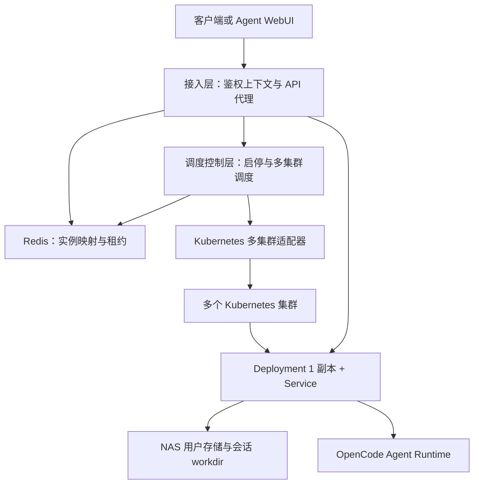
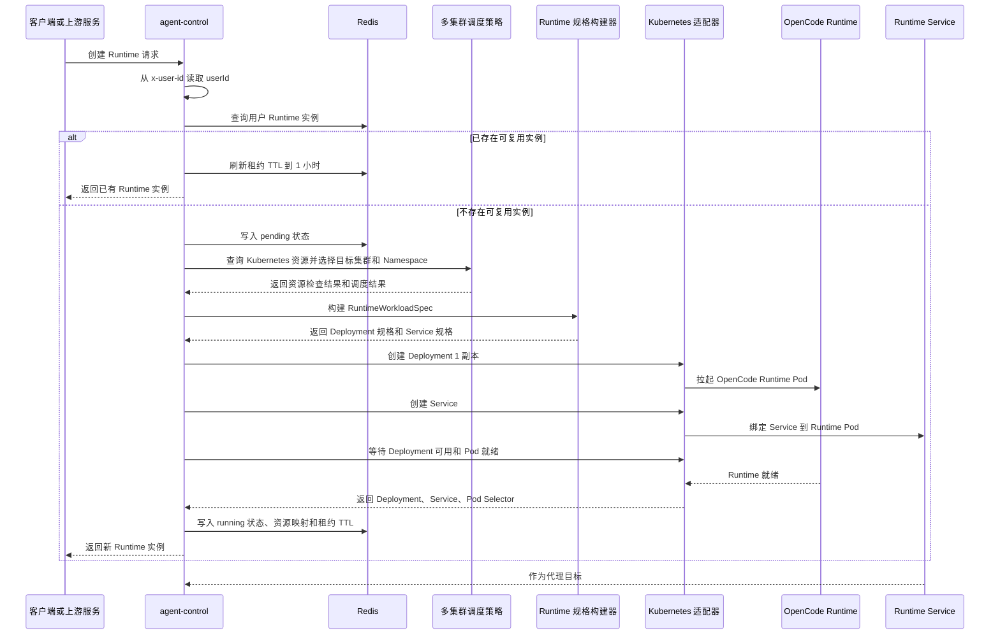
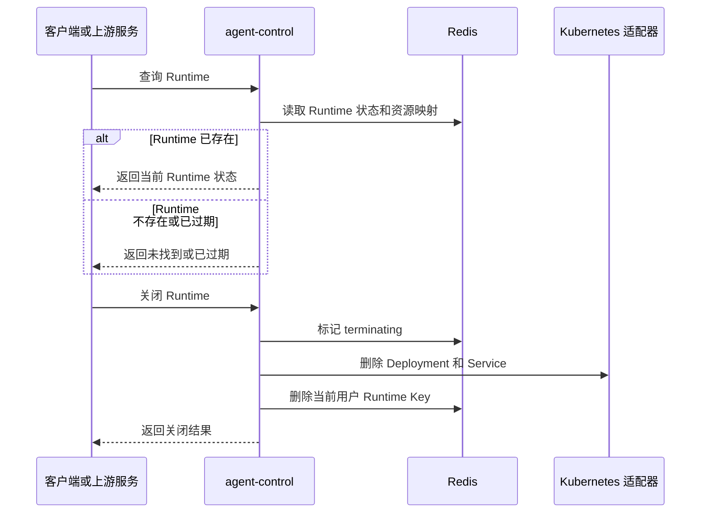
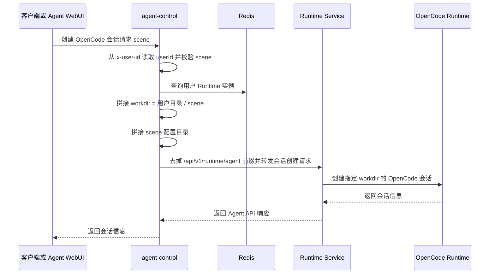
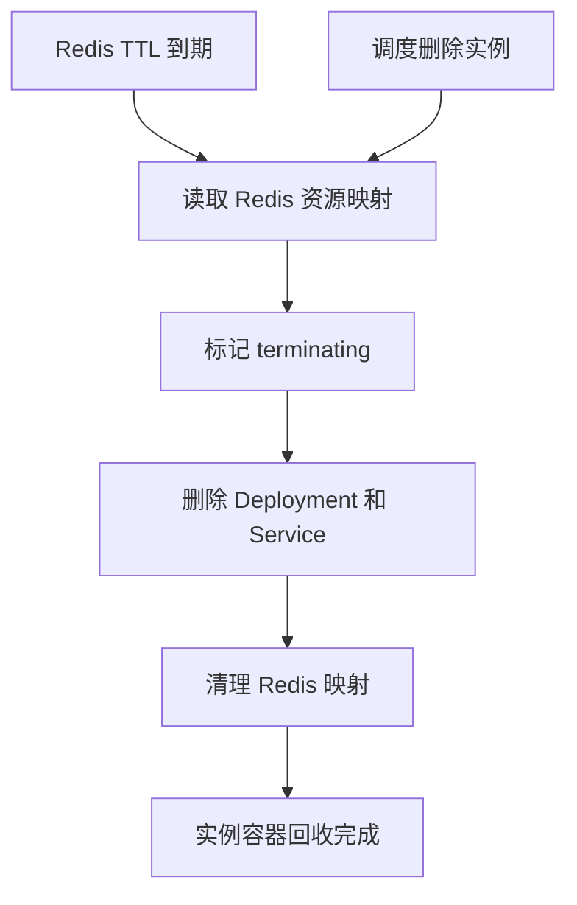
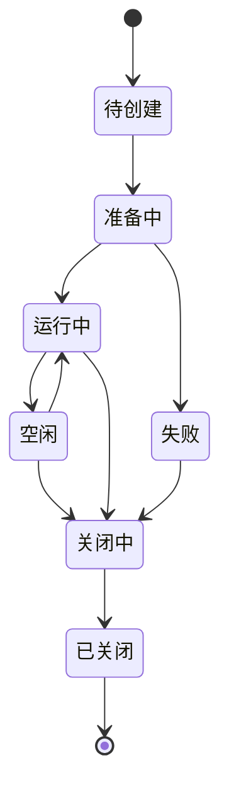

# agent-control · Agent Runtime 控制面服务

> Agent Runtime 控制面服务：负责多 Kubernetes 集群下 OpenCode Agent 工作负载的调度启停，并代理转发对应 Agent API 请求。

## 1. 定位与目标

`agent-control` 是一个 Agent Runtime 控制面服务，负责根据用户或上游平台请求，在多个 Kubernetes 集群中选择目标集群与 Namespace，创建、查询、关闭 OpenCode Agent 工作负载，并代理转发对应 Agent API 请求。

当前 Agent 基座默认是 **OpenCode**。服务不直接实现 Agent 推理能力，而是管理 Agent 运行实例的生命周期，并为上层调用方提供统一的 API 入口。

一句话定位：

- 用户或上游平台请求创建、查询、关闭 Agent Runtime。
- 服务在多个 Kubernetes 集群中选择目标集群，并创建、查询、关闭对应 Agent 工作负载。
- 服务维护用户、Agent 实例、Deployment、Service、Pod、API 连接之间的映射。
- 服务将外部 API 请求代理到目标 Agent Service。

设计目标：

- 用统一控制面管理 OpenCode Agent Runtime 生命周期。
- 支持多 Kubernetes 集群下的 Runtime 调度控制。
- 固定以 Deployment（1 副本）+ Service 作为 Runtime 运行单元。
- 通过 Redis 维护用户实例映射、启停状态、租约续约和 TTL 回收。
- Runtime 按用户动态启停，scene 只用于 OpenCode 会话创建时的 workdir 和场景约定材料选择。
- 为 Agent WebUI / Agent API 提供统一 HTTP 与 SSE 代理入口。

## 2. 总体架构设计

`agent-control` 对外提供 Agent Runtime 管理 API 和 Agent API 代理入口，对内通过 Redis 维护实例状态，通过多 Kubernetes 集群适配器调度和管理 OpenCode Agent 工作负载。

服务分为三层：

1. **接入层**：承接用户或上游平台请求，以用户作为 Agent 实例归属；当用户使用 Agent 时，先查询 Redis 获取对应实例，没有实例则触发调度创建并写入 Redis。上游鉴权后注入 `x-user-id`，服务据此查找对应 Agent 实例，并对 Agent Runtime 的全量接口做代理转发，代理需支持 HTTP 与 SSE。
2. **调度控制层**：负责 Runtime 实例状态、Redis 映射、创建/查询/关闭幂等、租约续约、TTL 回收、多集群调度策略，以及 Deployment（1 副本）+ Service 的创建、查询和删除。
3. **实例层**：按用户运行 OpenCode Agent 工作负载，通过 NAS 挂载用户存储根路径。scene 不决定 Runtime 实例归属，只在 OpenCode 创建会话时用于拼接会话 workdir、读取场景约定材料，实现会话级资源与配置隔离。



它对外提供：

- 当前用户 Runtime 创建、查询与关闭。
- 多 Kubernetes 集群调度控制。
- Agent API 代理入口。
- Agent WebUI 到 Runtime 的 HTTP / SSE 连接代理。

它对内管理：

- 用户与 Agent Runtime 实例映射。
- Redis 状态、租约和 TTL。
- OpenCode Agent Deployment。
- 每个 Deployment 固定 1 个副本。
- 与 Deployment 配套的 Service。
- NAS 用户存储根路径挂载。
- Pod 就绪状态与 Service 代理目标。

## 3. 技术选型与说明

| 维度 | 选型 | 说明 |
|---|---|---|
| 运行时 | Bun | 用于快速启动 TypeScript 后端服务，内置测试能力。 |
| 开发语言 | TypeScript | 保持接口、配置、领域对象和适配器边界可类型化。 |
| Web 框架 | Fastify | 提供轻量 HTTP API、插件机制和较好的测试注入能力。 |
| 配置校验 | Zod | 对 `config.yaml` 和集群配置做运行时校验。 |
| 测试框架 | bun:test | 覆盖健康检查、配置加载和调度控制逻辑。 |
| Kubernetes 集成 | Kubernetes Client Adapter | 通过适配器封装多集群 Deployment（1 副本）+ Service 创建、查询、关闭和代理目标解析。 |
| API 代理 | HTTP / SSE 代理 | 用于转发 Agent Runtime API，请求路径、Header 和错误处理必须受控。 |
| 状态存储 | Redis | 用于 Runtime 实例映射、启停状态、租约续约、TTL 回收和轻量状态恢复。 |

## 4. 核心业务流程

`agent-control` 的核心业务流程围绕 Runtime 创建、状态维护、租约续约、API 代理和资源回收展开。Runtime 运行单元固定为 Deployment（1 副本）+ Service，状态和租约维护统一使用 Redis。

### 4.1 Runtime 创建流程



RuntimeWorkloadSpec 构建逻辑：

- 根据用户归属生成 Runtime 实例 ID、Deployment 名称、Service 名称和统一 Labels。
- 根据调度结果写入目标 cluster、Namespace、资源规格和 Service 端口。
- 根据用户标识拼接 NAS 用户存储根路径。
- 将 NAS 用户存储根路径挂载到 Runtime 容器。
- scene 不参与 RuntimeWorkloadSpec 构建，不决定 Deployment、Service 或 Redis Key。
- OpenCode Runtime 启动命令、环境变量、容器端口和挂载路径使用服务预设参数。
- Deployment 固定 `replicas = 1`，Service 作为 Agent API 代理目标。

### 4.2 Runtime 查询与关闭流程



### 4.3 Agent API 代理流程


### 4.4 OpenCode 会话创建与 scene 流程

scene 是会话级参数，不是 Runtime 实例级参数。Runtime 按用户动态启停；当用户通过 Agent API 创建 OpenCode 会话时，服务读取会话创建请求中的 `scene`，按规则拼接会话 workdir，并从 Kubernetes 挂载的 `runtime.config` 根目录读取该 scene 对应的约定材料，例如 `AGENTS.md`。



scene 约束：

- scene 只用于会话 workdir 和读取场景约定材料，例如 `{runtime.config}/{scene}/AGENTS.md`。
- scene 不写入 Runtime Redis Key 作为实例归属条件。
- scene 不参与 Runtime 启停、Deployment 名称、Service 名称和调度均衡。
- 同一个用户 Runtime 可以在不同时间创建不同 scene 的会话。

### 4.5 回收删除流程

Runtime 回收有两类触发源：

- Redis TTL 到期，表示 Runtime 租约未续约或已空闲超时。
- 上游或系统触发调度删除，要求主动关闭指定 Runtime 实例。



流程约束：

- 创建、查询、关闭、内部续约和删除都必须具备幂等性或一致性控制。
- Redis 是 Runtime 状态、资源映射和租约 TTL 的权威存储。
- Redis TTL 到期或调度删除实例时，必须删除对应 Deployment（1 副本）+ Service，并清理 Redis 映射。
- Kubernetes 资源以 Deployment（1 副本）+ Service 为统一运行单元。
- Agent API 代理只经 Service 访问 Runtime，不直接访问 Pod IP。
- 任何异常都不能泄露 kubeconfig、Token、Pod IP、ClusterIP、内部 Service DNS。

## 5. 存储结构设计

存储结构分为三类：Redis 运行态存储、NAS 文件存储、Kubernetes 资源标识。Redis 负责实例映射、状态、租约和回收；NAS 负责用户工作区与 OpenCode 项目级配置；Kubernetes 资源标识负责把 Runtime 实例和 Deployment、Service、Pod 绑定起来。

### 5.1 Redis Key 设计

初始阶段只保留一个核心 Key：

| Key | 类型 | TTL | 用途 |
|---|---|---:|---|
| `agent-runtime:user:{userId}` | Hash / JSON | 1 小时 | 保存用户当前 Runtime 的完整状态、Kubernetes 资源映射、NAS 路径引用、Service 代理目标和租约信息。 |

Value 示例：

```json
{
  "runtimeId": "rt-xxxx",
  "userId": "user-ref",
  "status": "running",
  "cluster": "cluster-a",
  "namespace": "agent-runtime",
  "deploymentName": "opencode-rt-xxxx",
  "serviceName": "opencode-rt-xxxx",
  "podSelector": {
    "app": "opencode-runtime",
    "runtimeId": "rt-xxxx",
    "userId": "user-ref"
  },
  "servicePort": 4096,
  "targetPort": 4096,
  "workspaceRootPath": "/nas/agent-control/users/user-ref",
  "leaseExpireAt": "2026-06-11T12:00:00.000Z",
  "createdAt": "2026-06-11T11:00:00.000Z",
  "updatedAt": "2026-06-11T11:20:00.000Z"
}
```

设计原则：

- Redis 只保存 Runtime 调度控制所需的轻量状态。
- Redis 不保存 kubeconfig、Token、证书、明文密钥或完整请求体。
- Runtime 归属以用户为基本单位，初始阶段一个用户同一时间只维护一个可用 Runtime。
- 上游鉴权后通过 `x-user-id` 传入用户标识，服务据此作为 `userId` 并查询该 Key。
- Agent API / WebUI 连接存在时，持续刷新该 Key TTL 到 1 小时。
- TTL 到期或主动删除时，读取该 Key 内的 Deployment、Service、cluster、namespace 信息，删除对应 Kubernetes 资源后清理 Key。
- 不单独拆分状态 Key、租约 Key、代理目标 Key；后续只有出现多 Runtime、runtimeId 反查、后台巡检等真实需求时再增加索引 Key。

### 5.2 Runtime 状态结构

| 字段 | 说明 |
|---|---|
| `runtimeId` | Runtime 实例 ID。 |
| `userId` | 用户或上游主体引用。 |
| `status` | `pending`、`preparing`、`running`、`idle`、`terminating`、`terminated`、`failed`。 |
| `cluster` | Kubernetes 集群逻辑名。 |
| `namespace` | Kubernetes Namespace。 |
| `deploymentName` | Runtime Deployment 名称。 |
| `serviceName` | Runtime Service 名称。 |
| `podSelector` | Runtime Pod 选择器。 |
| `servicePort` | Service 暴露端口。 |
| `targetPort` | Runtime 容器监听端口。 |
| `workspaceRootPath` | 用户 NAS 存储根路径引用。 |
| `leaseExpireAt` | 租约过期时间。 |
| `createdAt` | 创建时间。 |
| `updatedAt` | 更新时间。 |

### 5.3 Runtime 生命周期状态



状态含义：

| 状态 | 说明 |
|---|---|
| `pending` | 已接收创建请求，尚未创建 Kubernetes 资源。 |
| `preparing` | 正在创建 Deployment（1 副本）+ Service、挂载用户存储根路径、等待 Pod 就绪。 |
| `running` | Runtime 已就绪，可代理 API 请求。 |
| `idle` | Runtime 暂无活跃请求，可复用或等待回收。 |
| `terminating` | 正在关闭并释放资源。 |
| `terminated` | 已关闭并释放资源。 |
| `failed` | 创建、运行或回收失败。 |

### 5.4 NAS 存储结构

NAS 用于挂载用户存储根路径。`runtime.config` 用于挂载场景约定配置根目录，不是 OpenCode 自身的 `.opencode` 配置目录。Runtime 实例仍按用户创建和复用；scene 只在创建会话时用于选择工作目录和读取场景约定材料，不参与 Runtime 实例归属。

建议路径结构：

```text
/nas/agent-control/
├── users/
│   └── {userId}/
│       └── {scene}/
│           ├── input/
│           ├── output/
│           ├── temp/
│           └── logs/
└── scenes/
    └── {scene}/
        └── AGENTS.md
```

路径拼接规则：

| 路径 | 规则 |
|---|---|
| Runtime 用户存储根路径 | `{nas.path}/users/{userId}` |
| OpenCode 会话 NAS workdir | `{nas.path}/users/{userId}/{scene}` |
| OpenCode 会话容器内 workdir | `{runtime.workdir}/{scene}` |
| scene 约定配置 NAS 目录 | `{nas.path}/scenes/{scene}` |
| scene 约定配置容器内目录 | `{runtime.config}/{scene}` |
| scene 约定 AGENTS.md | `{runtime.config}/{scene}/AGENTS.md` |

挂载规则：

- Runtime 容器按用户挂载 `{nas.path}/users/{userId}`，不能跨用户混用。
- `{nas.path}/users/{userId}/{scene}` 是会话持久化目录；Runtime 内创建会话时使用 `{runtime.workdir}/{scene}` 作为 workdir。
- `runtime.config` 是 Kubernetes 挂载进 Runtime 容器的场景约定配置根目录，用于按 scene 读取约定材料，例如 `{runtime.config}/{scene}/AGENTS.md`。
- `runtime.config` 不等同于 OpenCode 项目级 `.opencode` 目录，也不参与 Runtime 实例归属。
- README 不记录真实 NAS 地址、真实用户路径或内部业务路径。

### 5.5 Kubernetes 资源标识

Runtime 实例与 Kubernetes 资源通过统一命名和 Labels 绑定。

| 资源 | 命名建议 | 说明 |
|---|---|---|
| Runtime ID | `rt-{shortId}` | 对外返回的 Runtime 实例标识。 |
| Deployment | `opencode-{runtimeId}` | 固定 1 副本。 |
| Service | `opencode-{runtimeId}` | 作为 Agent API 代理目标。 |
| Labels | `app=opencode-runtime`、`runtimeId={runtimeId}`、`userId={userId}` | 用于资源查询、清理和 Selector 绑定。 |

## 6. API 接口设计

API 分为健康检查、Runtime 管理、Agent API 代理三类。Runtime 管理接口面向上游平台或控制端；Agent API 代理接口面向 Agent WebUI 或调用方。

### 6.1 健康检查接口

```http
GET /health
```

响应字段：

| 字段 | 说明 |
|---|---|
| `status` | 服务状态。 |
| `service` | 固定为 `agent-control`。 |

### 6.2 Runtime 管理接口

```http
POST /api/v1/runtime
GET /api/v1/runtime
DELETE /api/v1/runtime
```

接口语义：

| 接口 | 语义 |
|---|---|
| `POST /api/v1/runtime` | 创建当前用户 Runtime；已存在则返回当前 Runtime。 |
| `GET /api/v1/runtime` | 查询当前用户 Runtime 状态、集群和资源映射。 |
| `DELETE /api/v1/runtime` | 关闭当前用户 Runtime，并删除 Deployment（1 副本）+ Service 与 Redis Key。 |

### 6.3 Runtime 创建请求

Runtime 创建请求不传 scene。Runtime 只按用户动态启停，用户归属不由请求体传入，也不由本服务解析 `Authorization`；上游完成鉴权后必须通过 `x-user-id` Header 传入用户标识，服务将其作为 `userId`。HTTP Header 大小写不敏感，实现中统一按 `x-user-id` 读取。若 `x-user-id` 缺失或为空，服务必须拒绝 Runtime 创建、查询、关闭和代理请求。

```http
POST /api/v1/runtime
x-user-id: user-ref
```

请求体为空或 `{}`。

scene 只在 OpenCode 会话创建请求中传入。

### 6.4 Runtime 响应结构

```json
{
  "runtimeId": "rt-xxxx",
  "userId": "user-ref",
  "status": "running",
  "cluster": "cluster-a",
  "namespace": "agent-runtime",
  "deploymentName": "opencode-rt-xxxx",
  "serviceName": "opencode-rt-xxxx",
  "leaseExpireAt": "2026-06-11T12:00:00.000Z"
}
```

响应不返回 Pod IP、ClusterIP、内部 Service DNS、kubeconfig、Token 或 NAS 真实内部地址。

### 6.5 Agent API 代理接口

```http
/api/v1/runtime/agent/*
```

代理入口以 Runtime 实际暴露的 OpenCode Server API 为准。`agent-runtime` 镜像使用 `opencode web --port 4096 --hostname 0.0.0.0` 启动，OpenAPI 3.1 规范页面为 Runtime 内部的 `/doc`。除会话创建请求需要处理 agent-control 的 `scene` 扩展参数外，本服务不自定义 OpenCode API 路径，只把 `/api/v1/runtime/agent` 前缀去掉后转发到当前用户 Runtime Service。

常用 OpenCode Server API 代理关系：

| 用途 | 对外代理路径 | 转发到 Runtime 路径 | 说明 |
|---|---|---|---|
| 健康检查 | `GET /api/v1/runtime/agent/global/health` | `GET /global/health` | OpenCode Server 健康与版本。 |
| 全局事件 | `GET /api/v1/runtime/agent/global/event` | `GET /global/event` | SSE 事件流。 |
| 当前项目 | `GET /api/v1/runtime/agent/project/current` | `GET /project/current` | 获取当前 OpenCode 项目。 |
| 创建会话 | `POST /api/v1/runtime/agent/session` | `POST /session` | OpenCode 原生 body 为 `{ parentID?, title? }`。 |
| 会话列表 | `GET /api/v1/runtime/agent/session` | `GET /session` | 返回会话列表。 |
| 会话详情 | `GET /api/v1/runtime/agent/session/:id` | `GET /session/:id` | 返回指定会话。 |
| 删除会话 | `DELETE /api/v1/runtime/agent/session/:id` | `DELETE /session/:id` | 删除会话及数据。 |
| 中断会话 | `POST /api/v1/runtime/agent/session/:id/abort` | `POST /session/:id/abort` | 中断运行中的会话。 |
| 发送消息 | `POST /api/v1/runtime/agent/session/:id/message` | `POST /session/:id/message` | 发送消息并等待响应。 |
| 异步发送消息 | `POST /api/v1/runtime/agent/session/:id/prompt_async` | `POST /session/:id/prompt_async` | 发送消息但不等待响应。 |
| 消息列表 | `GET /api/v1/runtime/agent/session/:id/message` | `GET /session/:id/message` | 查询会话消息。 |
| 执行命令 | `POST /api/v1/runtime/agent/session/:id/command` | `POST /session/:id/command` | 执行 slash command。 |
| 执行 Shell | `POST /api/v1/runtime/agent/session/:id/shell` | `POST /session/:id/shell` | 执行 shell command。 |
| 文件列表 | `GET /api/v1/runtime/agent/file?path=<path>` | `GET /file?path=<path>` | 查询文件目录。 |
| 文件内容 | `GET /api/v1/runtime/agent/file/content?path=<path>` | `GET /file/content?path=<path>` | 读取文件内容。 |
| 文件状态 | `GET /api/v1/runtime/agent/file/status` | `GET /file/status` | 查询文件状态。 |
| Agent 列表 | `GET /api/v1/runtime/agent/agent` | `GET /agent` | 查询可用 agents。 |
| 事件流 | `GET /api/v1/runtime/agent/event` | `GET /event` | OpenCode Server SSE 事件流。 |
| OpenAPI 文档 | `GET /api/v1/runtime/agent/doc` | `GET /doc` | OpenCode Server OpenAPI 文档。 |

scene 处理规则：

- OpenCode 官方 `POST /session` 请求体为 `{ parentID?, title? }`，官方文档未定义 `scene` 或 `workdir` 字段。
- `scene` 是 agent-control 的会话级扩展参数，用于选择会话 workdir 和场景约定材料。
- 当代理 OpenCode 会话创建请求时，agent-control 必须读取请求体中的 `scene`，在转发给 Runtime 前按 Runtime 运行约定或包装层约定转换为 OpenCode 可识别的会话上下文。
- 转换后的容器内 workdir 为 `{runtime.workdir}/{scene}`。
- 场景约定材料来自 Kubernetes 挂载的 `{runtime.config}/{scene}`，例如 `{runtime.config}/{scene}/AGENTS.md`。
- `runtime.config` 不等同于 OpenCode 项目级 `.opencode` 目录。
- `scene` 不参与 Runtime Redis Key、Deployment、Service 或调度均衡。

代理规则：

- 支持普通 HTTP 请求代理。
- 支持 SSE 长连接代理。
- 代理前必须读取上游注入的 `x-user-id` 作为用户归属，不能由调用方传入任意 `runtimeId` 后直接转发。
- 缺少 `x-user-id` 或 `x-user-id` 为空时，必须拒绝代理请求。
- `x-user-id` 只信任上游网关或上游服务注入，不接受公网客户端绕过上游后直接伪造。
- `Authorization` 由上游处理，本服务不自行解析用户 Token；如请求中仍携带 `Authorization`，禁止向 Runtime 透传。
- 连接存在时必须持续将 Runtime 租约续到 1 小时。
- 转发到 Runtime Service 时必须去掉 `/api/v1/runtime/agent` 前缀，保留后续路径、查询参数、HTTP 方法和请求体。
- 代理只经 Runtime Service 转发，不直接访问 Pod IP。
- 不允许通过代理路径访问 `agent-control` 自身管理接口。

## 7. Kubernetes 资源设计

Kubernetes 资源设计只围绕 Runtime 运行单元展开，不承接完整平台控制面、审计中心或 scene 配置编排职责。

### 7.1 运行单元

每个 Runtime 固定创建：

- 1 个 Deployment。
- Deployment 固定 `replicas = 1`。
- 1 个配套 Service。
- 一组统一 Labels / Selector。

### 7.2 调度输入

调度控制层需要显式处理：

- `cluster`：目标 Kubernetes 集群。
- `namespace`：目标 Namespace。
- `runtimeId`：Runtime 实例 ID。
- `deploymentName`：Deployment 名称。
- `serviceName`：Service 名称。
- `labels`：Deployment、Pod、Service 的统一标签。
- `workspaceRootPath`：用户 NAS 存储根路径。

### 7.3 Kubernetes 资源检查与调度均衡

`agent-control` 通过 Kubernetes Server API 查询目标集群和 Namespace 的资源状态，用于在创建 Agent Runtime 前做调度均衡判断。服务负责选择更合适的 cluster、namespace 和 Runtime 资源规格；Pod 在节点上的最终落点仍由 Kubernetes Scheduler 决定。

资源检查范围：

| 检查项 | 用途 |
|---|---|
| Node 可用性 | 判断集群是否存在可调度节点，过滤 NotReady、不可调度或资源压力明显的节点。 |
| Node allocatable / requests | 估算 CPU、Memory 剩余容量，避免把 Runtime 集中调度到资源紧张集群。 |
| Namespace ResourceQuota | 判断目标 Namespace 是否还有足够 CPU、Memory、Pod 数和 Service 数配额。 |
| LimitRange | 选择或校验 Runtime 默认资源请求与限制。 |
| 现有 Runtime Deployment 分布 | 统计当前 cluster / namespace 下已运行的 OpenCode Runtime 数量，用于均衡分布。 |
| Pod readiness | 判断已创建 Runtime 是否真正可用，避免把不可用实例计入健康容量。 |
| Event / Condition | 识别调度失败、镜像拉取失败、资源不足等异常原因。 |

调度均衡原则：

- 优先选择可用资源余量更高的集群和 Namespace。
- 避免单个 Namespace 中 Runtime 数量过度集中。
- 同等资源条件下，优先复用配置中的默认集群和 Namespace。
- 如果所有候选集群资源不足，应返回明确错误，不创建半成品 Deployment。
- 调度控制层只做集群和 Namespace 级均衡，不直接替代 Kubernetes Scheduler 的节点调度职责。
- 如需影响节点落点，可在 Deployment 规格中配置 nodeSelector、affinity、tolerations 或 priorityClass，但必须由上游策略或服务配置显式提供。

### 7.4 回收规则

- 关闭 Runtime 时必须删除 Deployment 和 Service。
- Redis TTL 到期时必须触发 Deployment 和 Service 回收。
- 删除实例时必须先读取 Redis 资源映射，再按映射删除 Kubernetes 资源。
- 删除完成后必须清理 Redis 映射，避免旧 Service 被继续代理。

### 7.5 服务自身运行方式

`agent-control` 自身也按 Kubernetes 工作负载方式运行。访问目标 Kubernetes 集群所需的 kubeconfig、Token、证书或等价凭证，由 `agent-control` 的服务运行配置提供，不写入 Redis，不作为 Runtime 状态保存。

凭证来源可以包括：

- 当前集群内访问：使用 `agent-control` Pod 绑定的 ServiceAccount 与 RBAC 权限。
- 多集群访问：通过受控 Secret、挂载文件或外部配置系统注入 kubeconfig / Token / 证书引用。
- 配置文件中只保留集群逻辑名、Namespace 策略、访问方式引用和资源规格，不记录真实明文凭证。

## 8. 配置设计

`agent-control` 自身运行在 Kubernetes 中，配置按 Kubernetes 方式管理。服务启动时读取服务目录下的 `config.yaml`；`config.yaml` 由 Kubernetes ConfigMap 挂载或镜像内默认配置提供。敏感信息不写入 `config.yaml`，通过 Kubernetes ServiceAccount、Secret、挂载文件或外部受控配置系统提供。

### 8.1 配置文件位置

服务内配置文件固定为：

```text
./config.yaml
```

Kubernetes 部署时建议通过 ConfigMap 挂载到服务工作目录：

```text
/app/config.yaml
```

### 8.2 config.yaml 结构

示例结构：

```yaml
server:
  port: 3000
  host: 0.0.0.0
  log: info

redis:
  url: redis://redis:6379
  key: agent-runtime:user

runtime:
  image: ghcr.io/example/opencode-runtime:latest
  ttl: 3600
  timeout: 60000
  port: 4096
  workdir: /workspace
  config: /scenes

nas:
  path: /nas/agent-control

kubernetes:
  cluster: default
  namespace: agent-runtime
  clusters:
    - name: default
      namespace: agent-runtime
      auth: inCluster
      scheduling:
        enabled: true
        maxRuntime: 100
```

### 8.3 配置字段说明

| 配置路径 | 说明 |
|---|---|
| `server.port` | HTTP 服务端口。 |
| `server.host` | HTTP 监听地址。 |
| `server.log` | 日志级别。 |
| `redis.url` | Redis 连接地址，写服务内可访问地址；如需认证，密码不写入 URL，单独由 Kubernetes Secret 提供。 |
| `redis.key` | Runtime Redis Key 前缀，固定为 `agent-runtime:user`。 |
| `runtime.image` | OpenCode Runtime 镜像。 |
| `runtime.ttl` | Runtime 租约有效期，连接存在时续约到 1 小时。 |
| `runtime.timeout` | Runtime API 代理超时时间。 |
| `runtime.port` | OpenCode Runtime 容器监听端口，当前与 `agent-runtime` 镜像约定为 `4096`，Runtime 需监听 `0.0.0.0` 以便 Service 访问。 |
| `runtime.workdir` | 用户存储根路径在 Runtime 容器内的挂载路径。 |
| `runtime.config` | Kubernetes 挂载到 Runtime 容器内的场景约定配置根路径，用于按 scene 读取约定材料，例如 `{runtime.config}/{scene}/AGENTS.md`；它不是 OpenCode 项目级 `.opencode` 目录。 |
| `nas.path` | NAS 挂载基础路径。 |
| `kubernetes.cluster` | 默认 Kubernetes 集群逻辑名。 |
| `kubernetes.namespace` | 默认 Runtime Namespace。 |
| `kubernetes.clusters[]` | 可调度 Kubernetes 集群配置。 |
| `kubernetes.clusters[].auth` | 集群访问方式，如 `inCluster`、`kubeconfig`、`secret`。 |
| `kubernetes.clusters[].scheduling` | 资源检查和调度均衡配置。 |

### 8.4 Kubernetes 配置约束

- `config.yaml` 不保存真实 kubeconfig、Token、证书、Cookie、账号密码或明文密钥。
- kubeconfig、Token、证书、明文密钥由 `agent-control` 服务自身运行配置提供。
- `agent-control` 自身按 Kubernetes 工作负载方式运行，优先通过 ServiceAccount、RBAC、Secret 挂载或外部受控配置系统获得集群访问能力。
- Redis、Runtime 状态、`config.yaml` 和 API 响应中不保存也不返回 kubeconfig、Token、证书或明文密钥。
- README 不记录真实集群地址、真实 Namespace 或内部访问地址。

## 9. 安全边界

必须保护：

- 上游主体身份引用。
- Runtime 实例归属关系。
- Kubernetes 凭证。
- Runtime Pod、Service、ClusterIP 等内部地址。
- Agent API 请求中的敏感 Header。
- OpenCode 运行所需配置和 Token。

默认规则：

- 不记录原始 Authorization Header，也不记录上游注入的完整用户身份上下文。
- 不记录完整请求体，除非经过脱敏。
- 不把内部错误栈直接返回给调用方。
- 不允许跨主体访问其他 Runtime。
- 不允许通过代理路径访问本服务管理接口。
- 不在 README 中出现真实集群地址、真实 Namespace、真实凭证或内部业务标识。

## 10. 设计边界

`agent-control` 只负责 Agent Runtime 控制面能力：

- Runtime 创建。
- Runtime 启停。
- Runtime 状态查询。
- Runtime 租约续约和 TTL 回收。
- Runtime API 代理。
- Kubernetes 多集群适配。

不负责：

- 业务 scene 编排。
- 配置版本管理。
- 工具授权策略。
- 平台审计中心。
- 用户业务权限判定。
- OpenCode Runtime 内部能力实现。

这些能力应由上游平台控制面完成后，将必要的用户、scene、配置路径和调度参数传入本服务。
