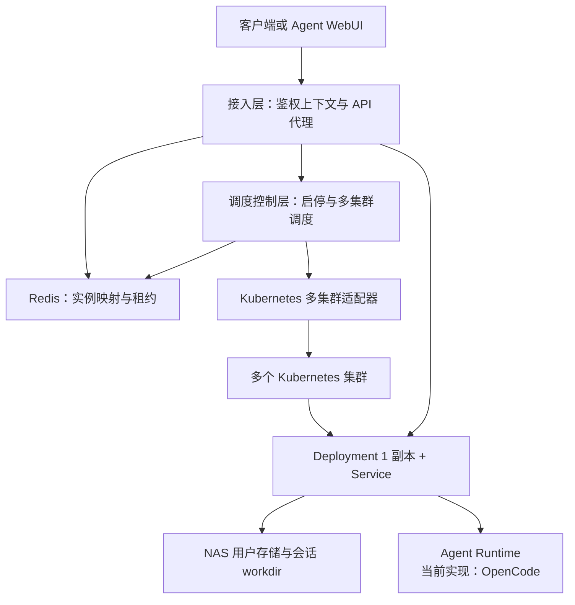
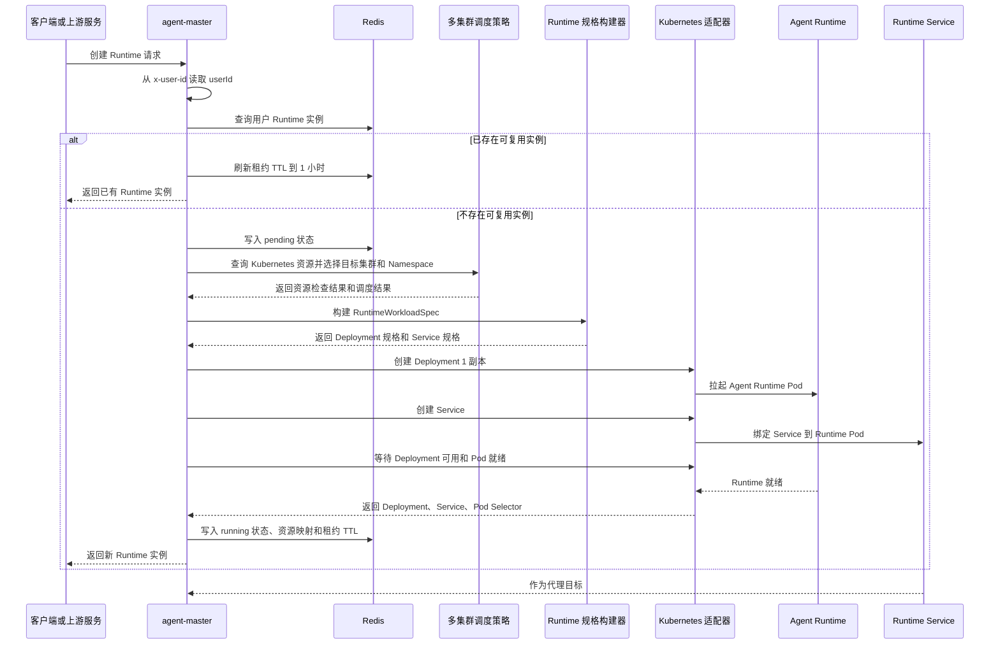
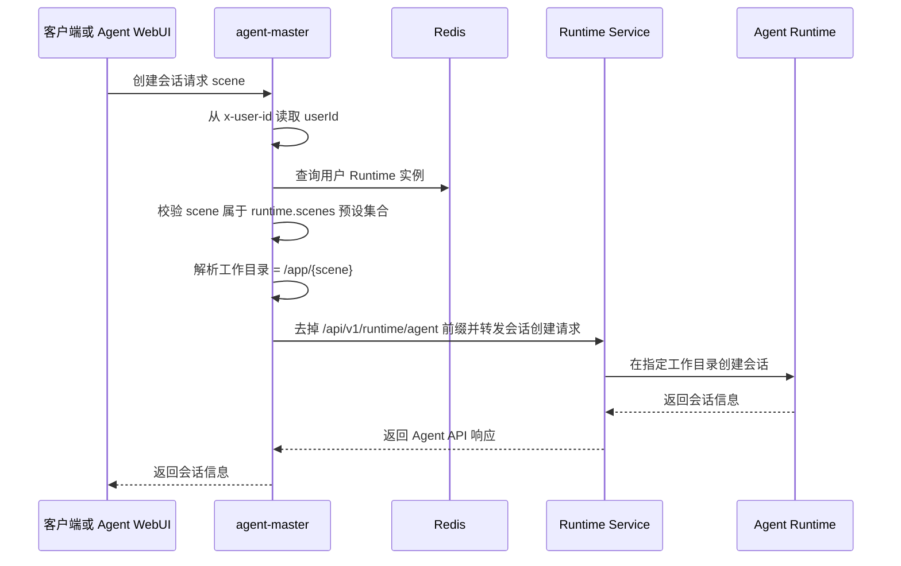
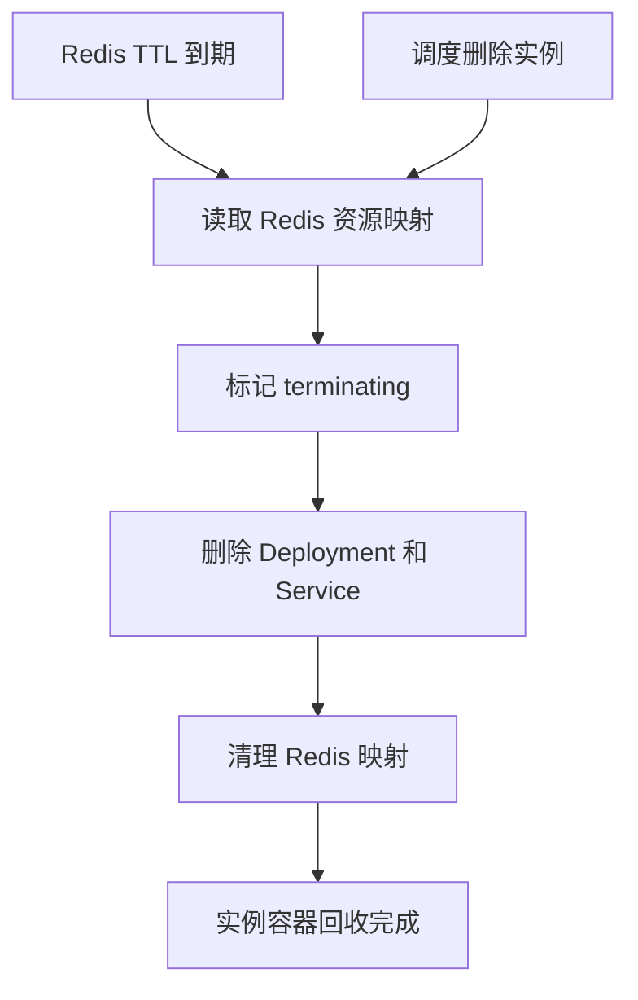
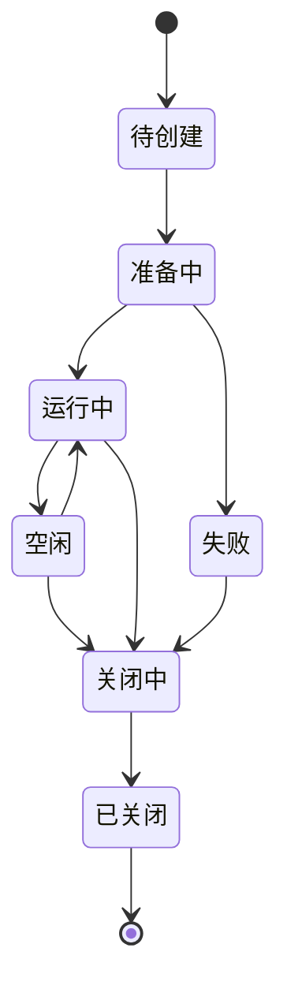

# agent-master · Agent Runtime 控制面服务

> Agent Runtime 控制面服务：负责多 Kubernetes 集群下的 Runtime 调度启停、用户归属、租约维护、代理转发和 WebUI 交互 BFF。OpenCode 是当前接入的 AgentApp 实现，不是服务核心边界。

## 1. 定位与目标

`agent-master` 是一个 Agent Runtime 控制面服务。它根据用户或上游平台请求，在多个 Kubernetes 集群中选择目标集群与 Namespace，创建、查询、关闭用户专属 Agent Runtime，并对外提供 Runtime 管理、原生 Agent API 代理和 WebUI 交互 BFF。

服务不实现 Agent 推理能力。它管理 Agent Runtime 的生命周期、网络入口、用户工作目录、租约和交互协议。当前运行时实现接入 OpenCode；后续可通过 AgentApp 适配器接入其它智能体应用。

一句话定位：

- 用户或上游平台请求创建、查询、关闭 Agent Runtime。
- 服务在多个 Kubernetes 集群中选择目标集群，并创建、查询、关闭对应 Agent 工作负载。
- 服务维护用户、Agent 实例、Deployment、Service、Pod、API 连接之间的映射。
- 服务将外部 API 请求代理到目标 Agent Service。

设计目标：

- 用统一控制面管理用户专属 Agent Runtime 生命周期。
- 支持多 Kubernetes 集群下的 Runtime 调度控制。
- 固定以 Deployment（1 副本）+ Service 作为 Runtime 运行单元。
- 通过 Redis 维护用户实例映射、启停状态、租约续约和 TTL 回收。
- Runtime 按用户动态启停，Kubernetes 按约定挂载用户工作目录、运行态数据目录和预设场景配置。
- 为 Agent WebUI 提供稳定的 Interaction BFF，为调试和扩展保留 Runtime 原生 API 代理入口。

## 2. 总体架构设计

`agent-master` 对外提供 Agent Runtime 管理 API、Runtime 原生 API 代理入口和 Interaction BFF；对内通过 Redis 维护实例状态，通过多 Kubernetes 集群适配器调度和管理 Runtime 工作负载。

服务分为三层：

1. **接入层**：承接用户或上游平台请求。上游鉴权后注入 `x-user-id`，服务据此查找用户专属 Runtime，并提供 Runtime 管理 API、原生代理 API 与 Interaction BFF。
2. **调度控制层**：负责 Runtime 实例状态、Redis 映射、创建/查询/关闭幂等、租约续约、TTL 回收、多集群调度策略，以及 Deployment（1 副本）+ Service 的创建、查询和删除。
3. **实例层**：按用户运行 Agent Runtime 工作负载，通过 Kubernetes 挂载用户工作目录和预设场景配置。Runtime 实例按用户归属创建和复用；scene 是 `agent-master` 的会话级扩展参数，用于解析会话工作目录。OpenCode 的 `directory=/app/{scene}` 是当前 AgentApp 的适配细节。



它对外提供：

- 当前用户 Runtime 创建、查询与关闭。
- 多 Kubernetes 集群调度控制。
- Agent API 代理入口。
- Agent WebUI 到 Runtime 的 HTTP / SSE 连接代理。

它对内管理：

- 用户与 Agent Runtime 实例映射。
- Redis 状态、租约和 TTL。
- Agent Runtime Deployment（当前镜像内实现为 OpenCode）。
- 每个 Deployment 固定 1 个副本。
- 与 Deployment 配套的 Service。
- NAS 用户存储根路径挂载。
- Pod 就绪状态与 Service 代理目标。

## 3. 架构演进原则

`agent-master` 的长期演进方向是横向扩展 Kubernetes 调度承载能力，而不是改变 Runtime 归属、NAS 挂载或 Agent API 代理模型。

演进原则：

- 保持已确认的用户 Runtime 归属逻辑：`userId -> Runtime`。
- 保持已确认的 NAS 挂载逻辑：主 Runtime 容器只挂载 `{runtime.workdir}/{userId} -> /app`；预设 scene 配置先只读挂载到 initContainer `/scene-config/{scene}`，再复制生成 `/app/{scene}/AGENTS.md` 和 `/app/{scene}/.opencode` 运行时快照。
- 保持已确认的会话工作目录解析逻辑：`scene -> /app/{scene}`。
- 保持已确认的 Runtime 原生 API 通用代理逻辑：除会话创建时的 `scene` 适配外，其余原生 API 按通用代理透传；具体参数名由当前 AgentApp 适配器决定。
- 当单集群 Runtime Deployment 数量增长导致 Kubernetes Server API 压力上升时，通过新增可调度集群、调整集群调度权重或扩展 Namespace 容量分摊负载。
- 多集群扩展只影响 Runtime 调度落点，不改变用户侧 API、Runtime 容器内目录结构和 scene 挂载约定。

## 4. 技术选型与说明

| 维度 | 选型 | 说明 |
|---|---|---|
| 运行时 | Bun | 用于快速启动 TypeScript 后端服务，内置测试能力。 |
| 开发语言 | TypeScript | 保持接口、配置、领域对象和适配器边界可类型化。 |
| Web 框架 | Fastify | 提供轻量 HTTP API、插件机制和较好的测试注入能力。 |
| 配置校验 | Zod | 对 `config.yaml` 和集群配置做运行时校验。 |
| 测试框架 | bun:test | 覆盖健康检查、配置加载和调度控制逻辑。 |
| Kubernetes 集成 | Kubernetes Client Adapter | 通过适配器封装多集群 Deployment（1 副本）+ Service 创建、查询、关闭和代理目标解析。 |
| API 代理 | HTTP / SSE 代理 | 用于转发 Agent Runtime API，请求路径、Header 和错误处理必须受控。 |
| 状态存储 | Redis | 用于 Runtime 实例映射、启停状态、租约续约、TTL 回收和轻量状态恢复。 |

## 5. 核心业务流程

`agent-master` 的核心业务流程围绕 Runtime 创建、状态维护、租约续约、API 代理和资源回收展开。Runtime 运行单元固定为 Deployment（1 副本）+ Service，状态和租约维护统一使用 Redis。

### 5.1 Runtime 创建流程



RuntimeWorkloadSpec 构建逻辑：

- 根据用户归属生成 Runtime 实例 ID、Deployment 名称、Service 名称和统一 Labels。
- 根据调度结果写入目标 cluster、Namespace、资源规格和 Service 端口。
- 从 `x-user-id` 读取用户标识，并按 `{runtime.workdir}/{userId}` 拼接用户 NAS 工作目录。
- Runtime 创建或重启前，初始化流程必须确保用户目录 `{runtime.workdir}/{userId}`、用户默认 `AGENTS.md`、用户默认 `.opencode/`、所有已声明 scene 的用户工作目录 `{runtime.workdir}/{userId}/{scene}/` 均已存在。
- Runtime 创建或重启前，初始化流程必须确保所有已声明 scene 的预设配置源路径 `{runtime.scenes.<scene>}/AGENTS.md` 与 `{runtime.scenes.<scene>}/.opencode/` 均已存在。
- 将 `{runtime.workdir}/{userId}` 挂载到 Runtime 容器内固定工作目录 `/app`；用户默认项目规则和当前运行时配置通过根挂载自然成为 `/app/AGENTS.md` 与 `/app/.opencode`。
- 根据 `runtime.scenes` 声明的全部预设 scene，将每个 `{runtime.scenes.<scene>}` 只读挂载到 initContainer `/scene-config/{scene}`，再复制生成 `/app/{scene}/AGENTS.md` 与 `/app/{scene}/.opencode` 运行时快照。
- 将上述镜像、端口、环境变量、卷、挂载路径和安全约束渲染为 `deploy.yaml`，作为创建或更新 Kubernetes Runtime Deployment 的输入。
- Runtime 启动命令、环境变量、容器端口和挂载路径使用服务预设参数；当前镜像内实现为 OpenCode。
- Deployment 固定 `replicas = 1`，Service 作为 Agent API 代理目标。

### 5.2 Runtime 查询与关闭流程


### 5.3 Agent API 代理流程


### 5.4 会话、scene 与运行时配置加载规则

`agent-master` 约定 Kubernetes 挂载关系，并在 Runtime 原生代理中处理 `scene` 扩展参数。Runtime 启动时，用户工作目录和预设场景配置已经挂载到容器内；创建会话时传入的 `scene` 只用于解析容器内会话工作目录 `/app/{scene}`。当前 OpenCode 适配器会把该目录转换为原生 `directory=/app/{scene}` 参数。



scene 约束：

- `scene` 是 `agent-master` 的会话级扩展参数，不是 Runtime 实例归属参数。
- `scene` 必须属于服务配置 `runtime.scenes` 声明的预设集合，不能由客户端传入任意路径。
- `scene` 只用于解析容器内会话工作目录 `/app/{scene}`；具体原生参数名由当前运行时适配器处理。
- `scene` 字段不透传给底层 Runtime；转发请求体应移除 `scene`，只保留底层 Runtime 支持的 body 字段。
- `scene` 不参与 Runtime Redis Key、Deployment、Service、镜像选择或调度均衡。

运行时配置加载约束：

- 当前 OpenCode 实现的项目级 `plugins`、`skills`、`agents`、`tools`、`.opencode` 等配置由 Runtime 进程启动时加载，不是每次创建会话时动态重新加载。
- `plugins` 只放在用户默认项目级配置 `/app/.opencode` 中，不放在 `runtime.scenes` 场景配置中。
- 用户默认项目规则位于 `{runtime.workdir}/{userId}/AGENTS.md`，通过 `{runtime.workdir}/{userId} -> /app` 根挂载自然成为 `/app/AGENTS.md`。
- 用户默认项目级配置位于 `{runtime.workdir}/{userId}/.opencode`，通过根挂载自然成为 `/app/.opencode`。
- `runtime.scenes` 约定的场景配置在 Runtime 容器启动时只读挂载到 initContainer `/scene-config/{scene}`，再复制生成 `/app/{scene}/AGENTS.md` 与 `/app/{scene}/.opencode` 运行时快照。
- 主 Runtime 容器只挂载用户工作目录 `{runtime.workdir}/{userId} -> /app`；用户场景工作目录 `/app/{scene}` 保持为用户工作文件与运行产物目录。
- 如果 Kubernetes ConfigMap、Secret 或 volumeMount 中的运行时配置发生更新，需要重启 Runtime 容器 / Pod，让 Runtime 进程重新启动后加载新配置。
- `agent-master` 只负责挂载路径约定、`scene` 工作目录解析和代理转发；具体如何在指定工作目录下应用项目规则，由 `agent-runtime` 的启动流程和当前运行时实现约定。

### 5.5 Interaction BFF 与运行时适配器

`agent-master` 保留 `/api/v1/runtime/agent/*` 作为 Runtime 原生 API 代理入口，同时提供 `/api/v1/runtime/interactions/*` 作为 Agent WebUI 的稳定交互协议。Interaction BFF 面向页面行为建模，覆盖会话恢复、消息输入、模型选择、附件输入、流式事件、中断、终端、命令、Agent 列表和文件面板。

运行时适配器是内部机制。调用方不能选择底层智能体应用，也不会在 Interaction API 的请求、响应或错误码中看到内部实现名称。当前内部适配器接入 OpenCode；后续新增适配器时，不应改变 Interaction API 的公共契约。

边界规则：

- Interaction API 对外只暴露 WebUI 交互语义，不暴露内部适配器名称、装配列表或原生 API 路径。
- 模型服务商和模型是用户可选交互配置；底层智能体应用不是用户可选配置。
- Interaction API 不负责创建 Runtime，也不改变 `userId -> Runtime` 归属、NAS 挂载、scene 或 Kubernetes 调度逻辑。
- `sessionID`、文件路径、附件文件名和 SSE `directory` 必须做 BFF 层校验，不能依赖底层 Runtime 兜底。
- 文件读取只允许访问用户工作目录白名单，不能读取 Runtime 的全局配置、运行态数据库、日志、Token 或内部系统路径。
- 附件能力只有在文件真实写入 Runtime 可读工作目录后才能对外声明可用；不能只保存内存元数据就返回可用。
- 底层调用返回非 2xx 时，Interaction API 必须返回稳定错误结构，不能透传原始错误体，也不能伪装为提交成功、取消中或空消息列表。

### 5.6 回收删除流程

Runtime 回收有两类触发源：

- Redis TTL 到期，表示 Runtime 租约未续约或已空闲超时。
- 上游或系统触发调度删除，要求主动关闭指定 Runtime 实例。



流程约束：

- 创建、查询、关闭、内部续约和删除都必须具备幂等性或一致性控制。
- Redis 是 Runtime 状态、资源映射和租约 TTL 的权威存储。
- Redis TTL 到期或调度删除实例时，必须删除对应 Deployment（1 副本）+ Service，并清理 Redis 映射。
- Kubernetes 资源以 Deployment（1 副本）+ Service 为统一运行单元。
- Agent API 代理只经 Service 访问 Runtime，不直接访问 Pod IP。
- 任何异常都不能泄露 kubeconfig、Token、Pod IP、ClusterIP、内部 Service DNS。

## 6. 存储结构设计

存储结构分为三类：Redis 运行态存储、NAS 文件存储、Kubernetes 资源标识。Redis 负责实例映射、状态、租约和回收；NAS 负责用户工作区与 OpenCode 项目级配置；Kubernetes 资源标识负责把 Runtime 实例和 Deployment、Service、Pod 绑定起来。

### 6.1 Redis Key 设计

初始阶段只保留一个核心 Key：

| Key | 类型 | TTL | 用途 |
|---|---|---:|---|
| `agent-runtime:user:{userId}` | Hash / JSON | 1 小时 | 保存用户当前 Runtime 的完整状态、Kubernetes 资源映射、NAS 路径引用、Service 代理目标和租约信息。 |

Value 示例：

```json
{
  "runtimeId": "rt-xxxx",
  "userId": "user-ref",
  "status": "running",
  "cluster": "cluster-a",
  "namespace": "agent-runtime",
  "deploymentName": "opencode-rt-xxxx",
  "serviceName": "opencode-rt-xxxx",
  "podSelector": {
    "app": "opencode-runtime",
    "runtimeId": "rt-xxxx",
    "userId": "user-ref"
  },
  "servicePort": 4096,
  "targetPort": 4096,
  "workspaceRootPath": "/nas/agent-master/users/user-ref",
  "leaseExpireAt": "2026-06-11T12:00:00.000Z",
  "createdAt": "2026-06-11T11:00:00.000Z",
  "updatedAt": "2026-06-11T11:20:00.000Z"
}
```

设计原则：

- Redis 只保存 Runtime 调度控制所需的轻量状态。
- Redis 不保存 kubeconfig、Token、证书、明文密钥或完整请求体。
- Runtime 归属以用户为基本单位，初始阶段一个用户同一时间只维护一个可用 Runtime。
- 上游鉴权后通过 `x-user-id` 传入用户标识，服务据此作为 `userId` 并查询该 Key。
- Agent API / WebUI 连接存在时，持续刷新该 Key TTL 到 1 小时。
- TTL 到期或主动删除时，读取该 Key 内的 Deployment、Service、cluster、namespace 信息，删除对应 Kubernetes 资源后清理 Key。
- 不单独拆分状态 Key、租约 Key、代理目标 Key；后续只有出现多 Runtime、runtimeId 反查、后台巡检等真实需求时再增加索引 Key。

### 6.2 Runtime 状态结构

| 字段 | 说明 |
|---|---|
| `runtimeId` | Runtime 实例 ID。 |
| `userId` | 用户或上游主体引用。 |
| `status` | `pending`、`preparing`、`running`、`idle`、`terminating`、`terminated`、`failed`。 |
| `cluster` | Kubernetes 集群逻辑名。 |
| `namespace` | Kubernetes Namespace。 |
| `deploymentName` | Runtime Deployment 名称。 |
| `serviceName` | Runtime Service 名称。 |
| `podSelector` | Runtime Pod 选择器。 |
| `servicePort` | Service 暴露端口。 |
| `targetPort` | Runtime 容器监听端口。 |
| `workspaceRootPath` | 用户 NAS 存储根路径引用。 |
| `leaseExpireAt` | 租约过期时间。 |
| `createdAt` | 创建时间。 |
| `updatedAt` | 更新时间。 |

### 6.3 Runtime 生命周期状态



状态含义：

| 状态 | 说明 |
|---|---|
| `pending` | 已接收创建请求，尚未创建 Kubernetes 资源。 |
| `preparing` | 正在创建 Deployment（1 副本）+ Service、挂载用户存储根路径、等待 Pod 就绪。 |
| `running` | Runtime 已就绪，可代理 API 请求。 |
| `idle` | Runtime 暂无活跃请求，可复用或等待回收。 |
| `terminating` | 正在关闭并释放资源。 |
| `terminated` | 已关闭并释放资源。 |
| `failed` | 创建、运行或回收失败。 |

### 6.4 NAS 存储结构

NAS 用于承载四类目录：用户 Runtime 工作目录、用户默认项目配置、OpenCode Runtime 自身运行态数据、预设 scene 配置。Runtime 实例按用户创建和复用；Kubernetes 启动 Runtime 时，按服务配置拼接源路径，并挂载到 Runtime 容器内固定路径。

建议路径结构：

```text
/nas/agent-master/
├── users/
│   └── {userId}/
│       ├── AGENTS.md
│       ├── .opencode/
│       │   ├── opencode.json
│       │   ├── agents/
│       │   ├── commands/
│       │   ├── modes/
│       │   ├── plugins/
│       │   ├── skills/
│       │   ├── tools/
│       │   └── themes/
│       ├── .runtime/
│       │   └── opencode/
│       │       ├── share/   # 挂载到 /root/.local/share/opencode；内部内容由 OpenCode 运行时生成
│       │       └── config/  # 挂载到 /root/.config/opencode；内部内容由 OpenCode 运行时、用户安装或命令生成
│       └── {scene}/
│           └── ... 用户场景工作文件与运行产物，自由组织
└── scenes/
    ├── coding/
    │   ├── AGENTS.md
    │   └── .opencode/
    │       ├── opencode.json
    │       ├── agents/
    │       ├── skills/
    │       └── tools/
    └── review/
        ├── AGENTS.md
        └── .opencode/
            ├── opencode.json
            ├── agents/
            ├── skills/
            └── tools/
```

路径拼接与挂载映射：

| 源路径 | 目标路径 | 说明 |
|---|---|---|
| `{runtime.workdir}/{userId}` | `/app` | 用户 Runtime 工作目录；`userId` 来自上游注入的 `x-user-id`，覆盖镜像内 `/app` 是预期行为；根目录下的 `AGENTS.md` 与 `.opencode/` 自然作为 OpenCode 项目级配置生效。 |
| `{runtime.workdir}/{userId}/.runtime/opencode/share` | `/root/.local/share/opencode` | 当前用户专属 Runtime 的 state/database 目录；承载会话、消息、OpenCode 数据库、WAL、日志和本地仓库缓存，必须随用户专属实例存储持久化，支持 Runtime 重启或 Pod 重建后恢复。 |
| `{runtime.workdir}/{userId}/.runtime/opencode/config` | `/root/.config/opencode` | 当前用户专属 Runtime 的全局配置目录；承载用户在该 Runtime 内通过对话或命令安装/生成的全局 plugins、skills、agents、commands、tools、MCP 配置和相关依赖，必须随用户专属实例存储持久化，支持 Runtime 重启或 Pod 重建后恢复。 |
| `{runtime.workdir}/{userId}/{scene}` | `/app/{scene}` | 用户 scene 工作目录；内容由业务自由组织，创建会话时作为 OpenCode `directory=/app/{scene}`。 |
| `{runtime.scenes.<scene>}/AGENTS.md` | `/app/{scene}/AGENTS.md` | 预设 scene 项目规则；`scene` 必须来自 `runtime.scenes` 声明的预设集合。 |
| `{runtime.scenes.<scene>}/.opencode` | `/app/{scene}/.opencode` | 预设 scene OpenCode 配置；不包含 `plugins/`、`commands/`、`modes/`。 |

挂载规则：

- `x-user-id` 是用户标识来源，用于拼接用户 NAS 工作目录。
- `runtime.workdir` 是用户 NAS 工作目录根路径；Kubernetes 启动 Runtime 时，将 `{runtime.workdir}/{userId}` 挂载到容器内 `/app`。覆盖镜像内 `/app` 是预期行为，Runtime 运行时以用户挂载目录为准。
- 用户默认项目配置直接放在 `{runtime.workdir}/{userId}` 根目录下，其中 `AGENTS.md` 和 `.opencode/` 通过 `{runtime.workdir}/{userId} -> /app` 根挂载自然成为 `/app/AGENTS.md` 和 `/app/.opencode`。
- OpenCode Runtime 自身 state/database 必须放在用户目录下的 `{runtime.workdir}/{userId}/.runtime/opencode/share`，并挂载到容器内 `/root/.local/share/opencode`；当前已在运行容器中观察到该目录包含 `opencode.db`、`opencode.db-shm`、`opencode.db-wal`、`log/`、`repos/` 等运行态数据，但这些是 OpenCode 运行时生成内容，不是 agent-master 要求预创建的固定子目录结构；agent-master 只固定并预创建挂载根目录。
- OpenCode Runtime 全局配置必须放在用户目录下的 `{runtime.workdir}/{userId}/.runtime/opencode/config`，并挂载到容器内 `/root/.config/opencode`；当前已在运行容器中观察到该目录包含 `opencode.jsonc`、`node_modules/`、`package.json`、`package-lock.json` 等内容，用户后续也可能通过对话或命令生成全局 `agents/`、`commands/`、`plugins/`、`skills/`、`tools/`、MCP 配置等，但这些是 OpenCode 运行时、用户安装或命令生成内容，不是 agent-master 要求预创建的固定子目录结构；agent-master 只固定并预创建挂载根目录。
- 用户 scene 工作目录位于 `{runtime.workdir}/{userId}/{scene}`，容器内对应 `/app/{scene}`；目录内容由业务自由组织，`input/`、`output/`、`temp/`、`logs/` 只作为可选示例，不是强制结构。
- `runtime.scenes` 是预设 scene 配置映射；每个 `{runtime.scenes.<scene>}` 是 scene 配置根目录，必须包含 `AGENTS.md` 和 `.opencode/`。
- Runtime 创建或重启前，必须先初始化所有挂载依赖路径：`{runtime.workdir}/{userId}`、`{runtime.workdir}/{userId}/AGENTS.md`、`{runtime.workdir}/{userId}/.opencode/`、`{runtime.workdir}/{userId}/.runtime/opencode/share/`、`{runtime.workdir}/{userId}/.runtime/opencode/config/`、所有已声明 scene 的用户工作目录 `{runtime.workdir}/{userId}/{scene}/`，以及所有已声明 scene 的预设配置源路径 `{runtime.scenes.<scene>}/AGENTS.md` 与 `{runtime.scenes.<scene>}/.opencode/`。
- Kubernetes 启动 Runtime 时，必须将 `runtime.scenes` 中声明的所有预设 scene 源目录只读挂载到 initContainer `/scene-config/{scene}`；对每个 scene，由 initContainer 复制生成 `/app/{scene}/AGENTS.md` 和 `/app/{scene}/.opencode`。
- 主 Runtime 容器只挂载用户工作目录 `{runtime.workdir}/{userId} -> /app`；`/app/{scene}/AGENTS.md` 和 `/app/{scene}/.opencode` 是运行时快照，用户 scene 工作目录 `/app/{scene}` 的其它内容保持承载工作文件和运行产物。
- `/app/{scene}/AGENTS.md` 和 `/app/{scene}/.opencode` 由 `runtime.scenes` 映射管理；不要同时在 `{runtime.workdir}/{userId}/{scene}/AGENTS.md` 或 `{runtime.workdir}/{userId}/{scene}/.opencode` 维护另一套配置，避免被映射遮蔽或产生优先级歧义。
- 用户默认 `.opencode/` 可包含 `plugins/`、`commands/`、`modes/`、`themes/` 等配置；scene `.opencode/` 不配置 `plugins/`、`commands/`、`modes/`，只承接 `agents/`、`skills/`、`tools/` 等约束材料。
- 用户默认项目配置和预设 scene 运行时快照都是 Runtime 启动时准备、启动时加载的配置，不是创建会话时动态加载的配置；配置更新后需要重启 Runtime 容器 / Pod 才能重新加载。
- Runtime 重启、删除、滚动更新和 TTL 回收必须支持优雅下线：Deployment 应保留足够的 `terminationGracePeriodSeconds`，并通过 `preStop` 或等效机制给 OpenCode 进程正常退出窗口，避免 SQLite WAL、会话数据库、配置文件或依赖安装过程被强制中断；当前 `agent-runtime` 镜像需提供 `/bin/sh` 与 `sleep`，用于启动 wrapper 和 `preStop` 延迟。
- OpenCode state/database 和全局配置挂载目录只保证持久化，不假设内部文件永远有效；如果 `/root/.config/opencode` 中用户生成的配置、插件、依赖或 MCP 配置损坏导致 OpenCode 启动失败，启动 wrapper 必须隔离坏配置、保留故障现场并用最小配置重试启动，避免用户专属 Runtime 永久无法恢复。
- OpenCode 持久化目录可能包含 OAuth token、插件依赖、模型配置和运行日志；agent-master 不得将这些目录内容写入 API 响应、控制面日志或 Redis 状态。
- 新增 `runtime.scenes` 时，同样必须先创建用户侧 scene 工作目录 `{runtime.workdir}/{userId}/{scene}/` 和预设配置源路径 `{runtime.scenes.<scene>}/AGENTS.md`、`{runtime.scenes.<scene>}/.opencode/`；后续新建或重启的 Runtime 按最新配置生成 volumeMount。
- README 不记录真实 NAS 地址、真实用户路径或内部业务路径。

### 6.5 Kubernetes 资源标识

Runtime 实例与 Kubernetes 资源通过统一命名和 Labels 绑定。

| 资源 | 命名建议 | 说明 |
|---|---|---|
| Runtime ID | `rt-{shortId}` | 对外返回的 Runtime 实例标识。 |
| Deployment | `opencode-{runtimeId}` | 固定 1 副本。 |
| Service | `opencode-{runtimeId}` | 作为 Agent API 代理目标。 |
| Labels | `app=opencode-runtime`、`runtimeId={runtimeId}`、`userId={userId}` | 用于资源查询、清理和 Selector 绑定。 |

## 7. API 接口设计

完整接口说明、请求/响应示例和核心交互流程见 [`API.md`](./API.md)。

API 分为健康检查、Runtime 管理、Agent API 代理三类。Runtime 管理接口面向上游平台或控制端；Agent API 代理接口面向 Agent WebUI 或调用方。

### 7.1 健康检查接口

```http
GET /api/v1/health
```

响应字段：

| 字段 | 说明 |
|---|---|
| `status` | 服务状态。 |
| `service` | 固定为 `agent-master`。 |

### 7.2 Runtime 管理接口

```http
POST /api/v1/runtime
GET /api/v1/runtime
GET /api/v1/runtime/events
POST /api/v1/runtime/restart
DELETE /api/v1/runtime
```

接口语义：

| 接口 | 语义 |
|---|---|
| `POST /api/v1/runtime` | 创建当前用户 Runtime；已存在则返回当前 Runtime。 |
| `GET /api/v1/runtime` | 当前用户 Runtime 状态 API；查询 Runtime 生命周期状态、租约、集群和 Kubernetes 资源映射。 |
| `GET /api/v1/runtime/events` | 当前用户 Runtime 平台事件 SSE；推送控制面状态变化和 `runtime.heartbeat` 心跳。 |
| `POST /api/v1/runtime/restart` | 重启当前用户 Runtime，用于重新加载 OpenCode 项目级配置、动态安装的 skills / tools / plugins 或运行时环境变更；Runtime 不存在时返回 404。 |
| `DELETE /api/v1/runtime` | 关闭当前用户 Runtime，并删除 Deployment（1 副本）+ Service 与 Redis Key。 |

### 7.3 Runtime 创建请求

Runtime 创建请求不传业务参数。Runtime 只按用户动态启停，用户归属不由请求体传入，也不由本服务解析 `Authorization`；上游完成鉴权后必须通过 `x-user-id` Header 传入用户标识，服务将其作为 `userId`。HTTP Header 大小写不敏感，实现中统一按 `x-user-id` 读取。若 `x-user-id` 缺失或为空，服务必须拒绝 Runtime 创建、查询、关闭和代理请求。

```http
POST /api/v1/runtime
x-user-id: user-ref
```

请求体为空或 `{}`。

### 7.4 Runtime 重启请求

Runtime 重启用于让 OpenCode Web 重新加载项目级配置、动态安装的 skills / tools / plugins 或运行时环境变更。

```http
POST /api/v1/runtime/restart
x-user-id: user-ref
```

请求体为空或 `{}`，也可以携带可选原因：

```json
{
  "reason": "reload-opencode-config"
}
```

重启规则：

- 基于 `x-user-id` 查找当前用户 Runtime，不接受 `runtimeId`。
- Runtime 不存在时返回 404。
- 重启不改变 Runtime 归属、NAS 挂载约定、Service 代理入口或 scene 处理规则。
- 推荐通过 patch Deployment PodTemplate annotation 触发 rollout restart。
- Deployment 固定 1 副本，重启期间该用户 Runtime 会短暂不可用。
- 重启后仍通过原 Runtime Service 代理访问。

### 7.5 Runtime 状态查询请求

Runtime 状态 API 用于查询当前用户 Runtime 的生命周期状态、租约和 Kubernetes 资源映射。

```http
GET /api/v1/runtime
x-user-id: user-ref
```

查询规则：

- 基于 `x-user-id` 查询当前用户 Runtime，不接受 `runtimeId`。
- Runtime 存在时返回 Redis 中记录的轻量状态，并可结合 Deployment、Service、Pod readiness 校验服务状态。
- Runtime 不存在或 TTL 已过期时返回未找到或已过期状态。
- 响应不返回 Pod IP、ClusterIP、内部 Service DNS、kubeconfig、Token 或 NAS 真实内部地址。

### 7.6 Runtime 平台事件 SSE

平台事件 SSE 用于推送当前用户 Runtime 的控制面状态变化和心跳，不代理 OpenCode 事件，不承载会话消息。

```http
GET /api/v1/runtime/events
x-user-id: user-ref
```

事件范围：

```text
runtime.creating
runtime.scheduled
runtime.deployment.created
runtime.service.created
runtime.pod.pending
runtime.pod.ready
runtime.running
runtime.restarting
runtime.terminating
runtime.terminated
runtime.failed
runtime.ttl.extended
runtime.heartbeat
```

心跳规则：

- 事件名固定为 `runtime.heartbeat`。
- 默认每 30 秒发送一次。
- 心跳只返回 `userId`、`runtimeId`、`status`、`time` 等轻量信息。
- SSE 连接存在时周期性续约 Runtime TTL；TTL 续约间隔默认为 5 分钟，不与每次心跳强绑定，避免高频 Redis 写入。
- 连接断开后停止心跳和 TTL 续约。

边界：

- 平台事件 SSE 只推送 Runtime 创建、调度、重启、回收、失败和 readiness 等控制面事件。
- OpenCode 原生事件继续通过 `/api/v1/runtime/agent/event` 和 `/api/v1/runtime/agent/global/event` 代理。
- 平台事件 SSE 不返回 OpenCode 会话消息、Agent 对话内容、文件内容、Pod IP、ClusterIP、内部 Service DNS、kubeconfig、Token、Secret 或 NAS 真实内部地址。

### 7.7 Runtime 响应结构

```json
{
  "runtimeId": "rt-xxxx",
  "userId": "user-ref",
  "status": "running",
  "cluster": "cluster-a",
  "namespace": "agent-runtime",
  "deploymentName": "opencode-rt-xxxx",
  "serviceName": "opencode-rt-xxxx",
  "leaseExpireAt": "2026-06-11T12:00:00.000Z"
}
```

响应不返回 Pod IP、ClusterIP、内部 Service DNS、kubeconfig、Token 或 NAS 真实内部地址。

### 7.8 Agent API 代理接口

```http
/api/v1/runtime/agent/*
```

代理入口以 Runtime 实际暴露的原生 API 为准。当前 `agent-runtime` 镜像使用 `opencode web --port 4096 --hostname 0.0.0.0` 启动，OpenAPI 3.1 规范页面为 Runtime 内部的 `/doc`。Agent API 代理默认是通用透明代理：服务基于用户归属找到当前 Runtime Service，去掉 `/api/v1/runtime/agent` 前缀后保留 HTTP 方法、后续路径、查询参数和请求体转发。当前唯一语义特例是会话创建时的 `scene`：本服务将请求体扩展参数 `scene` 解析为容器内工作目录，并按当前运行时原生协议转换后转发。

当前运行时原生 API 代理关系：

| 用途 | 对外代理路径 | 转发到 Runtime 路径 | 说明 |
|---|---|---|---|
| 健康检查 | `GET /api/v1/runtime/agent/global/health` | `GET /global/health` | 当前 Runtime 健康与版本。 |
| OpenCode 全局事件 | `GET /api/v1/runtime/agent/global/event` | `GET /global/event` | 当前 Runtime 全局 SSE 事件流。 |
| 当前项目 | `GET /api/v1/runtime/agent/project/current` | `GET /project/current` | 获取当前 Runtime 项目信息。 |
| 创建会话 | `POST /api/v1/runtime/agent/session` | `POST /session?directory=/app/{scene}` | `scene` 由代理层转换为当前 Runtime 原生工作目录参数，请求体不透传 `scene`。 |
| 会话列表 | `GET /api/v1/runtime/agent/session` | `GET /session` | 返回会话列表。 |
| 会话详情 | `GET /api/v1/runtime/agent/session/:id` | `GET /session/:id` | 返回指定会话。 |
| 删除会话 | `DELETE /api/v1/runtime/agent/session/:id` | `DELETE /session/:id` | 删除会话及数据。 |
| 中断会话 | `POST /api/v1/runtime/agent/session/:id/abort` | `POST /session/:id/abort` | 中断运行中的会话。 |
| 发送消息 | `POST /api/v1/runtime/agent/session/:id/message` | `POST /session/:id/message` | 发送消息并等待响应。 |
| 异步发送消息 | `POST /api/v1/runtime/agent/session/:id/prompt_async` | `POST /session/:id/prompt_async` | 发送消息但不等待响应。 |
| 消息列表 | `GET /api/v1/runtime/agent/session/:id/message` | `GET /session/:id/message` | 查询会话消息。 |
| 执行命令 | `POST /api/v1/runtime/agent/session/:id/command` | `POST /session/:id/command` | 执行 slash command。 |
| 执行 Shell | `POST /api/v1/runtime/agent/session/:id/shell` | `POST /session/:id/shell` | 执行 shell command。 |
| 文件列表 | `GET /api/v1/runtime/agent/file?path=<path>` | `GET /file?path=<path>` | 查询文件目录。 |
| 文件内容 | `GET /api/v1/runtime/agent/file/content?path=<path>` | `GET /file/content?path=<path>` | 读取文件内容。 |
| 文件状态 | `GET /api/v1/runtime/agent/file/status` | `GET /file/status` | 查询文件状态。 |
| Agent 列表 | `GET /api/v1/runtime/agent/agent` | `GET /agent` | 查询可用 agents。 |
| 工作目录事件 | `GET /api/v1/runtime/agent/event?directory=/app/{scene}` | `GET /event?directory=/app/{scene}` | 订阅指定 directory / workspace 相关 SSE 事件。 |
| OpenAPI 文档 | `GET /api/v1/runtime/agent/doc` | `GET /doc` | 当前 Runtime OpenAPI 文档。 |

会话代理规则：

- 会话创建是当前唯一代理语义特例；其它 Runtime 原生 API 按通用代理透传。
- 当前 OpenCode 实现的 `POST /session` 支持 `directory` query 参数，用于指定会话目录；请求体可包含 `parentID`、`title`、`agent`、`model`、`metadata`、`permission`、`workspaceID` 等原生字段。
- `scene` 是 `agent-master` 的会话创建扩展参数，必须属于 `runtime.scenes` 中声明的预设集合；未知 scene 应拒绝或按默认策略处理，不能临时拼接任意路径。
- 当代理会话创建请求时，agent-master 根据 `scene` 解析容器内目录 `/app/{scene}`，并转换为当前运行时需要的原生参数。
- `scene` 字段不透传给底层 Runtime；转发请求体应移除 `scene`，只保留底层 Runtime 支持的字段。
- `scene` 不触发配置动态加载，不改变 Runtime 实例归属，不影响 Redis Key、Deployment、Service、镜像选择或调度均衡。

运行时配置加载规则：

- 当前 OpenCode 实现的项目级配置由 Runtime 进程启动时加载，不是每次创建会话时动态重新加载。
- 用户默认项目规则位于 `{runtime.workdir}/{userId}/AGENTS.md`，通过 `{runtime.workdir}/{userId} -> /app` 根挂载自然成为 `/app/AGENTS.md`。
- 用户默认项目级配置位于 `{runtime.workdir}/{userId}/.opencode`，通过根挂载自然成为 `/app/.opencode`。
- `runtime.scenes` 中声明的所有场景配置都必须在 Runtime 启动时只读挂载到 initContainer `/scene-config/{scene}`，再由 initContainer 复制生成 `/app/{scene}/AGENTS.md` 与 `/app/{scene}/.opencode`；场景 `.opencode/` 可包含 `agents/`、`skills`、`tools` 等约束材料，不配置 `plugins/`、`commands/`、`modes/`。
- 如果 Kubernetes ConfigMap、Secret 或 volumeMount 中的运行时配置发生更新，需要重启 Runtime 容器 / Pod，让 Runtime 进程重新启动后加载新配置。

代理规则：

- 支持普通 HTTP 请求代理。
- 支持 Runtime 原生 SSE 长连接代理；原生 SSE 仍走 `/api/v1/runtime/agent/*` 通用代理入口，平台控制面事件使用独立的 `GET /api/v1/runtime/events`；当前 OpenCode 实现中，`/event` 可携带 `directory=/app/{scene}` 订阅指定 directory 事件，`/global/event` 用于 Runtime 全局事件。
- 代理前必须读取上游注入的 `x-user-id` 作为用户归属，不能由调用方传入任意 `runtimeId` 后直接转发。
- 缺少 `x-user-id` 或 `x-user-id` 为空时，必须拒绝代理请求。
- `x-user-id` 只信任上游网关或上游服务注入，不接受公网客户端绕过上游后直接伪造。
- `Authorization` 由上游处理，本服务不自行解析用户 Token；如请求中仍携带 `Authorization`，禁止向 Runtime 透传。
- 普通代理请求触发 Runtime 租约续约到 1 小时；SSE 长连接存在时周期性续约；连接结束后停止续约，后续由 Redis TTL 到期触发回收。
- 转发到 Runtime Service 时必须去掉 `/api/v1/runtime/agent` 前缀，保留后续路径、查询参数、HTTP 方法和请求体。
- 代理只经 Runtime Service 转发，不直接访问 Pod IP。
- 不允许通过代理路径访问 `agent-master` 自身管理接口。

## 8. Kubernetes 资源设计

Kubernetes 资源设计只围绕 Runtime 运行单元展开，承接用户目录和预设 scene 配置的挂载约定，不承接完整平台控制面、审计中心、业务 scene 编排或运行时动态配置切换职责。

### 8.1 运行单元

每个 Runtime 固定创建：

- 1 份按服务配置和用户标识渲染出的 `deploy.yaml`。
- 1 个 Deployment。
- Deployment 固定 `replicas = 1`。
- 1 个配套 Service。
- 一组统一 Labels / Selector。

`deploy.yaml` 是 Runtime 启动清单，必须体现 `runtime.workdir`、`runtime.scenes`、容器端口、镜像、环境变量、volume、volumeMount、Labels / Selector 和安全约束。

### 8.2 调度输入

调度控制层需要显式处理：

- `cluster`：目标 Kubernetes 集群。
- `namespace`：目标 Namespace。
- `runtimeId`：Runtime 实例 ID。
- `deploymentName`：Deployment 名称。
- `serviceName`：Service 名称。
- `labels`：Deployment、Pod、Service 的统一标签。
- `workspaceRootPath`：用户 NAS 存储根路径。

### 8.3 Kubernetes 资源检查与调度均衡

`agent-master` 通过 Kubernetes Server API 查询目标集群和 Namespace 的资源状态，用于在创建 Agent Runtime 前做调度均衡判断。服务负责选择更合适的 cluster、namespace 和 Runtime 资源规格；Pod 在节点上的最终落点仍由 Kubernetes Scheduler 决定。

资源检查范围：

| 检查项 | 用途 |
|---|---|
| Node 可用性 | 判断集群是否存在可调度节点，过滤 NotReady、不可调度或资源压力明显的节点。 |
| Node allocatable / requests | 估算 CPU、Memory 剩余容量，避免把 Runtime 集中调度到资源紧张集群。 |
| Namespace ResourceQuota | 判断目标 Namespace 是否还有足够 CPU、Memory、Pod 数和 Service 数配额。 |
| LimitRange | 选择或校验 Runtime 默认资源请求与限制。 |
| 现有 Runtime Deployment 分布 | 统计当前 cluster / namespace 下已运行的 OpenCode Runtime 数量，用于均衡分布。 |
| Pod readiness | 判断已创建 Runtime 是否真正可用，避免把不可用实例计入健康容量。 |
| Event / Condition | 识别调度失败、镜像拉取失败、资源不足等异常原因。 |

调度均衡原则：

- 优先选择可用资源余量更高的集群和 Namespace。
- 避免单个 Namespace 中 Runtime 数量过度集中。
- 同等资源条件下，优先复用配置中的默认集群和 Namespace。
- 如果所有候选集群资源不足，应返回明确错误，不创建半成品 Deployment。
- 调度控制层只做集群和 Namespace 级均衡，不直接替代 Kubernetes Scheduler 的节点调度职责。
- 如需影响节点落点，可在 Deployment 规格中配置 nodeSelector、affinity、tolerations 或 priorityClass，但必须由上游策略或服务配置显式提供。

### 8.4 回收规则

- 关闭 Runtime 时必须删除 Deployment 和 Service。
- Redis TTL 到期时必须触发 Deployment 和 Service 回收。
- 删除实例时必须先读取 Redis 资源映射，再按映射删除 Kubernetes 资源。
- 删除完成后必须清理 Redis 映射，避免旧 Service 被继续代理。

### 8.5 服务自身运行方式

`agent-master` 自身也按 Kubernetes 工作负载方式运行。访问目标 Kubernetes 集群所需的 kubeconfig、Token、证书或等价凭证，由 `agent-master` 的服务运行配置提供，不写入 Redis，不作为 Runtime 状态保存。

凭证来源可以包括：

- 当前集群内访问：使用 `agent-master` Pod 绑定的 ServiceAccount 与 RBAC 权限。
- 多集群访问：通过受控 Secret、挂载文件或外部配置系统注入 kubeconfig / Token / 证书引用。
- 配置文件中只保留集群逻辑名、Namespace 策略、访问方式引用和资源规格，不记录真实明文凭证。

## 9. 配置设计

`agent-master` 自身运行在 Kubernetes 中，配置按 Kubernetes 方式管理。服务启动时读取服务目录下的 `config.yaml`；`config.yaml` 由 Kubernetes ConfigMap 挂载或镜像内默认配置提供。敏感信息不写入 `config.yaml`，通过 Kubernetes ServiceAccount、Secret、挂载文件或外部受控配置系统提供。

### 9.1 配置文件位置

服务内配置文件固定为：

```text
./config.yaml
```

Kubernetes 部署时建议通过 ConfigMap 挂载到服务工作目录：

```text
/app/config.yaml
```

### 9.2 config.yaml 结构

示例结构：

```yaml
server:
  port: 3000
  host: 0.0.0.0
  log: info

redis:
  host: redis
  port: 6379
  db: 0
  key: agent-runtime:user
  password: ""

runtime:
  image: ghcr.io/example/opencode-runtime:latest
  ttl: 3600
  timeout: 60000
  port: 4096
  workdir: /nas/agent-master/users
  scenes:
    coding: /nas/agent-master/scenes/coding
    review: /nas/agent-master/scenes/review

nas:
  path: /nas/agent-master

kubernetes:
  cluster: default
  namespace: agent-runtime
  clusters:
    - name: default
      namespace: agent-runtime
      auth: inCluster
      scheduling:
        enabled: true
        maxRuntime: 100
```

### 9.3 配置字段说明

| 配置路径 | 说明 |
|---|---|
| `server.port` | HTTP 服务端口。 |
| `server.host` | HTTP 监听地址。 |
| `server.log` | 日志级别。 |
| `redis.host` | Redis 服务主机名或服务名，写服务内可访问地址，不包含密码。 |
| `redis.port` | Redis 服务端口，默认 `6379`。 |
| `redis.db` | Redis 逻辑库编号，默认 `0`；用于区分环境或租户时必须由部署配置显式指定。 |
| `redis.key` | Runtime Redis Key 前缀，固定为 `agent-runtime:user`。 |
| `redis.password` | 可选 Redis 密码；为空字符串表示不启用 Redis AUTH。真实密码不得提交到仓库，部署时应通过 Kubernetes Secret、环境变量替换或受控配置系统注入，例如 `${REDIS_PASSWORD}`。 |
| `runtime.image` | OpenCode Runtime 镜像。 |
| `runtime.ttl` | Runtime 租约有效期，连接存在时续约到 1 小时。 |
| `runtime.timeout` | Runtime API 代理超时时间。 |
| `runtime.port` | OpenCode Runtime 容器监听端口，当前与 `agent-runtime` 镜像约定为 `4096`，Runtime 需监听 `0.0.0.0` 以便 Service 访问。 |
| `runtime.workdir` | 用户 NAS 工作目录根路径；Kubernetes 启动 Runtime 时拼接 `{runtime.workdir}/{userId}` 并挂载到容器内 `/app`。用户默认项目规则和 OpenCode 配置直接位于 `{runtime.workdir}/{userId}/AGENTS.md` 与 `{runtime.workdir}/{userId}/.opencode/`，通过根挂载自然成为 `/app/AGENTS.md` 与 `/app/.opencode/`。 |
| `runtime.scenes` | 预设场景配置映射；每个条目的值是场景配置根目录，目录内包含 `AGENTS.md` 和 `.opencode/`；Kubernetes 启动 Runtime 时将全部已声明 scene 只读挂载到 initContainer `/scene-config/{scene}`，再复制生成 `/app/{scene}/AGENTS.md` 和 `/app/{scene}/.opencode` 运行时快照，用户场景工作目录 `/app/{scene}` 保持承载工作文件和运行产物。 |
| `nas.path` | NAS 挂载基础路径，用于说明和组织 users、scenes 等目录。 |
| `kubernetes.cluster` | 默认 Kubernetes 集群逻辑名。 |
| `kubernetes.namespace` | 默认 Runtime Namespace。 |
| `kubernetes.clusters[]` | 可调度 Kubernetes 集群配置。 |
| `kubernetes.clusters[].auth` | 集群访问方式，如 `inCluster`、`kubeconfig`、`secret`。 |
| `kubernetes.clusters[].scheduling` | 资源检查和调度均衡配置。 |

### 9.4 deploy.yaml 渲染规则

`agent-master` 根据服务配置、`x-user-id` 和调度结果生成 Runtime 启动清单 `deploy.yaml`。该文件用于创建或更新 Kubernetes Runtime Deployment。

`deploy.yaml` 必须体现两类关系：主 Runtime 容器的实际挂载，以及 initContainer 生成的 scene 配置快照。

主 Runtime 容器实际挂载：

| 源路径 | 容器路径 | 说明 |
|---|---|---|
| `{runtime.workdir}/{userId}` | `/app` | 用户 Runtime 工作目录；覆盖镜像内 `/app` 是预期行为；根目录下 `AGENTS.md` 与 `.opencode/` 作为用户默认项目配置自然生效。 |
| `{runtime.workdir}/{userId}/.runtime/opencode/share` | `/root/.local/share/opencode` | 当前 OpenCode 实现的 state/database 目录；必须持久化到用户目录，确保会话、消息、数据库、WAL、日志和本地仓库缓存不因 Runtime 重启或 Pod 重建丢失。 |
| `{runtime.workdir}/{userId}/.runtime/opencode/config` | `/root/.config/opencode` | 当前 OpenCode 实现的全局配置目录；必须持久化到用户目录，确保用户通过对话或命令安装/生成的全局 plugins、skills、agents、commands、tools、MCP 配置和依赖不因 Runtime 重启或 Pod 重建丢失。 |

initContainer scene 配置来源与生成快照：

| 源路径 | initContainer 路径 / 生成路径 | 说明 |
|---|---|---|
| `{runtime.scenes.<scene>}` | `/scene-config/{scene}` | 预设 scene 配置源目录，只读挂载到 initContainer。 |
| `/scene-config/{scene}/AGENTS.md` | `/app/{scene}/AGENTS.md` | initContainer 复制生成的 scene 项目规则运行时快照。 |
| `/scene-config/{scene}/.opencode/` | `/app/{scene}/.opencode/` | initContainer 复制生成的 scene 配置运行时快照，不包含 `plugins/`、`commands/`、`modes/`。 |

渲染约束：

- `deploy.yaml` 中的用户路径必须来自 `x-user-id` 和服务端配置拼接，不接受客户端传入任意挂载路径。
- `{runtime.workdir}/{userId} -> /app` 是根挂载；用户默认项目配置通过 `{runtime.workdir}/{userId}/AGENTS.md` 和 `{runtime.workdir}/{userId}/.opencode/` 自然出现在 `/app/AGENTS.md` 与 `/app/.opencode/`。
- `runtime.scenes` 中声明的所有预设 scene 都渲染为 initContainer 的只读源挂载 `/scene-config/{scene}`，再复制生成 `/app/{scene}/AGENTS.md` 和 `/app/{scene}/.opencode` 运行时快照。
- 每个已声明 scene 同时具备两类路径：用户侧工作目录 `{runtime.workdir}/{userId}/{scene}/`，以及预设配置源路径 `{runtime.scenes.<scene>}/AGENTS.md`、`{runtime.scenes.<scene>}/.opencode/`。
- `runtime.scenes.<scene>` 源目录包含 `AGENTS.md` 和 `.opencode/`；渲染时将该源目录只读挂载到 initContainer `/scene-config/{scene}`，并复制生成 `/app/{scene}/AGENTS.md` 与 `/app/{scene}/.opencode`。
- 仅为 `runtime.scenes` 中声明的 scene 生成 AGENTS.md 和 `.opencode` 运行时快照。
- initContainer 复制前，源文件、源目录和目标父目录必须由初始化流程预先创建，避免 Runtime 启动失败。
- 新增 `runtime.scenes` 时，必须先创建用户侧 scene 工作目录和预设配置源路径；后续新建或重启的 Runtime 按最新配置生成 initContainer 源挂载与运行时快照。
- `deploy.yaml` 不保存 kubeconfig、Token、证书、Cookie、账号密码或明文密钥。
- 真实凭证应通过 ServiceAccount、Secret、受控环境变量或受控挂载文件注入。

### 9.5 Kubernetes 配置约束

- `config.yaml` 不保存真实 kubeconfig、Token、证书、Cookie、账号密码或明文密钥。
- kubeconfig、Token、证书、明文密钥由 `agent-master` 服务自身运行配置提供。
- `agent-master` 自身按 Kubernetes 工作负载方式运行，优先通过 ServiceAccount、RBAC、Secret 挂载或外部受控配置系统获得集群访问能力。
- Redis、Runtime 状态、`config.yaml` 和 API 响应中不保存也不返回 kubeconfig、Token、证书或明文密钥。
- README 不记录真实集群地址、真实 Namespace 或内部访问地址。

## 10. 安全边界

必须保护：

- 上游主体身份引用。
- Runtime 实例归属关系。
- Kubernetes 凭证。
- Runtime Pod、Service、ClusterIP 等内部地址。
- Agent API 请求中的敏感 Header。
- OpenCode 运行所需配置和 Token。

默认规则：

- 不记录原始 Authorization Header，也不记录上游注入的完整用户身份上下文。
- 不记录完整请求体，除非经过脱敏。
- 不把内部错误栈直接返回给调用方。
- 不允许跨主体访问其他 Runtime。
- 不允许通过代理路径访问本服务管理接口。
- 不在 README 中出现真实集群地址、真实 Namespace、真实凭证或内部业务标识。

## 11. 设计边界

`agent-master` 只负责 Agent Runtime 控制面能力：

- Runtime 创建。
- Runtime 启停。
- Runtime 状态查询。
- Runtime 租约续约和 TTL 回收。
- Runtime API 代理。
- Kubernetes 多集群适配。

不负责：

- 业务 scene 编排和运行时动态配置切换。
- 配置版本管理。
- 工具授权策略。
- 平台审计中心。
- 用户业务权限判定。
- OpenCode Runtime 内部能力实现。

这些能力应由上游平台控制面完成。`agent-master` 只读取必要的用户标识、预设 scene 名称、配置路径和调度参数，并按约定创建 Kubernetes 挂载与代理关系。
