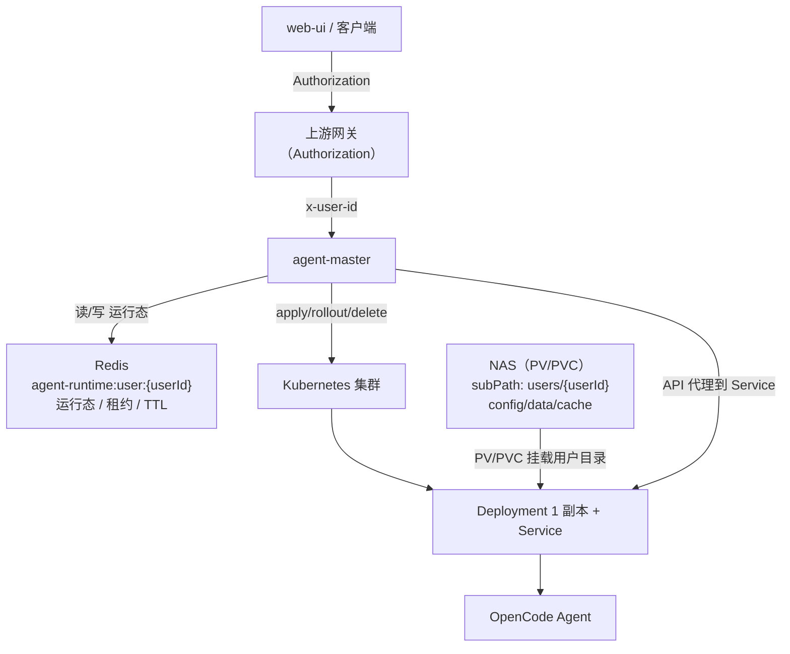
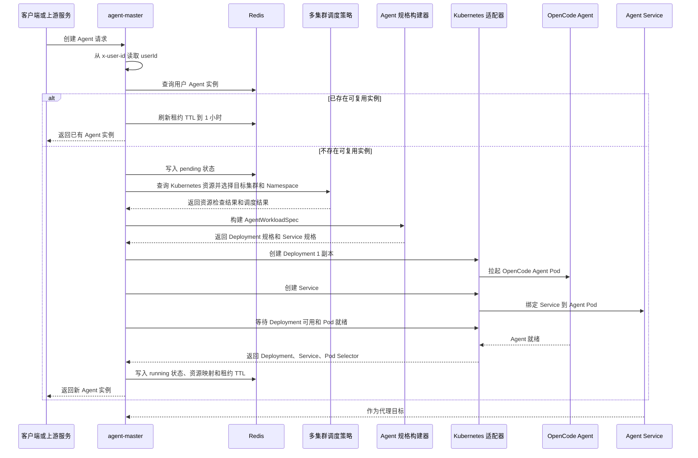
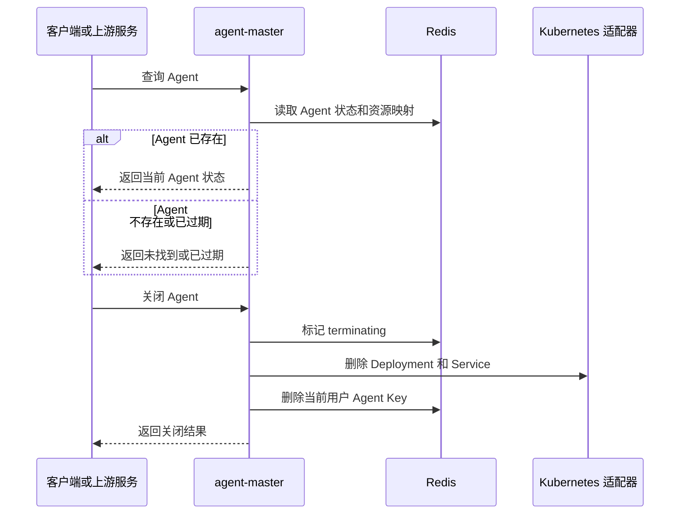
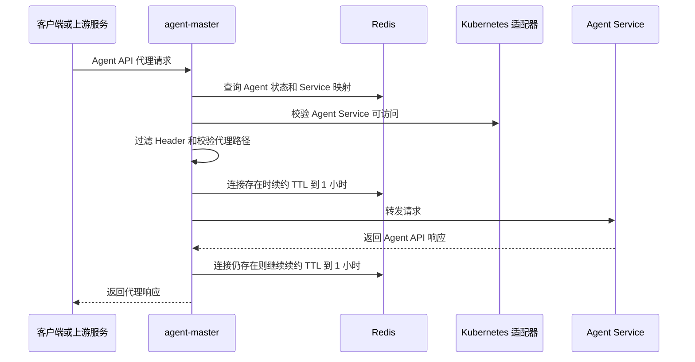
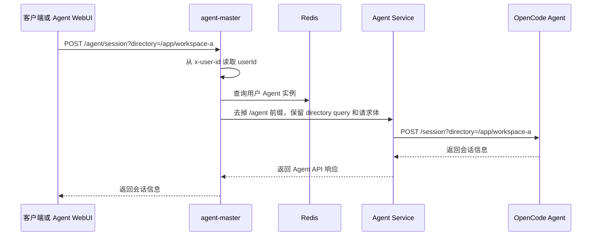
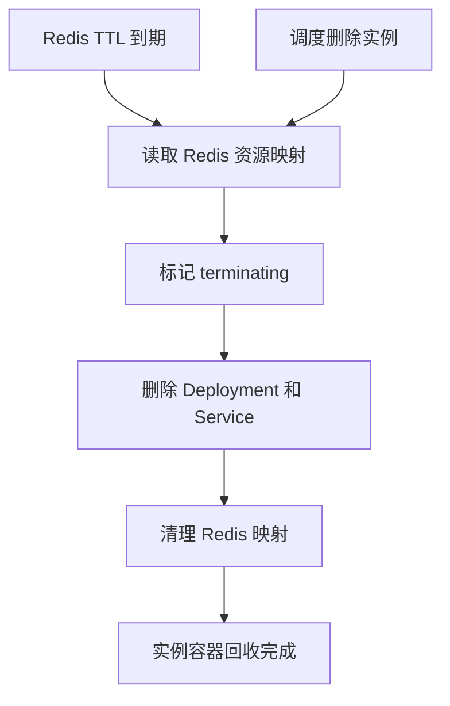
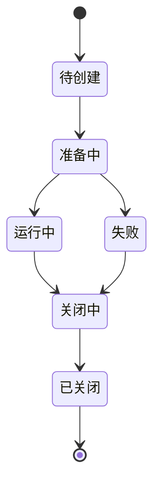

# agent-master · Agent 控制面服务

> Agent 控制面服务：负责多 Kubernetes 集群下 OpenCode Agent 工作负载的调度启停，并代理转发对应 Agent API 请求。

## 1. 定位与目标

`agent-master` 是一个 Agent 控制面服务，负责根据用户或上游平台请求，在多个 Kubernetes 集群中选择目标集群与 Namespace，创建、查询、关闭 OpenCode Agent 工作负载，并代理转发对应 Agent API 请求。

当前 Agent 基座默认是 **OpenCode**。服务不直接实现 Agent 推理能力，而是管理 Agent 运行实例的生命周期，并为上层调用方提供统一的 API 入口。

一句话定位：

- 用户或上游平台请求创建、查询、关闭 Agent。
- 服务在多个 Kubernetes 集群中选择目标集群，并创建、查询、关闭对应 Agent 工作负载。
- 服务维护用户、Agent 实例、Deployment、Service、Pod、API 连接之间的映射。
- 服务将外部 API 请求代理到目标 Agent Service。

设计目标：

- 用统一控制面管理 OpenCode Agent 生命周期。
- 支持多 Kubernetes 集群下的 Agent 调度控制。
- 固定以 Deployment（1 副本）+ Service 作为 Agent 运行单元。
- 通过 Redis 维护用户实例映射、启停状态、租约续约和 TTL 回收。
- Agent 按用户动态启停，Kubernetes 按约定挂载用户工作目录，并由 `resources/templates` 完成默认初始化。
- 为 Agent WebUI / Agent API 提供统一 HTTP 与 SSE 代理入口。

## 2. 总体架构设计

`agent-master` 对外提供 Agent 管理 API 和 Agent API 代理入口，对内通过 Redis 维护实例状态，通过多 Kubernetes 集群适配器调度和管理 OpenCode Agent 工作负载。

服务分为三层：

1. **接入层**：承接用户或上游平台请求，以用户作为 Agent 实例归属；当用户使用 Agent 时，先查询 Redis 获取对应实例，没有实例则触发调度创建并写入 Redis。上游鉴权后注入 `x-user-id`，服务据此查找对应 Agent 实例，并对 Agent 的全量接口做代理转发，代理需支持 HTTP 与 SSE。
2. **调度控制层**：负责 Agent 实例状态、Redis 映射、创建/查询/关闭幂等、租约续约、TTL 回收、多集群调度策略，以及 Deployment（1 副本）+ Service 的创建、查询和删除。
3. **实例层**：按用户运行 OpenCode Agent 工作负载，通过 Kubernetes PV/PVC 挂载用户工作目录和 OpenCode 持久化配置。Agent 实例按用户归属创建和复用；OpenCode `directory` 是官方接口 query 参数，由调用方显式传入并经 `/agent/*` 透明透传。



它对外提供：

- 当前用户 Agent 创建、查询与关闭。
- 多 Kubernetes 集群调度控制。
- Agent API 代理入口。
- Agent WebUI 到 Agent 的 HTTP / SSE 连接代理。

它对内管理：

- 用户与 Agent 实例映射。
- Redis 状态、租约和 TTL。
- OpenCode Agent Deployment。
- 每个 Deployment 固定 1 个副本。
- 与 Deployment 配套的 Service。
- NAS 用户存储根路径挂载。
- Pod 就绪状态与 Service 代理目标。

## 3. 架构演进原则

`agent-master` 的长期演进方向是横向扩展 Kubernetes 调度承载能力，而不是改变 Agent 归属、NAS 挂载或 Agent API 代理模型。

演进原则：

- 保持已确认的用户 Agent 归属逻辑：`userId -> Agent`。
- 保持已确认的 NAS 挂载逻辑：整个用户目录是一个 PVC 单卷，通过 `runtime.workspacePvcSubPathRoot` 拼接用户子路径分两个 subPath 挂载：`{runtime.workspacePvcSubPathRoot}/{userId}/runtime -> /app` (subPath)，`{runtime.workspacePvcSubPathRoot}/{userId}/global -> ~` (subPath)，OpenCode 默认路径自然匹配持久化。
- 保持已确认的 Agent API 通用透明代理逻辑：去掉 `/agent` 前缀，保留 OpenCode 官方路径、查询参数、HTTP 方法和请求体。
- OpenCode `directory` 是官方 query 参数，由调用方显式传入。
- 当单集群 Agent Deployment 数量增长导致 Kubernetes Server API 压力上升时，通过新增可调度集群、调整集群调度权重或扩展 Namespace 容量分摊负载。
- 多集群扩展只影响 Agent 调度落点，不改变用户侧 API、Agent 容器内目录结构和透明代理约定。

## 4. 技术选型与说明

| 维度 | 选型 | 说明 |
|---|---|---|
| 运行时 | Bun | 用于快速启动 TypeScript 后端服务，内置测试能力。 |
| 开发语言 | TypeScript | 保持接口、配置、领域对象和适配器边界可类型化。 |
| Web 框架 | Fastify | 提供轻量 HTTP API、插件机制和较好的测试注入能力。 |
| 配置校验 | Zod | 对 `config.yaml` 和集群配置做运行时校验。 |
| 测试框架 | bun:test | 覆盖健康检查、配置加载和调度控制逻辑。 |
| Kubernetes 集成 | Kubernetes Client Adapter | 通过适配器封装多集群 Deployment（1 副本）+ Service 创建、查询、关闭和代理目标解析。 |
| API 代理 | HTTP / SSE 代理 | 用于转发 Agent API，请求路径、Header 和错误处理必须受控。 |
| 状态存储 | Redis | 用于 Agent 实例映射、启停状态、租约续约、TTL 回收和轻量状态恢复。 |

## 5. 核心业务流程

`agent-master` 的核心业务流程围绕 Agent 创建、状态维护、租约续约、API 代理和资源回收展开。Agent 运行单元固定为 Deployment（1 副本）+ Service，状态和租约维护统一使用 Redis。

### 5.1 Agent 创建流程



AgentWorkloadSpec 构建逻辑：

- 根据用户归属生成 Agent 实例 ID、Deployment 名称、Service 名称和统一 Labels。
- 根据调度结果写入目标 cluster、Namespace、资源规格和 Service 端口。
- 从 `x-user-id` 读取用户标识，并按 `{runtime.workdir}/{userId}` 拼接用户 NAS 工作目录。
- Agent 创建或重启前，初始化流程必须确保完整目录结构存在：
  - `{runtime.workdir}/{userId}/runtime/` + `{runtime.workdir}/{userId}/runtime/.opencode/`
  - `{runtime.workdir}/{userId}/global/.config/opencode/`
  - `{runtime.workdir}/{userId}/global/.local/share/opencode/`
  - `{runtime.workdir}/{userId}/global/.cache/opencode/`
- Runtime Deployment 使用 `runtime.workspacePvcClaimName` 指定的单个 PVC，通过两个 subPath 分别挂载：
  - `{runtime.workspacePvcSubPathRoot}/{userId}/runtime` → `/app`（用户项目工作目录，`AGENTS.md` + `.opencode/` 自然成为 `/app/AGENTS.md` + `/app/.opencode`）
  - `{runtime.workspacePvcSubPathRoot}/{userId}/global` → `~`（OpenCode 默认查找路径正好匹配全局配置/data/cache）
- 将上述镜像、端口、环境变量、卷、挂载路径和安全约束渲染为 `deploy.yaml`，作为创建或更新 Kubernetes Agent Deployment 的输入。
- OpenCode Agent 启动命令、环境变量、容器端口和挂载路径使用服务预设参数。
- Deployment 固定 `replicas = 1`，Service 作为 Agent API 代理目标。

### 5.2 Agent 查询与关闭流程



### 5.3 Agent API 代理流程



### 5.4 OpenCode 会话、directory 与配置加载规则

`agent-master` 约定 Kubernetes 挂载关系，并按 OpenCode 官方接口透明代理会话创建请求。`directory` 是 OpenCode 官方 query 参数，由调用方显式传入。



directory 约束：

- `directory` 是 OpenCode 官方 query 参数，不是 Agent 实例归属参数。
- `agent-master` 只透明透传 `directory`。
- `directory` 不参与 Agent Redis Key、Deployment、Service、镜像选择或调度均衡。

OpenCode 配置加载规则：

- OpenCode 项目级 `plugins`、`skills`、`agents`、`tools`、`.opencode` 等配置由 OpenCode 进程启动时加载，不是每次创建会话时动态重新加载。
- 用户默认项目规则位于 `{runtime.workdir}/{userId}/AGENTS.md`，通过 `{runtime.workdir}/{userId} -> /app` 根挂载自然成为 `/app/AGENTS.md`。
- 用户默认项目级 OpenCode 配置位于 `{runtime.workdir}/{userId}/.opencode`，通过根挂载自然成为 `/app/.opencode`。
- OpenCode 用户级配置持久化到 `{runtime.workdir}/{userId}/global/.config/opencode`，通过 subPath 挂载到 `~/.config/opencode`。
- OpenCode 用户级数据持久化到 `{runtime.workdir}/{userId}/global/.local/share/opencode`，通过 subPath 挂载到 `~/.local/share/opencode`，包含 `auth.json`、会话记录、索引、缓存等。
- OpenCode 动态下载的 provider 包和插件缓存持久化到 `{runtime.workdir}/{userId}/global/.cache/opencode`，通过 subPath 挂载到 `~/.cache/opencode`，避免每次重启重新下载。
- 平台场景化能力通过 OpenCode 原生 `plugin` 机制实现：用户在 `/app/.opencode/opencode.json` 的 `plugin` 字段声明插件包名，OpenCode 启动时下载插件并缓存到 `~/.cache/opencode`，由 PVC 持久化；配置更新后需要重启 Agent 容器 / Pod 才能重新加载。
- `agent-master` 只负责挂载路径约定和 OpenCode API 透明代理；具体如何在指定 directory 下应用项目规则，由 `agent-runtime` 的启动流程和 OpenCode 项目级配置约定实现。

### 5.5 回收删除流程

Agent 回收有两类触发源：

- Redis TTL 到期，表示 Agent 租约未续约或已空闲超时。
- 上游或系统触发调度删除，要求主动关闭指定 Agent 实例。



流程约束：

- 创建、查询、关闭、内部续约和删除都必须具备幂等性或一致性控制。
- Redis 是 Agent 状态、资源映射和租约 TTL 的权威存储。
- Redis TTL 到期或调度删除实例时，必须删除对应 Deployment（1 副本）+ Service，并清理 Redis 映射。
- Kubernetes 资源以 Deployment（1 副本）+ Service 为统一运行单元。
- Agent API 代理只经 Service 访问 Agent，不直接访问 Pod IP。
- 任何异常都不能泄露 kubeconfig、Token、Pod IP、ClusterIP、内部 Service DNS。

## 6. 存储结构设计

存储结构分为三类：Redis 运行态存储、NAS 文件存储、Kubernetes 资源标识。Redis 负责实例映射、状态、租约和回收；NAS 负责用户工作区与 OpenCode 项目级配置；Kubernetes 资源标识负责把 Agent 实例和 Deployment、Service、Pod 绑定起来。

### 6.1 Redis Key 设计

初始阶段只保留一个核心 Key：

| Key | 类型 | TTL | 用途 |
|---|---|---:|---|
| `agent-runtime:user:{userId}` | Hash / JSON | 1 小时 | 保存用户当前 Agent 的完整状态、Kubernetes 资源映射、NAS 路径引用、Service 代理目标和租约信息。 |

Value 示例：

```json
{
  "runtimeId": "rt-weizuxiao-a3b7",
  "userId": "weizuxiao",
  "status": "running",
  "cluster": "cluster-a",
  "namespace": "agent-runtime",
  "deploymentName": "agent-rt-weizuxiao-a3b7",
  "serviceName": "agent-rt-weizuxiao-a3b7",
  "podSelector": {
    "app": "agent-runtime",
    "runtimeId": "rt-weizuxiao-a3b7",
    "userId": "weizuxiao"
  },
  "servicePort": 4096,
  "targetPort": 4096,
  "workspaceRootPath": "/nas/agent-master/users/weizuxiao",
  "leaseExpireAt": "2026-06-11T12:00:00.000Z",
  "createdAt": "2026-06-11T11:00:00.000Z",
  "updatedAt": "2026-06-11T11:20:00.000Z",
}
```

设计原则：

- Redis 只保存 Agent 调度控制所需的轻量状态。
- Redis 不保存 kubeconfig、Token、证书、明文密钥或完整请求体。
- Agent 归属以用户为基本单位，初始阶段一个用户同一时间只维护一个可用 Agent。
- 上游鉴权后通过 `x-user-id` 传入用户标识，服务据此作为 `userId` 并查询该 Key。
- Agent API / WebUI 连接存在时，持续刷新该 Key TTL 到 1 小时。
- TTL 到期或主动删除时，读取该 Key 内的 Deployment、Service、cluster、namespace 信息，删除对应 Kubernetes 资源后清理 Key。
- 不单独拆分状态 Key、租约 Key、代理目标 Key；后续只有出现多 Agent、runtimeId 反查、后台巡检等真实需求时再增加索引 Key。

### 6.2 Agent 状态结构

| 字段 | 说明 |
|---|---|
| `runtimeId` | Agent 实例 ID。 |
| `userId` | 用户或上游主体引用。 |
| `status` | `pending`、`preparing`、`running`、`terminating`、`terminated`、`failed`。 |
| `cluster` | Kubernetes 集群逻辑名。 |
| `namespace` | Kubernetes Namespace。 |
| `deploymentName` | Agent Deployment 名称。 |
| `serviceName` | Agent Service 名称。 |
| `podSelector` | Agent Pod 选择器。 |
| `servicePort` | Service 暴露端口。 |
| `targetPort` | Agent 容器监听端口。 |
| `workspaceRootPath` | 用户 NAS 存储根路径引用。 |
| `leaseExpireAt` | 租约过期时间。 |
| `createdAt` | 创建时间。 |
| `updatedAt` | 更新时间。 |

### 6.3 Agent 生命周期状态



状态含义：

| 状态 | 说明 |
|---|---|
| `pending` | 已接收创建请求，尚未创建 Kubernetes 资源。 |
| `preparing` | 正在创建 Deployment（1 副本）+ Service、挂载用户存储根路径、等待 Pod 就绪。 |
| `running` | Agent 已就绪，可代理 API 请求；空闲回收由租约 TTL 处理，不引入独立 `idle` 状态。 |
| `terminating` | 正在关闭并释放资源。 |
| `terminated` | 已关闭并释放资源。 |
| `failed` | 创建、运行或回收失败。 |

### 6.4 NAS 存储结构

NAS 用于承载用户级 OpenCode 持久化数据，包括：用户 Agent 工作目录、用户项目级配置、OpenCode 全局配置、全局数据和插件缓存。所有路径按 `x-user-id` 隔离，通过 Kubernetes PV/PVC 挂载到 Agent 容器。

**设计思路：简洁两级目录**

- 整个用户目录位于 PVC 内，`{runtime.workspacePvcSubPathRoot}/{userId}` 是用户根
- 根下分两个顶层子目录，分别 subPath 挂载到容器不同位置：
  - `runtime/` → 容器 `/app`（用户项目工作区，包含 `AGENTS.md` + `.opencode/`）
  - `global/` → 容器 `~`（OpenCode 全局配置/data/cache 自然对应用户家目录）

路径结构：

```text
/nas/agent-master/
└── users/
    └── {userId}/                     # {runtime.workdir}/{userId}
        ├── runtime/                  # → subPath 挂载到容器 /app
        │   ├── AGENTS.md            # 用户默认项目规则
        │   └── .opencode/           # 用户项目级 OpenCode 配置
        │       ├── opencode.json    # 可通过 plugin 字段声明插件包名
        │       ├── agents/
        │       ├── commands/
        │       ├── modes/
        │       ├── plugins/
        │       ├── skills/
        │       ├── tools/
        │       └── themes/
        └── global/                  # → subPath 挂载到容器 ~
            └── .config/
                └── opencode/       # OpenCode 全局配置 → ~/.config/opencode
            └── .local/share/
                └── opencode/       # OpenCode 全局数据 → ~/.local/share/opencode
            └── .cache/
                └── opencode/       # provider 包和插件缓存 → ~/.cache/opencode
```

路径拼接与挂载映射：

| 源路径 (NAS) | 容器内路径 | 挂载方式 | 说明 |
|---|---|---|---|
| `{runtime.workspacePvcSubPathRoot}/{userId}/runtime` | `/app` | subPath | 用户**项目工作目录**，包含 `AGENTS.md` 与 `.opencode/` 项目级配置 |
| `{runtime.workspacePvcSubPathRoot}/{userId}/global` | `/root` / `~` | subPath | 用户**全局数据目录**，完全对应用户家目录，OpenCode 默认路径自然生效 |

> 因为 `{runtime.workspacePvcSubPathRoot}/{userId}/global/.config/opencode` → `~/.config/opencode`，正好匹配 OpenCode 原生查找路径，**不需要修改 OpenCode 任何逻辑**。

挂载规则：

- `x-user-id` 是用户标识来源，用于拼接用户 NAS 工作目录。
- Runtime Deployment 禁止使用 `hostPath`，必须使用 `runtime.workspacePvcClaimName` 指定的单个 PVC，并通过 `runtime.workspacePvcSubPathRoot` 拼接 subPath。
- 挂载关系固定为 `{runtime.workspacePvcSubPathRoot}/{userId}/runtime` → `/app` 和 `{runtime.workspacePvcSubPathRoot}/{userId}/global` → `~`。
- 覆盖 `agent-image` 镜像内默认 `/app` 是预期行为，Agent 运行时以用户挂载目录为准。
- OpenCode 默认查找 `~/.config/opencode`、`~/.local/share/opencode`、`~/.cache/opencode`，正好对应 NAS 上 `global/` 下路径，完美匹配不需要改动。
- 平台场景化能力通过 OpenCode 原生 `plugin` 机制实现：用户在 `/app/.opencode/opencode.json` 的 `plugin` 字段声明插件包名，OpenCode 启动时下载插件并缓存到 `~/.cache/opencode`，由 PV 持久化。
- Agent 创建或重启前，必须先初始化所有挂载依赖路径。
- 用户项目配置、OpenCode 全局配置和插件缓存都是 Agent 启动时加载的配置；配置更新后需要重启 Agent 容器 / Pod 才能重新加载。
- README 不记录真实 NAS 地址、真实用户路径或内部业务路径。

#### NAS 目录初始化规则

**为什么必须初始化**：
Kubernetes 的 `subPath` 挂载要求**源路径必须已经存在**。如果 NAS 上对应的用户目录或文件不存在，Kubernetes 会自动用 root 权限创建一个空目录/空文件，导致容器内的 OpenCode 进程无权限写入。因此 master 必须在创建 Agent Pod 之前，提前以正确的权限初始化所有挂载依赖路径。

---

**首次创建 Agent（新用户）→ 完整初始化**

触发时机：`POST /runtime` 时，Redis 中找不到该用户的 Agent 实例，进入调度流程之前。

操作顺序（所有操作幂等，不存在则创建，已存在则跳过）：

1. **创建目录结构**（`mkdir -p`）：
   ```text
   {runtime.workdir}/{userId}/
   ├── runtime/                     # 对应容器 /app
   │   ├── .opencode/               # 用户项目级 OpenCode 配置
   │   │   └── opencode.json
   │   └── AGENTS.md                # 用户默认项目规则
   └── global/                      # 对应容器 ~
       └── .config/
           └── opencode/           # OpenCode 全局配置 → ~/.config/opencode
       └── .local/share/
           └── opencode/           # OpenCode 全局数据 → ~/.local/share/opencode
       └── .cache/
           └── opencode/           # provider 包和插件缓存 → ~/.cache/opencode
   ```

2. **从模板拷贝默认文件到 `runtime/` 目录**（文件不存在时才写）：
   - `resources/default-agents.md` → `{runtime.workdir}/{userId}/runtime/AGENTS.md`
   - `resources/default-opencode.json` → `{runtime.workdir}/{userId}/runtime/.opencode/opencode.json`

   默认 `AGENTS.md` 模板内容：
   ```markdown
   # OpenCode Agent Rules
   
   ## 默认项目约束
   - 本文件由 master 在首次创建 Agent 时自动生成
   - 后续修改不会被 master 覆盖
   - 配置变更需重启 Agent 生效
   ```

    默认 `opencode.json` 模板内容：
    ```json
    {
      "$schema": "https://opencode.ai/config.json",
      "model": "anthropic/claude-sonnet-4-5",
      "small_model": "anthropic/claude-haiku-4-5",
      "plugin": []
    }
    ```

    模板已经预留 `plugin` 数组，用户后续可以直接添加场景化插件声明，例如：
    ```json
    "plugin": ["agent-plugin@git+https://github.com/ArchAIHarness/agent-plugin.git"]
    ```
    OpenCode 启动时会自动下载加载声明的插件，不需要修改平台核心代码。

3. **创建三级 OpenCode 全局目录**（`mkdir -p` 确保存在）：
   - `{runtime.workdir}/{userId}/global/.config/opencode/`
   - `{runtime.workdir}/{userId}/global/.local/share/opencode/`
   - `{runtime.workdir}/{userId}/global/.cache/opencode/`

4. **权限统一设置**：确保所有目录和文件对 Agent 容器内的运行 uid/gid 可读可写。

---

**重启 Agent → 仅做目录存在性检查**

触发时机：`POST /runtime/restart` 时。

操作范围：
- **只检查 7 个目录是否存在**，不存在则创建：
  - `runtime/`、`runtime/.opencode/`
  - `global/.config/opencode/`
  - `global/.local/share/opencode/`
  - `global/.cache/opencode/`
- **绝对不写任何文件**（`AGENTS.md`、`opencode.json` 即使丢失也不恢复、不覆盖）
- 不改权限

---

**关键边界**：
- 初始化只发生在**新用户首次创建 Agent** 时，后续重启只做最轻量的目录检查
- 所有文件写入操作必须带"不存在才创建"的原子语义（如 `O_EXCL` 标志或先检查 exists）
- 用户后续修改的 `AGENTS.md`、`opencode.json` 永远不会被 master 覆盖
- 平台级默认配置（如默认插件列表、默认 model 提供商）由上游控制面在初始化完成后写入到用户的 `opencode.json` 中，master 内置模板只提供最基础的骨架
- `cache/` 目录由 OpenCode 进程自行管理，初始化时只确保目录存在，不写入任何内容
- `data/auth.json` 由 OpenCode 首次连接 provider 时自动生成到 `global/.local/share/opencode/`，初始化流程绝不触碰

 ### 6.5 Kubernetes 资源标识

 Agent 实例与 Kubernetes 资源通过统一命名和 Labels 绑定。

 | 资源 | 命名规则 | 说明 |
 |---|---|---|
 | `runtimeId` | `rt-{sanitizedUserId}-{4-random-alphanumeric}` | Agent 实例唯一标识。 |
 | Deployment | `agent-{runtimeId}` | 固定 1 副本。 |
 | Service | `agent-{runtimeId}` | 作为 Agent API 代理目标。 |
 | Labels | `app=agent-runtime`、`runtimeId={runtimeId}`、`userId={userId}` | 用于资源查询、清理和 Selector 绑定。 |

 命名规则说明：
 - `runtimeId` 由 `userId`  sanitize 后加上 4 位随机小写字母数字后缀生成
 - 保证 Kubernetes 名称兼容性（只能小写字母、数字、'-'，不能开头/结尾是 '-'）
 - 同一个用户多次创建会生成不同 `runtimeId`，避免名称冲突

## 7. API 接口设计

API 分为健康检查、Agent 管理、Agent API 代理三类。Agent 管理接口面向上游平台或控制端；Agent API 代理接口面向 Agent WebUI 或调用方。

### 7.1 健康检查接口

```http
GET /health
```

响应字段：

| 字段 | 说明 |
|---|---|
| `status` | 服务状态。 |
| `service` | 固定为 `agent-master`。 |

### 7.2 Agent 管理接口

```http
POST /runtime
GET /runtime
GET /runtime/events
POST /runtime/restart
DELETE /runtime
```

接口语义：

| 接口 | 语义 |
|---|---|
| `POST /runtime` | 创建当前用户 Agent；已存在则返回当前 Agent。 |
| `GET /runtime` | 当前用户 Agent 状态 API；查询 Agent 生命周期状态、租约、集群和 Kubernetes 资源映射。 |
| `GET /runtime/events` | 当前用户 Agent 平台事件 SSE；推送控制面状态变化和 `runtime.heartbeat` 心跳。 |
| `POST /runtime/restart` | 重启当前用户 Agent，用于重新加载 OpenCode 项目级配置、动态安装的 skills / tools / plugins 或运行时环境变更；Agent 不存在时返回 404。 |
| `DELETE /runtime` | 关闭当前用户 Agent，并删除 Deployment（1 副本）+ Service 与 Redis Key。 |

### 7.3 Agent 创建请求

Agent 创建请求不传业务参数。Agent 只按用户动态启停，用户归属不由请求体传入，也不由本服务解析 `Authorization`；上游完成鉴权后必须通过 `x-user-id` Header 传入用户标识，服务将其作为 `userId`。HTTP Header 大小写不敏感，实现中统一按 `x-user-id` 读取。若 `x-user-id` 缺失或为空，服务必须拒绝 Agent 创建、查询、关闭和代理请求。

```http
POST /runtime
x-user-id: user-ref
```

请求体为空或 `{}`。

### 7.4 Agent 重启请求

Agent 重启用于让 OpenCode Web 重新加载项目级配置、动态安装的 skills / tools / plugins 或运行时环境变更。

```http
POST /runtime/restart
x-user-id: user-ref
```

请求体为空或 `{}`，也可以携带可选原因：

```json
{
  "reason": "reload-opencode-config"
}
```

重启规则：

- 基于 `x-user-id` 查找当前用户 Agent，不接受 `runtimeId`。
- Agent 不存在时返回 404。
- 重启不改变 Agent 归属、NAS 挂载约定、Service 代理入口。
- 推荐通过 patch Deployment PodTemplate annotation 触发 rollout restart。
- Deployment 固定 1 副本，重启期间该用户 Agent 会短暂不可用。
- 重启后仍通过原 Agent Service 代理访问。

### 7.5 Agent 状态查询请求

Agent 状态 API 用于查询当前用户 Agent 的生命周期状态、租约和 Kubernetes 资源映射。

```http
GET /runtime
x-user-id: user-ref
```

查询规则：

- 基于 `x-user-id` 查询当前用户 Agent，不接受 `runtimeId`。
- Agent 存在时返回 Redis 中记录的轻量状态，并可结合 Deployment、Service、Pod readiness 校验服务状态。
- Agent 不存在或 TTL 已过期时返回未找到或已过期状态。
- 响应不返回 Pod IP、ClusterIP、内部 Service DNS、kubeconfig、Token 或 NAS 真实内部地址。

### 7.6 Agent 平台事件 SSE

平台事件 SSE 用于推送当前用户 Agent 的控制面状态变化和心跳，不代理 OpenCode 事件，不承载会话消息。

```http
GET /runtime/events
x-user-id: user-ref
```

事件范围：

```text
runtime.creating
runtime.scheduled
runtime.deployment.created
runtime.service.created
runtime.pod.pending
runtime.pod.ready
runtime.running
runtime.restarting
runtime.terminating
runtime.terminated
runtime.failed
runtime.ttl.extended
runtime.heartbeat
```

心跳规则：

- 事件名固定为 `runtime.heartbeat`。
- 默认每 30 秒发送一次。
- 心跳只返回 `userId`、`runtimeId`、`status`、`time` 等轻量信息。
- SSE 连接存在时周期性续约 Agent TTL；TTL 续约间隔默认为 5 分钟，不与每次心跳强绑定，避免高频 Redis 写入。
- 连接断开后停止心跳和 TTL 续约。

边界：

- 平台事件 SSE 只推送 Agent 创建、调度、重启、回收、失败和 readiness 等控制面事件。
- OpenCode 原生事件继续通过 `/agent/event` 和 `/agent/global/event` 代理。
- 平台事件 SSE 不返回 OpenCode 会话消息、Agent 对话内容、文件内容、Pod IP、ClusterIP、内部 Service DNS、kubeconfig、Token、Secret 或 NAS 真实内部地址。

### 7.7 Agent 响应结构

```json
{
  "runtimeId": "rt-weizuxiao-a3b7",
  "userId": "weizuxiao",
  "status": "running",
  "cluster": "cluster-a",
  "namespace": "agent-runtime",
  "deploymentName": "agent-rt-weizuxiao-a3b7",
  "serviceName": "agent-rt-weizuxiao-a3b7",
  "leaseExpireAt": "2026-06-11T12:00:00.000Z",
}
```

响应不返回 Pod IP、ClusterIP、内部 Service DNS、kubeconfig、Token 或 NAS 真实内部地址。

### 7.8 Agent API 代理接口

```http
/agent/*
```

代理入口以 Agent 实际暴露的 OpenCode Server API 为准。`agent-runtime` 镜像使用 `opencode web --port 4096 --hostname 0.0.0.0` 启动，OpenAPI 3.1 规范页面为 Agent 内部的 `/doc`。Agent API 代理默认是通用透明代理：服务基于用户归属找到当前 Agent Service，去掉 `/agent` 前缀后保留 HTTP 方法、后续路径、查询参数和请求体转发。`POST /agent/session` 也按 OpenCode 官方接口透明代理；`directory` query 参数由调用方显式传入。

常用 OpenCode Server API 代理关系：

| 用途 | 对外代理路径 | 转发到 Agent 路径 | 说明 |
|---|---|---|---|
| 健康检查 | `GET /agent/global/health` | `GET /global/health` | OpenCode Server 健康与版本。 |
| OpenCode 全局事件 | `GET /agent/global/event` | `GET /global/event` | OpenCode Agent 全局 SSE 事件流。 |
| 当前项目 | `GET /agent/project/current` | `GET /project/current` | 获取当前 OpenCode 项目。 |
| 创建会话 | `POST /agent/session?directory=/app/workspace-a` | `POST /session?directory=/app/workspace-a` | `directory` 是 OpenCode 官方 query 参数，由调用方显式传入并透明透传。 |
| 会话列表 | `GET /agent/session` | `GET /session` | 返回会话列表。 |
| 会话详情 | `GET /agent/session/:id` | `GET /session/:id` | 返回指定会话。 |
| 删除会话 | `DELETE /agent/session/:id` | `DELETE /session/:id` | 删除会话及数据。 |
| 中断会话 | `POST /agent/session/:id/abort` | `POST /session/:id/abort` | 中断运行中的会话。 |
| 发送消息 | `POST /agent/session/:id/message` | `POST /session/:id/message` | 发送消息并等待响应。 |
| 异步发送消息 | `POST /agent/session/:id/prompt_async` | `POST /session/:id/prompt_async` | 发送消息但不等待响应。 |
| 消息列表 | `GET /agent/session/:id/message` | `GET /session/:id/message` | 查询会话消息。 |
| 执行命令 | `POST /agent/session/:id/command` | `POST /session/:id/command` | 执行 slash command。 |
| 执行 Shell | `POST /agent/session/:id/shell` | `POST /session/:id/shell` | 执行 shell command。 |
| 文件列表 | `GET /agent/file?path=<path>` | `GET /file?path=<path>` | 查询文件目录。 |
| 文件内容 | `GET /agent/file/content?path=<path>` | `GET /file/content?path=<path>` | 读取文件内容。 |
| 文件状态 | `GET /agent/file/status` | `GET /file/status` | 查询文件状态。 |
| Agent 列表 | `GET /agent/agent` | `GET /agent` | 查询可用 agents。 |
| OpenCode directory 事件 | `GET /agent/event?directory=/app/workspace-a` | `GET /event?directory=/app/workspace-a` | 订阅指定 directory / workspace 相关 SSE 事件。 |
| OpenAPI 文档 | `GET /agent/doc` | `GET /doc` | OpenCode Server OpenAPI 文档。 |

会话代理规则：

- `POST /agent/session` 按 OpenCode 官方接口透明代理，不做业务扩展参数转换。
- OpenCode 官方 `POST /session` 支持 `directory` query 参数，用于指定会话目录；请求体可包含 `parentID`、`title`、`agent`、`model`、`metadata`、`permission`、`workspaceID` 等官方字段。
- `directory` 由调用方显式传入，`agent-master` 保留 query 原样转发。
- `directory` 不触发配置动态加载，不改变 Agent 实例归属，不影响 Redis Key、Deployment、Service、镜像选择或调度均衡。

OpenCode 配置加载规则：

- OpenCode 项目级配置和用户级配置由 OpenCode 进程启动时加载，不是每次创建会话时动态重新加载。
- 用户默认项目规则位于 `{runtime.workdir}/{userId}/runtime/AGENTS.md`，通过 `{runtime.workspacePvcSubPathRoot}/{userId}/runtime -> /app` subPath 挂载自然成为 `/app/AGENTS.md`。
- 用户默认项目级 OpenCode 配置位于 `{runtime.workdir}/{userId}/runtime/.opencode`，通过 `{runtime.workspacePvcSubPathRoot}/{userId}/runtime -> /app` subPath 挂载自然成为 `/app/.opencode`。
- OpenCode 默认从 `~/.config/opencode`、`~/.local/share/opencode`、`~/.cache/opencode` 读取/写入全局配置、数据和缓存。
- 我们通过 `{runtime.workspacePvcSubPathRoot}/{userId}/global -> /root` subPath 挂载，正好让这些路径对应到 PVC 上的持久化存储：
  - `{runtime.workspacePvcSubPathRoot}/{userId}/global/.config/opencode` → `~/.config/opencode`（OpenCode 用户级全局配置）
  - `{runtime.workspacePvcSubPathRoot}/{userId}/global/.local/share/opencode` → `~/.local/share/opencode`（OpenCode 用户级全局数据，包含 `auth.json`、会话记录、索引等）
  - `{runtime.workspacePvcSubPathRoot}/{userId}/global/.cache/opencode` → `~/.cache/opencode`（OpenCode 动态下载的 provider 包和插件缓存，避免每次重启重新下载）
- 平台场景化能力通过 OpenCode 原生 `plugin` 机制实现：用户在 `/app/.opencode/opencode.json` 的 `plugin` 字段声明插件包名，OpenCode 启动时下载插件并缓存到 `~/.cache/opencode`，由 PV 持久化。
- 如果用户目录内容或 OpenCode 配置发生更新，需要重启 Agent 容器 / Pod，让 OpenCode 进程重新启动后加载新配置。

代理规则：

- 支持普通 HTTP 请求代理。
- 支持 OpenCode 原生 SSE 长连接代理；OpenCode 原生 SSE 仍走 `/agent/*` 通用代理入口，平台控制面事件使用独立的 `GET /runtime/events`；`/event` 可携带 OpenCode 官方 `directory` query 订阅指定 directory 事件，`/global/event` 用于 OpenCode Agent 全局事件。
- 代理前必须读取上游注入的 `x-user-id` 作为用户归属，不能由调用方传入任意 `runtimeId` 后直接转发。
- 缺少 `x-user-id` 或 `x-user-id` 为空时，必须拒绝代理请求。
- `x-user-id` 只信任上游网关或上游服务注入，不接受公网客户端绕过上游后直接伪造。
- `Authorization` 由上游处理，本服务不自行解析用户 Token；如请求中仍携带 `Authorization`，禁止向 Agent 透传。
- 普通代理请求触发 Agent 租约续约到 1 小时；SSE 长连接存在时周期性续约；连接结束后停止续约，后续由 Redis TTL 到期触发回收。
- 转发到 Agent Service 时必须去掉 `/agent` 前缀，保留后续路径、查询参数、HTTP 方法和请求体。
- 代理只经 Agent Service 转发，不直接访问 Pod IP。
- 不允许通过代理路径访问 `agent-master` 自身管理接口。

### 7.9 WebUI 反向代理（可选）

```http
/webui/*
```

`/webui/*` 是浏览器进入 Runtime 内置 WebUI（如 `agent-image-webui` 镜像内置的 AionUi）的统一入口。本路由是**可选**的：仅当 `runtime.webuiPort` 在 `config.yaml` 中显式配置（典型值 `3000`）且 Agent Deployment 对应的 Service 也暴露了同一端口时才注册；不配置时 master 不暴露 `/webui/*`，对外仍只保留 `/agent/*` 与 `/runtime/*`。

行为约定：

- WebUI 路由只支持 HTTP（含 SSE）。WebSocket 升级请求不在 `/webui/*` 处理；如未来需要 WebUI WebSocket，会另开独立入口，避免与 `/agent/ws/*` 路由冲突。
- 转发到 Agent Service 时必须去掉 `/webui` 前缀，保留后续路径、查询参数、HTTP 方法和请求体；根访问 `/webui` 与 `/webui/` 都映射到上游 `/`。
- WebUI 反代必须连接到 Service 的 `runtime.webuiPort`，**不复用**已有 `/agent/*` 的 `runtime.port`（4096）。
- 不向 Agent 透传 `Authorization`、`x-user-id`、`Proxy-Authorization` 与所有 hop-by-hop Header；浏览器的 `Cookie` 必须保留，因为 AionUi session 依赖。
- 上游响应中的 `Set-Cookie` 必须把 `Path` 属性改写为 `runtime.webuiPathPrefix`（默认 `/webui`），避免 Cookie 误渗到 `/agent/*` 与 `/runtime/*`。
- 上游响应中的 hop-by-hop Header（`Connection`、`Content-Length`、`Transfer-Encoding` 等）按既有 `/agent/*` 规则剥离。
- 普通请求触发 Agent 租约续约到 1 小时；SSE 长连接存在时周期性续约；连接结束后停止续约，后续由 Redis TTL 到期触发回收。

配置入口（`config.yaml`）：

```yaml
runtime:
  image: agent-image-webui:latest   # 必须使用带 WebUI 的镜像
  port: 4096                        # OpenCode Web 端口（不变）
  webuiPort: 3000                   # AionUi 端口；不设置则不开 /webui/*
  webuiPathPrefix: /webui           # 浏览器侧前缀；默认 /webui
```

如果运行时镜像本身不含 WebUI（如 `agent-image`），保持 `webuiPort` 留空即可，master 自动跳过本路由。

## 8. Kubernetes 资源设计

Kubernetes 资源设计只围绕 Agent 运行单元展开，承接用户目录和 OpenCode 三级持久化目录（config/data/cache）的挂载约定，不承接完整平台控制面、审计中心或运行时动态配置切换职责。平台场景化能力由 OpenCode 原生 `plugin` 机制在上游控制面实现。

### 8.1 运行单元

每个 Agent 固定创建：

- 1 份按服务配置和用户标识渲染出的 `deploy.yaml`。
- 1 个 Deployment。
- Deployment 固定 `replicas = 1`。
- 1 个配套 Service。
- 一组统一 Labels / Selector。

`deploy.yaml` 是 Agent 启动清单，必须体现 `runtime.workdir`、容器端口、镜像、环境变量、volume、volumeMount、Labels / Selector 和安全约束。

### 8.2 调度输入

调度控制层需要显式处理：

- `cluster`：目标 Kubernetes 集群。
- `namespace`：目标 Namespace。
- `runtimeId`：Agent 实例 ID。
- `deploymentName`：Deployment 名称。
- `serviceName`：Service 名称。
- `labels`：Deployment、Pod、Service 的统一标签。
- `workspaceRootPath`：用户 NAS 存储根路径。

### 8.3 Kubernetes 资源检查与调度均衡

`agent-master` 通过 Kubernetes Server API 查询目标集群和 Namespace 的资源状态，用于在创建 Agent 前做调度均衡判断。服务负责选择更合适的 cluster、namespace 和 Agent 资源规格；Pod 在节点上的最终落点仍由 Kubernetes Scheduler 决定。

资源检查范围：

| 检查项 | 用途 |
|---|---|
| Node 可用性 | 判断集群是否存在可调度节点，过滤 NotReady、不可调度或资源压力明显的节点。 |
| Node allocatable / requests | 估算 CPU、Memory 剩余容量，避免把 Agent 集中调度到资源紧张集群。 |
| Namespace ResourceQuota | 判断目标 Namespace 是否还有足够 CPU、Memory、Pod 数和 Service 数配额。 |
| LimitRange | 选择或校验 Agent 默认资源请求与限制。 |
| 现有 Agent Deployment 分布 | 统计当前 cluster / namespace 下已运行的 OpenCode Agent 数量，用于均衡分布。 |
| Pod readiness | 判断已创建 Agent 是否真正可用，避免把不可用实例计入健康容量。 |
| Event / Condition | 识别调度失败、镜像拉取失败、资源不足等异常原因。 |

调度均衡原则：

- 优先选择可用资源余量更高的集群和 Namespace。
- 避免单个 Namespace 中 Agent 数量过度集中。
- 同等资源条件下，优先复用配置中的默认集群和 Namespace。
- 如果所有候选集群资源不足，应返回明确错误，不创建半成品 Deployment。
- 调度控制层只做集群和 Namespace 级均衡，不直接替代 Kubernetes Scheduler 的节点调度职责。
- 如需影响节点落点，可在 Deployment 规格中配置 nodeSelector、affinity、tolerations 或 priorityClass，但必须由上游策略或服务配置显式提供。

### 8.4 回收规则

- 关闭 Agent 时必须删除 Deployment 和 Service。
- Redis TTL 到期时必须触发 Deployment 和 Service 回收。
- 删除实例时必须先读取 Redis 资源映射，再按映射删除 Kubernetes 资源。
- 删除完成后必须清理 Redis 映射，避免旧 Service 被继续代理。

### 8.5 服务自身运行方式

`agent-master` 自身也按 Kubernetes 工作负载方式运行。访问目标 Kubernetes 集群所需的 kubeconfig、Token、证书或等价凭证，由 `agent-master` 的服务运行配置提供，不写入 Redis，不作为 Agent 状态保存。

凭证来源可以包括：

- 当前集群内访问：使用 `agent-master` Pod 绑定的 ServiceAccount 与 RBAC 权限。
- 多集群访问：通过受控 Secret、挂载文件或外部配置系统注入 kubeconfig / Token / 证书引用。
- 配置文件中只保留集群逻辑名、Namespace 策略、访问方式引用和资源规格，不记录真实明文凭证。

## 9. 配置设计

`agent-master` 自身运行在 Kubernetes 中，配置按 Kubernetes 方式管理。服务启动时读取服务目录下的 `config.yaml`；`config.yaml` 由 Kubernetes ConfigMap 挂载或镜像内默认配置提供。敏感信息不写入 `config.yaml`，通过 Kubernetes ServiceAccount、Secret、挂载文件或外部受控配置系统提供。

### 9.1 配置文件位置

服务内配置文件固定为：

```text
./config.yaml
```

Kubernetes 部署时建议通过 ConfigMap 挂载到服务工作目录：

```text
/app/config.yaml
```

### 9.2 config.yaml 结构

示例结构：

```yaml
server:
  port: 3000
  host: 0.0.0.0
  log: info

redis:
  host: redis
  port: 6379
  db: 0
  key: agent-runtime:user
  password: ""

runtime:
  image: ghcr.io/example/opencode-runtime:latest
  ttl: 3600
  timeout: 60000
  port: 4096
  workdir: /nas/agent-master/users
  workspacePvcClaimName: agent-runtime-nas
  workspacePvcSubPathRoot: agent-master/users
kubernetes:
  cluster: default
  namespace: agent-runtime
  clusters:
    - name: default
      namespace: agent-runtime
      auth: inCluster
      scheduling:
        enabled: true
        maxRuntime: 100
```

### 9.3 配置字段说明

| 配置路径 | 说明 |
|---|---|
| `server.port` | HTTP 服务端口。 |
| `server.host` | HTTP 监听地址。 |
| `server.log` | 日志级别。 |
| `redis.host` | Redis 服务主机名或服务名，写服务内可访问地址，不包含密码。 |
| `redis.port` | Redis 服务端口，默认 `6379`。 |
| `redis.db` | Redis 逻辑库编号，默认 `0`；用于区分环境或租户时必须由部署配置显式指定。 |
| `redis.key` | Agent Redis Key 前缀，固定为 `agent-runtime:user`。 |
| `redis.password` | 可选 Redis 密码；为空字符串表示不启用 Redis AUTH。真实密码不得提交到仓库，部署时应通过 Kubernetes Secret、环境变量替换或受控配置系统注入，例如 `${REDIS_PASSWORD}`。 |
| `runtime.image` | OpenCode Agent 镜像。 |
| `runtime.ttl` | Agent 租约有效期，连接存在时续约到 1 小时。 |
| `runtime.port` | OpenCode Agent 容器监听端口，当前与 `agent-runtime` 镜像约定为 `4096`，Agent 需监听 `0.0.0.0` 以便 Service 访问。 |
 | `runtime.workdir` | 用户 NAS 工作目录根路径，用于控制面初始化和状态引用，不作为 Runtime Deployment `hostPath` 使用。 |
| `runtime.workspacePvcClaimName` | Runtime Deployment 用户存储 PVC 名称，必填；Deployment 只能声明该 `persistentVolumeClaim` 卷，禁止 `hostPath`。 |
| `runtime.workspacePvcSubPathRoot` | PVC 内用户目录 subPath 根，必填；Kubernetes 启动 Agent 时通过两个 subPath 分别挂载：<br>- `{runtime.workspacePvcSubPathRoot}/{userId}/runtime` → 容器 `/app`（用户项目工作目录，包含 `AGENTS.md` + `.opencode/`）<br>- `{runtime.workspacePvcSubPathRoot}/{userId}/global` → 容器 `~`（OpenCode 全局配置/data/cache 对应用户主目录 `.config/`、`.local/share/`、`.cache/`，正好匹配 OpenCode 默认查找路径，不需要修改代码） |
| `kubernetes.cluster` | 默认 Kubernetes 集群逻辑名。 |
| `kubernetes.namespace` | 默认 Agent Namespace。 |
| `kubernetes.clusters[]` | 可调度 Kubernetes 集群配置。 |
| `kubernetes.clusters[].auth` | 集群访问方式，如 `inCluster`、`kubeconfig`、`secret`。 |
| `kubernetes.clusters[].scheduling` | 资源检查和调度均衡配置。 |

### 9.4 deploy.yaml 渲染规则

`agent-master` 根据服务配置、`x-user-id` 和调度结果生成 Agent 启动清单 `deploy.yaml`。该文件用于创建或更新 Kubernetes Agent Deployment。

`deploy.yaml` 必须体现以下挂载关系：

Runtime Deployment 禁止 `hostPath`，必须使用 `runtime.workspacePvcClaimName` 指定的单个 PVC，并通过两个 subPath 分别挂载：

| 源路径 (NAS) | 容器内路径 | 挂载方式 | 说明 |
|---|---|---|---|
| `{runtime.workspacePvcSubPathRoot}/{userId}/runtime` | `/app` | subPath | 用户**项目工作目录**；覆盖镜像内 `/app` 是预期行为；`AGENTS.md` 与 `.opencode/` 作为用户默认项目配置自然生效。 |
| `{runtime.workspacePvcSubPathRoot}/{userId}/global` | `~` | subPath | 用户**全局数据目录**，完整对应用户主目录结构：<br>- `global/.config/opencode` → `~/.config/opencode` <br>- `global/.local/share/opencode` → `~/.local/share/opencode` <br>- `global/.cache/opencode` → `~/.cache/opencode` <br>正好匹配 OpenCode 默认查找路径，**不需要修改 OpenCode 任何代码**。

渲染约束：

- `deploy.yaml` 中的用户路径必须来自 `x-user-id` 和服务端配置拼接，不接受客户端传入任意挂载路径。
- Runtime Deployment 使用单个 PVC，并以 `{runtime.workspacePvcSubPathRoot}/{userId}` 为用户根分两个 subPath 挂载，结构清晰不冲突。
- OpenCode 默认查找 `~/.config/opencode` 等路径，正好对应 NAS `global/` 下的路径，完美匹配。
- 使用 subPath 挂载时，源目录和目标父目录必须由初始化流程预先创建，避免 Kubernetes 因挂载目标不存在而启动失败。
- 平台场景化能力通过 OpenCode 原生 `plugin` 机制实现：用户在 `/app/.opencode/opencode.json` 的 `plugin` 字段声明插件包名，OpenCode 启动时下载插件并缓存到 `~/.cache/opencode`。
- `deploy.yaml` 不保存 kubeconfig、Token、证书、Cookie、账号密码或明文密钥。
- 真实凭证应通过 ServiceAccount、Secret、受控环境变量或受控挂载文件注入。

### 9.5 Kubernetes 配置约束

- `config.yaml` 不保存真实 kubeconfig、Token、证书、Cookie、账号密码或明文密钥。
- kubeconfig、Token、证书、明文密钥由 `agent-master` 服务自身运行配置提供。
- `agent-master` 自身按 Kubernetes 工作负载方式运行，优先通过 ServiceAccount、RBAC、Secret 挂载或外部受控配置系统获得集群访问能力。
- Redis、Agent 状态、`config.yaml` 和 API 响应中不保存也不返回 kubeconfig、Token、证书或明文密钥。
- README 不记录真实集群地址、真实 Namespace 或内部访问地址。

## 10. 安全边界

必须保护：

- 上游主体身份引用。
- Agent 实例归属关系。
- Kubernetes 凭证。
- Agent Pod、Service、ClusterIP 等内部地址。
- Agent API 请求中的敏感 Header。
- OpenCode 运行所需配置和 Token。

默认规则：

- 不记录原始 Authorization Header，也不记录上游注入的完整用户身份上下文。
- 不记录完整请求体，除非经过脱敏。
- 不把内部错误栈直接返回给调用方。
- 不允许跨主体访问其他 Agent。
- 不允许通过代理路径访问本服务管理接口。
- 不在 README 中出现真实集群地址、真实 Namespace、真实凭证或内部业务标识。

## 11. 设计边界

`agent-master` 只负责 Agent 控制面能力：

- Agent 创建。
- Agent 启停。
- Agent 状态查询。
- Agent 租约续约和 TTL 回收。
- Agent API 代理。
- Kubernetes 多集群适配。

不负责：

- 平台插件和能力的分发管理。
- 配置版本管理。
- 工具授权策略。
- 平台审计中心。
- 用户业务权限判定。
- OpenCode Agent 内部能力实现。

这些能力应由上游平台控制面完成。平台场景化能力通过 OpenCode 原生 `plugin` 机制承载：上游负责维护插件仓库和分发策略，用户在 `/app/.opencode/opencode.json` 中声明所需插件；`agent-master` 只负责挂载用户目录和 OpenCode 三级持久化目录（config/data/cache），并按约定创建 Kubernetes 资源和代理。
